

	
  
## Universidad Peruana de Ciencias Aplicadas

**1ACC0238 - Aplicaciones para Dispositivos Móviles**

Carrera de Ingeniería de Software

**NRC:** 1813

**Profesor:** Eduardo Martin Reyes Rodriguez

## Informe de TB1 

"GigMap"

**Integrantes:**

Cabanillas Meza, Jose Mateo (u202311458)

Collantes Carrillo, Diego Mateo (u202311823)

Lizarbe Alvarez, Ariana Nickole (u202311704)

Ortiz Cardenas, Johanna Antuanete (u202310358)

Zegarra Lopez, Renato Sebastian Rubber (u202311558)

**2025**

## Registro de Versiones del Informe

<table>
  <thead>
    <tr>
      <th>Versión</th>
      <th>Fecha</th>
      <th>Autor</th>
      <th>Descripción de modificación</th>
    </tr>
  </thead>
  <tbody>
    <tr>
      <td>TB1</td>
      <td>08/09/2025</td>
      <td>
  - Cabanillas Meza, Jose Mateo  
	- Collantes Carrillo, Diego Mateo  
	- Lizarbe Alvarez, Ariana Nickole  
	- Ortiz Cardenas, Johanna Antuanete  
	- Zegarra Lopez, Renato Sebastian Rubber   
      </td>
      <td> Desarrollo del Capítulo I:
1.1. Startup Profile 1.1.1. Descripción de la Startup 1.1.2. Perfiles de integrantes del equipo 1.2. Solution Profile 1.2.1. Antecedentes y problemática 1.2.2. Lean UX Process 1.2.2.1. Lean UX Problem Statements 1.2.2.2. Lean UX Assumptions 1.2.2.3. Lean UX Hypothesis Statements 1.2.2.4. Lean UX Canvas 1.3. Segmentos objetivo 
Desarrollo del Capítulo II:
2.1. Competidores 2.1.1. Análisis competitivo 2.1.2. Estrategias y tácticas frente a competidores 2.2. Entrevistas 2.2.1. Diseño de entrevistas 2.2.2. Registro de entrevistas 2.2.3. Análisis de entrevistas 2.3. Needfinding 2.3.1. User Personas 2.3.2. User Task Matrix 2.3.3. User Journey Mapping 2.3.4. Empathy Mapping 2.3.5. Ubiquitous Language 2.4. Requirements specification 2.4.1. User Stories 2.4.2. Impact Mapping 2.4.3. Product Backlog 2.5. Strategic-Level Domain-Driven Design 2.5.1. EventStorming 2.5.1.1. Candidate Context Discovery 2.5.1.2. Domain Message Flows Modeling 2.5.1.3. Bounded Context Canvases 2.5.2. Context Mapping 2.5.3. Software Architecture 2.5.3.1. Software Architecture Context Level Diagrams 2.5.3.2. Software Architecture Container Level Diagrams 2.5.3.3. Software Architecture Deployment Diagrams 2.6. Tactical-Level Domain-Driven Design 2.6.1. Bounded Context: Conciertos 2.6.1.1. Domain Layer 2.6.1.2. Interface Layer 2.6.1.3. Application Layer 2.6.1.4. Infrastructure Layer 2.6.1.5. Bounded Context Software Architecture Component Level Diagrams 2.6.1.6. Bounded Context Software Architecture Code Level Diagrams 2.6.1.6.1. Bounded Context Domain Layer Class Diagrams 2.6.1.6.2. Bounded Context Database Design Diagram 2.6.2. Bounded Context: Comunidades 2.6.2.1. Domain Layer 2.6.2.2. Interface Layer 2.6.2.3. Application Layer 2.6.2.4. Infrastructure Layer 2.6.2.5. Bounded Context Software Architecture Component Level Diagrams 2.6.2.6. Bounded Context Software Architecture Code Level Diagrams 2.6.2.6.1. Bounded Context Domain Layer Class Diagrams 2.6.2.6.2. Bounded Context Database Design Diagram 2.6.3. Bounded Context: Eventos relacionados 2.6.3.1. Domain Layer 2.6.3.2. Interface Layer 2.6.3.3. Application Layer 2.6.3.4. Infrastructure Layer 2.6.3.5. Bounded Context Software Architecture Component Level Diagrams 2.6.3.6. Bounded Context Software Architecture Code Level Diagrams 2.6.3.6.1. Bounded Context Domain Layer Class Diagrams 2.6.3.6.2. Bounded Context Database Design Diagram 2.6.4. Bounded Context: Notificaciones 2.6.4.1. Domain Layer 2.6.4.2. Interface Layer 2.6.4.3. Application Layer 2.6.4.4. Infrastructure Layer 2.6.4.5. Bounded Context Software Architecture Component Level Diagrams 2.6.4.6. Bounded Context Software Architecture Code Level Diagrams 2.6.4.6.1. Bounded Context Domain Layer Class Diagrams 2.6.4.6.2. Bounded Context Database Design Diagram 2.6.5. Bounded Context: Registro y autenticación 2.6.5.1. Domain Layer 2.6.5.2. Interface Layer 2.6.5.3. Application Layer 2.6.5.4. Infrastructure Layer 2.6.5.5. Bounded Context Software Architecture Component Level Diagrams 2.6.5.6. Bounded Context Software Architecture Code Level Diagrams 2.6.5.6.1. Bounded Context Domain Layer Class Diagrams 2.6.5.6.2. Bounded Context Database Design Diagram
 </td>
    </tr>
  </tbody>
</table>

# Project Report Collaboration Insights

URL de repositorio del reporte del proyecto: `https://github.com/StayBits/GigMap-Report.git`

**TB1 (19/09/2025):**

  

  

  

  

  

  

Para esta primera entrega se desarrollaron únicamente los capítulos 1 y 2 del proyecto. En la captura adjunta se evidencia el trabajo colaborativo realizado a través de GitHub, donde todos los integrantes del equipo participaron activamente en el desarrollo y aportaron de manera conjunta al progreso del proyecto.

## **Contenido**
- [STUDENT OUTCOME](#student-outcome)
- [Project Report Collaboration Insights](#project-report-collaboration-insights)

- [CAPÍTULO I: Presentación](#capítulo-i-presentación)
- [1.1. Startup Profile](#11-startup-profile)
    - [1.1.1. Descripción de la Startup](#111-descripción-de-la-startup)
    - [1.1.2. Perfiles de integrantes del equipo](#112-perfiles-de-integrantes-del-equipo)
  - [1.2. Solution Profile](#12-solution-profile)
    - [1.2.1. Antecedentes y problemática](#121-antecedentes-y-problemática)
    - [1.2.2. Lean UX Process](#122-lean-ux-process)
      - [1.2.2.1. Lean UX Problem Statements](#1221-lean-ux-problem-statements)
      - [1.2.2.2. Lean UX Assumptions](#1222-lean-ux-assumptions)
      - [1.2.2.3. Lean UX Hypothesis Statements](#1223-lean-ux-hypothesis-statements)
      - [1.2.2.4. Lean UX Canvas](#1224-lean-ux-canvas)
  - [1.3. Segmentos objetivo](#13-segmentos-objetivo)
    
 - [Capítulo II: Requirements Elicitation & Analysis](#capítulo-ii-requirements-elicitation--analysis)
  - [2.1. Competidores](#21-competidores)
    - [2.1.1. Análisis competitivo](#211-análisis-competitivo)
    - [2.1.2. Estrategias y tácticas frente a competidores](#212-estrategias-y-tácticas-frente-a-competidores)
  - [2.2. Entrevistas](#22-entrevistas)
    - [2.2.1. Diseño de entrevistas](#221-diseño-de-entrevistas)
    - [2.2.2. Registro de entrevistas](#222-registro-de-entrevistas)
    - [2.2.3. Análisis de entrevistas](#223-análisis-de-entrevistas)
  - [2.3. Needfinding](#23-needfinding)
    - [2.3.1. User Personas](#231-user-personas)
    - [2.3.2. User Task Matrix](#232-user-task-matrix)
    - [2.3.3. User Journey Mapping](#233-user-journey-mapping)
    - [2.3.4. Empathy Mapping](#234-empathy-mapping)
    - [2.3.5 Ubiquitous Language](#235-ubiquitous-language)
  - [2.4: Requirements Specification](#24-requirements-specification)
    - [2.4.1 User Stories](#241-user-stories)
    - [2.4.2 Impact Mapping](#242-impact-mapping)
    - [2.4.3 Product Backlog](#243-product-backlog)
  - [2.5. Strategic-Level Domain-Driven Design](#25-strategic-level-domain-driven-design)
    - [2.5.1. EventStorming](#251-eventstorming)
      - [2.5.1.1. Candidate Context Discovery](#2511-candidate-context-discovery)
      - [2.5.1.2. Domain Message Flows Modeling](#2512-domain-message-flows-modeling)
      - [2.5.1.3. Bounded Context Canvases](#2513-bounded-context-canvases)
    - [2.5.2. Context Mapping](#252-context-mapping)
    - [2.5.3. Software Architecture](#253-software-architecture)
      - [2.5.3.1. Software Architecture Context Level Diagrams](#2531-software-architecture-context-level-diagrams)
      - [2.5.3.2. Software Architecture Container Level Diagrams](#2532-software-architecture-container-level-diagrams)
      - [2.5.3.3. Software Architecture Deployment Diagrams](#2533-software-architecture-deployment-diagrams)
  - [2.6. Tactical-Level Domain-Driven Design](#26-tactical-level-domain-driven-design)
    - [2.6.1. Bounded Context: Conciertos](#261-bounded-context-conciertos)
      - [2.6.1.1. Domain Layer](#2611-domain-layer)
      - [2.6.1.2. Interface Layer](#2612-interface-layer)
      - [2.6.1.3. Application Layer](#2613-application-layer)
      - [2.6.1.4. Infrastructure Layer](#2614-infrastructure-layer)
      - [2.6.1.5. Bounded Context Software Architecture Component Level Diagrams](#2615-bounded-context-software-architecture-component-level-diagrams)
      - [2.6.1.6. Bounded Context Software Architecture Code Level Diagrams](#2616-bounded-context-software-architecture-code-level-diagrams)
      - [2.6.1.6.1. Bounded Context Domain Layer Class Diagrams](#26161-bounded-context-domain-layer-class-diagrams)
      - [2.6.1.6.2. Bounded Context Database Design Diagram](#26162-bounded-context-database-design-diagram)
    - [2.6.2. Bounded Context: Comunidades](#262-bounded-context-comunidades)
      - [2.6.2.1. Domain Layer](#2621-domain-layer)
      - [2.6.2.2. Interface Layer](#2622-interface-layer)
      - [2.6.2.3. Application Layer](#2623-application-layer)
      - [2.6.2.4. Infrastructure Layer](#2624-infrastructure-layer)
      - [2.6.2.5. Bounded Context Software Architecture Component Level Diagrams](#2625-bounded-context-software-architecture-component-level-diagrams)
      - [2.6.2.6. Bounded Context Software Architecture Code Level Diagrams](#2626-bounded-context-software-architecture-code-level-diagrams)
      - [2.6.2.6.1. Bounded Context Domain Layer Class Diagrams](#26261-bounded-context-domain-layer-class-diagrams)
      - [2.6.2.6.2. Bounded Context Database Design Diagram](#26262-bounded-context-database-design-diagram)
    - [2.6.3. Bounded Context: Eventos relacionados](#263-bounded-context-eventos-relacionados)
      - [2.6.3.1. Domain Layer](#2631-domain-layer)
      - [2.6.3.2. Interface Layer](#2632-interface-layer)
      - [2.6.3.3. Application Layer](#2633-application-layer)
      - [2.6.3.4. Infrastructure Layer](#2634-infrastructure-layer)
      - [2.6.3.5. Bounded Context Software Architecture Component Level Diagrams](#2635-bounded-context-software-architecture-component-level-diagrams)
      - [2.6.3.6. Bounded Context Software Architecture Code Level Diagrams](#2636-bounded-context-software-architecture-code-level-diagrams)
      - [2.6.3.6.1. Bounded Context Domain Layer Class Diagrams](#26361-bounded-context-domain-layer-class-diagrams)
      - [2.6.3.6.2. Bounded Context Database Design Diagram](#26362-bounded-context-database-design-diagram)
    - [2.6.4. Bounded Context: Notificaciones](#264-bounded-context-notificaciones)
      - [2.6.4.1. Domain Layer](#2641-domain-layer)
      - [2.6.4.2. Interface Layer](#2642-interface-layer)
      - [2.6.4.3. Application Layer](#2643-application-layer)
      - [2.6.4.4. Infrastructure Layer](#2644-infrastructure-layer)
      - [2.6.4.5. Bounded Context Software Architecture Component Level Diagrams](#2645-bounded-context-software-architecture-component-level-diagrams)
      - [2.6.4.6. Bounded Context Software Architecture Code Level Diagrams](#2646-bounded-context-software-architecture-code-level-diagrams)
      - [2.6.4.6.1. Bounded Context Domain Layer Class Diagrams](#26461-bounded-context-domain-layer-class-diagrams)
      - [2.6.4.6.2. Bounded Context Database Design Diagram](#26462-bounded-context-database-design-diagram)
    - [2.6.5. Bounded Context: Registro y autenticación](#265-bounded-context-registro-y-autenticación)
      - [2.6.5.1. Domain Layer](#2651-domain-layer)
      - [2.6.5.2. Interface Layer](#2652-interface-layer)
      - [2.6.5.3. Application Layer](#2653-application-layer)
      - [2.6.5.4. Infrastructure Layer](#2654-infrastructure-layer)
      - [2.6.5.5. Bounded Context Software Architecture Component Level Diagrams](#2655-bounded-context-software-architecture-component-level-diagrams)
      - [2.6.5.6. Bounded Context Software Architecture Code Level Diagrams](#2656-bounded-context-software-architecture-code-level-diagrams)
      - [2.6.5.6.1. Bounded Context Domain Layer Class Diagrams](#26561-bounded-context-domain-layer-class-diagrams)
      - [2.6.5.6.2. Bounded Context Database Design Diagram](#26562-bounded-context-database-design-diagram)
      
- [Conclusiones](#conclusiones)
- [Bibliografía](#bibliografía)
- [Anexos](#anexos)

## STUDENT OUTCOME

ABET 7 - EAC - Student Outcome 7: La capacidad de adquirir y aplicar nuevos conocimientos según sea necesario, utilizando estrategias de aprendizaje apropiadas.

<table border="1">
  <thead>
    <tr>
      <th>Criterio específico</th>
      <th>Acciones realizadas</th>
      <th>Conclusiones</th>
    </tr>
  </thead>
  <tbody>
    <tr>
      <td>7.c1. Actualiza conceptos y
conocimientos necesarios para su
desarrollo profesional y en especial para
su proyecto en soluciones de ingeniería
de software</td>
      <td>
        <strong>Cabanillas Meza, Jose Mateo</strong> 
        TB1: Colaboró en el Needfinding, actualizando conceptos relacionados con el análisis de requerimientos y necesidades del usuario. Además, participó en el diseño de la arquitectura de software, aplicando principios de diseño estructurado y buenas prácticas en el desarrollo de sistemas. Su participación en el Event Storming y Tactical-Level DDD reforzó su comprensión sobre el modelado estratégico y táctico en proyectos de software   
	       
        <strong>Collantes Carrillo, Diego Mateo</strong> 
        TB1: Se encargó del análisis de entrevistas, lo que demandó aplicar y reforzar sus conocimientos en técnicas de análisis cualitativo y síntesis de información. También participó en el diseño de la arquitectura de software, donde profundizó en principios de diseño modular y escalable. Además, colaboró en sesiones de Event Storming y Tactical-Level DDD, actualizando y aplicando conceptos de modelado de dominio.  
	       
        <strong>Lizarbe Alvarez, Ariana Nickole</strong> 
        TB1: Diseñó las entrevistas y desarrolló el proceso de Needfinding, lo que implicó actualizarse en técnicas modernas de investigación con usuarios para obtener información relevante sobre el dominio. Asimismo, trabajó junto con Renato en la elaboración del Bounded Context Canvas, ejercicio que le permitió profundizar en el modelado estratégico con Domain-Driven Design. Además, colaboró en el Event Storming y el Tactical-Level DDD, consolidando conocimientos de ingeniería de software aplicada a escenarios reales. 
	      	       
        <strong>Ortiz Cardenas, Johanna Antuanete</strong> 
        TB1: Se encargó de la introducción del trabajo y de la identificación de los segmentos objetivos, aplicando conocimientos sobre análisis de usuarios y metodologías de investigación en el dominio. Además, participó en la elaboración de la arquitectura de software, lo que le permitió actualizar sus conceptos sobre diseño estructurado y buenas prácticas en la construcción de soluciones de software. También participó en actividades colaborativas como el Event Storming y el Tactical-Level Domain-Driven Design, reforzando su entendimiento de la modelación de sistemas.  
        <strong>Zegarra Lopez, Renato Sebastian Rubber</strong> 
        TB1: Contribuyó en el Needfinding aplicando metodologías de análisis de necesidades y en la creación del Bounded Context Canvas con Ariana, fortaleciendo sus conocimientos en modelado de contextos delimitados. Asimismo, participó activamente en el Event Storming y en el Tactical-Level DDD, donde pudo actualizarse en técnicas de representación visual de procesos y capacidades dentro de un sistema complejo.  
      </td>
      <td>
        El grupo en su conjunto logró actualizar y aplicar conocimientos clave en diferentes etapas del proyecto. Las actividades de entrevistas, análisis de necesidades, Event Storming, Bounded Context Canvas, diseño de arquitectura y Tactical-Level DDD contribuyeron a fortalecer sus competencias en la identificación de requerimientos, modelado de sistemas y diseño de soluciones. Este proceso demostró que cada integrante pudo actualizar conceptos y aplicarlos de manera práctica, asegurando un aprendizaje integral orientado al desarrollo de soluciones de software.
      </td>
    </tr>
    <tr>
      <td>7.c2. Reconoce la necesidad del
aprendizaje permanente para el
desempeño profesional y el desarrollo
de proyectos en soluciones de
tecnologías de ingeniería de software.</td>
      <td>
        <strong>Cabanillas Meza, Jose Mateo</strong> 
        TB1: Al trabajar en el Needfinding y la arquitectura de software, reconoció la importancia de seguir aprendiendo sobre metodologías ágiles y técnicas de diseño de sistemas. Su experiencia en las actividades grupales reafirmó la necesidad de una formación continua para garantizar la calidad en los proyectos de software.  
	       
        <strong>Collantes Carrillo, Diego Mateo</strong> 
        TB1: En el análisis de entrevistas y la arquitectura de software, descubrió la necesidad de perfeccionar constantemente sus habilidades de interpretación y diseño. Participar en metodologías como Event Storming le permitió entender que el aprendizaje permanente es clave para abordar proyectos complejos y mantenerse actualizado en nuevas tendencias y técnicas de modelado  
         
        <strong>Lizarbe Alvarez, Ariana Nickole</strong> 
	       TB1: Lideró el diseño de entrevistas y el Needfinding, lo que le exigió aprender continuamente sobre técnicas de investigación de usuarios y metodologías centradas en el dominio. Su trabajo en el Bounded Context Canvas reforzó la necesidad de actualizarse en Domain-Driven Design. Ariana reconoció que en el ámbito profesional siempre se deben incorporar nuevas herramientas y enfoques para mejorar el desempeño en proyectos de software.
  
        <strong>Ortiz Cardenas, Johanna Antuanete</strong> 
        TB1: Al elaborar la introducción y la identificación de segmentos objetivos, demostró apertura al aprendizaje en áreas de investigación de mercado y análisis de usuarios, habilidades que no dominaba previamente. Su participación en la arquitectura de software le permitió reconocer la importancia de mantenerse en constante aprendizaje para adaptarse a nuevas metodologías de diseño y desarrollo.  
	       
        <strong>Zegarra Lopez, Renato Sebastian Rubber</strong> 
        TB1: Al involucrarse en el Needfinding y el Bounded Context Canvas, comprendió que el aprendizaje permanente es necesario para aplicar correctamente metodologías modernas en la ingeniería de software. Reconoció que solo a través de la formación continua es posible adaptarse a entornos cambiantes y responder a las necesidades del usuario de manera efectiva.  
	       
        </td>
      <td>
        El equipo reconoció colectivamente la importancia del aprendizaje permanente en el ámbito de la ingeniería de software. A lo largo del proyecto, cada estudiante se enfrentó a nuevos retos que demandaron la adquisición de conocimientos adicionales y la aplicación de metodologías modernas. Este proceso permitió entender que el aprendizaje constante no solo es necesario para cumplir con los requerimientos de un proyecto, sino también para garantizar un crecimiento profesional sostenido y la capacidad de adaptarse a la evolución tecnológica.
      </td>
    </tr>
  </tbody>
</table>

## Objetivos SMART

<table>
  <thead>
    <tr>
      <th>Estudiante</th>
      <th>Objetivos SMART</th>
    </tr>
  </thead>
  <tbody>
    <tr>
      <td>Cabanillas Meza, Jose Mateo</td>
      <td>
      - En los 12 meses posteriores a mi graduación, conseguiré un trabajo bien remunerado en una empresa del sector tecnológico, aplicando mis conocimientos en IA y bases de datos, y participando en al menos 2 proyectos de implementación en estas áreas.  
	  - En un plazo máximo de 18 meses tras graduarme, llevaré un curso de especialización en IA o ciencia de datos en el extranjero con duración aproximada de 1 año, fortaleciendo mis competencias y ampliando mis oportunidades profesionales internacionales.
      </td>
    </tr>
    <tr>
      <td>Collantes Carrillo, Diego Mateo</td>
      <td>
        - Conseguir un empleo remunerado en una empresa reconocida del sector tecnológico en un plazo de 12 meses después de mi graduación, en un rol que me permita aplicar conocimientos de SQL y bases de datos. Durante el primer año en ese puesto, lideraré o participaré activamente en al menos 2 proyectos de mejora de procesos de almacenamiento y consulta de datos, demostrando impacto medible en eficiencia o precisión.  
		- Diseñar, desarrollar y documentar al menos 3 proyectos de software que resuelvan problemas reales, en un plazo máximo de 18 meses tras mi graduación, y publicarlos en un repositorio profesional en GitHub, acompañados de publicaciones explicativas en LinkedIn para fortalecer mi presencia profesional y aumentar mis oportunidades de trabajo, especialmente en empresas internacionales.
      </td>
    </tr>
    <tr>
      <td>Lizarbe Alvarez, Ariana Nickole</td>
     <td>
  <strong>Específico:</strong> Aprender y aplicar conceptos avanzados de Java y Python desarrollando proyectos prácticos con interfaz de usuario y bases de datos. 
  <strong>Medible:</strong> Completar 3 proyectos funcionales y documentarlos en GitHub con README detallado. 
  <strong>Alcanzable:</strong> Dedicar 1 hora diaria a estudiar y programar, utilizando cursos online y ejercicios prácticos. 
  <strong>Relevante:</strong> Mejorará tus competencias técnicas y te preparará para roles en empresas de tecnología o proyectos personales complejos. 
  <strong>Tiempo definido:</strong> Alcanzar este objetivo en 6 meses, con revisión de avances cada mes.
		   
<strong>Específico:</strong> Obtener un puesto de trabajo en una empresa reconocida del sector tecnológico que permita desarrollar habilidades en ingeniería de software y participar en proyectos desafiantes. 
  <strong>Medible:</strong> Aplicar a al menos 30 vacantes relevantes, asistir a 5 entrevistas técnicas y obtener una oferta laboral concreta. 
  <strong>Alcanzable:</strong> Prepararte mediante revisión de CV, práctica de entrevistas técnicas, desarrollo de proyectos propios y participación en cursos o certificaciones adicionales. 
  <strong>Relevante:</strong> Este objetivo te permitirá iniciar tu carrera profesional en un entorno que potencie tu crecimiento y experiencia práctica en el sector que deseas. 
  <strong>Tiempo definido:</strong> Lograrlo en los 12 meses siguientes a la culminación de la universidad, revisando tu progreso cada 2 meses.
</td>
    </tr>
    <tr>
      <td>Ortiz Cardenas, Johanna Antuanete</td>
      <td>
        - En los 9 meses posteriores a mi graduación, conseguiré un puesto como Frontend Developer Junior en una empresa tecnológica, para lo cual desarrollaré y publicaré al menos 4 proyectos completos utilizando Angular, TypeScript y frameworks modernos, 						integrándolos en un portafolio profesional en línea y actualizando mi CV con estos logros para demostrar mis habilidades técnicas y aumentar mis oportunidades laborales.  
		- En un plazo máximo de 12 meses tras graduarme, obtendré una certificación reconocida en ciberseguridad (como CompTIA Security+ o Ethical Hacking) y reforzaré mi CV con estas credenciales, con el objetivo de consolidar mi perfil como especialista en 					seguridad informática y ampliar mis oportunidades de inserción en empresas del sector tecnológico.
      </td>
    </tr>
    <tr>
      <td>Zegarra Lopez, Renato Sebastian Rubber</td>
      <td>
        - En los 12 meses posteriores a mi graduación, obtendré un puesto de desarrollador full stack junior en una empresa del sector tecnológico reconocida, donde pueda aplicar mis conocimientos en C++, bases de datos SQL/MongoDB y desarrollo web, participando activamente en al menos 2 proyectos reales que integren tanto el frontend como el backend, con impacto directo en la mejora de sistemas de información.  
		- En un plazo máximo de 18 meses tras mi graduación, diseñaré, implementaré y publicaré al menos 3 proyectos de software originales, orientados a resolver problemas del ámbito educativo, agrícola o de optimización de procesos, documentándolos en un repositorio profesional en GitHub y difundiéndolos en LinkedIn como parte de mi portafolio, con el fin de posicionar mi perfil como desarrollador innovador y aumentar mis oportunidades en el mercado internacional. 
      </td>
    </tr>
  </tbody>
</table>

# CAPÍTULO I: Presentación

# 1.1. Startup Profile

## 1.1.1. Descripción de la Startup
StayBits es una startup creativa y tecnológica dedicada a transformar la manera en que las personas descubren, conectan y disfrutan la música en vivo, convencidos de que cada concierto, sin importar su escala, tiene la capacidad de despertar emociones únicas y generar lazos duraderos entre artistas y fans. Nuestro esfuerzo se centra en GigMap, una aplicación mobile interactiva que funciona como un puente entre los amantes de la música y los escenarios de su ciudad, ofreciendo un mapa dinámico con geolocalización donde los usuarios pueden explorar eventos en tiempo real, seguir a sus artistas preferidos, conocer las fechas de sus giras, registrar su asistencia en conciertos y compartir experiencias con otros fans. Además, proporcionamos herramientas de visibilidad y promoción para bandas emergentes, impulsando así el crecimiento de la escena musical independiente. En StayBits creemos en el poder de la comunidad, el descubrimiento espontáneo y la tecnología como motores para enriquecer la vida cultural, con la visión de crear una red global en la que cada presentación en vivo "desde un pequeño bar hasta un gran festival internacional" pueda ser encontrada, compartida y disfrutada al máximo, celebrando la diversidad y el dinamismo del mundo musical. Con pasión, innovación y compromiso social, desde el corazón de StayBits impulsamos proyectos como GigMap, que reinventan la manera de vivir la música en directo y la acercan a quienes más la disfrutan.

## 1.1.2. Perfiles de integrantes del equipo
| Estudiante | Descripción |
|------------|-------------|
|  **Cabanillas Meza, José Mateo (u202311458)** | Mi nombre es Mateo Cabanillas y en la actualidad estoy cursando el sexto ciclo de la carrera de ingeniería de software en la universidad peruana de ciencias aplicadas, con una mente creativa y una actitud colaborativa. Mi amor por la programación y la resolución de problemas me impulsa a explorar nuevas soluciones y aportar ideas frescas a los proyectos. Como compañero de equipo, soy amable, atento y siempre estoy dispuesto a ayudar. Creo firmemente en la importancia de la comunicación efectiva y la colaboración para lograr resultados excepcionales. |
|  **Collantes Carrillo, Diego Mateo (u202311823)** | Mi nombre es Diego Collantes. Tengo 19 años. Soy estudiante de sexto ciclo en la Universidad Peruana de Ciencias Aplicadas (UPC). Disfruto de leer, redactar y escuchar música en mi tiempo libre. Elegí esta carrera, ya que me interesó todo el proceso que hay detrás de cada aplicación o programa que usamos en nuestro día a día. Personalmente, espero ampliar mis conocimientos en este ámbito a lo largo de este curso. Además, estoy comprometido a contribuir en todo lo que sea posible con el equipo y a desempeñarme de manera adecuada. |
|  **Lizarbe Alvarez, Ariana Nickole (u202311704)** | Mi nombre es Ariana Lizarbe, tengo 20 años y estoy cursando el sexto ciclo de la carrera de ingeniería de software en la Universidad Peruana de Ciencias Aplicadas. En mi tiempo libre fuera de la universidad, procuro mejorar mis habilidades blandas, como la empatía o inteligencia emocional. También, me esfuerzo en adquirir conocimientos que pueden ayudarme a desarrollarme como futura profesional, como distintos lenguajes de programación. A su vez, disfruto de escuchar música, podcasts, leer y ver series de televisión. Me comprometo a colaborar de manera activa y responsable en la creación de esta startup, aportando mis habilidades en pensamiento crítico, trabajo en equipo y adaptabilidad para alcanzar un trabajo de calidad sobresaliente. |
|  **Ortiz Cardenas, Johanna Antuanete (u202310358)** | Mi nombre es Johanna Antuanete Ortiz Cárdenas, tengo 19 años y me encuentro en el sexto ciclo de la carrera de Ingeniería de Software. Me considero una persona proactiva y responsable, siempre buscando que mis trabajos sean de la mejor calidad posible. Me apasiona investigar sobre tecnología, lo que me permite estar al tanto de las últimas novedades y tendencias. En mi tiempo libre, disfruto jugar videojuegos, escuchar música y leer cómics. En el presente proyecto grupal, me comprometo a colaborar de manera activa, aportando ideas y siendo puntual con los entregables para garantizar resultados sobresalientes. |
|  **Zegarra Lopez, Renato Sebastian Rubber (u202311558)** | Mi nombre es Renato Zegarra, tengo 19 años y actualmente estoy cursando la carrera de Ingeniería de Software en la Universidad Peruana de Ciencias Aplicadas. Fuera de mis estudios, disfruto explorar mis intereses en música, videojuegos y tecnología, siempre buscando nuevas formas de integrar estas pasiones en mi vida cotidiana. Me comprometo a colaborar de manera activa y responsable en la elaboración de este documento y en la concreción de la idea propuesta, aportando mis habilidades en análisis, creatividad y adaptabilidad. Estoy convencido de que con esfuerzo y trabajo en equipo, podemos alcanzar resultados innovadores y de alta calidad. |

# 1.2 Solution Profile
## 1.2.1. Antecedentes y problemática

**What**:

Las personas experimentan dificultad para descubrir y encontrar conciertos en vivo, en especial aquellos no tan conocidos. Esto reduce la visibilidad de artistas emergentes, limita el acceso a experiencias musicales auténticas y debilita el impacto de la música local en la rutina de los fans.
Por ejemplo, Chartmetric (2023) reporta que el 99,9 % de los artistas añadidos a la aplicación ese año permanecieron en las categorías de "no descubiertos" o "en desarrollo", mientras solo el 0,1 % alcanzó niveles medios o de éxito, destacando la extrema saturación de talento y la falta de visibilidad

**When**:

Esta problemática surge especialmente justo cuando las personas están dispuestas a disfrutar de música en vivo pero no tienen acceso a información confiable en tiempo real. Este escenario ocurre con frecuencia durante salidas espontáneas en fin de semana, cuando los fans intentan seguir a artistas emergentes pero desconocen sus fechas locales, y también en el caso de turistas que desean explorar la vida cultural de nuevas ciudades sin herramientas adecuadas de difusión. La evidencia de comportamiento en la recopilacion de Google (2016) sobre búsquedas locales que indica que el 76% de quienes buscan “algo cerca” en su smartphone visitan un lugar relacionado en 24 horas, subrayando la relevancia de la inmediatez móvil.

**Where**:

Ocurre en diversos entornos:
	- En la rutina diaria de los usuarios
 	- Al viajar o buscar actividades fuera de la zona habitual
  	- En barrios con oferta musical pero escasa visibilidad digital
	- En ciudades donde los medios tradicionales no alcanzan al público digital o joven
 
 La UNESCO (2022) advierte que los marcos e infraestructuras digitales son claves para ampliar el acceso y la participación cultural.
 

**Why**:

Porque asistir a conciertos en vivo genera valor cultural, emocional y social. No solo fortalece el sentido de comunidad y apoya directamente a los artistas, sino que también fomenta el descubrimiento de propuestas novedosas. La ausencia de una herramienta eficaz que conecte al público con eventos locales, especialmente independientes o espontáneos, impide el acceso a experiencias significativas y perjudica tanto a los músicos como al público.

**Who**:

Las personas más afectadas son:
	- Fans de música en vivo, tanto jóvenes como adultos, que buscan conciertos interesantes cerca de su ubicación pero carecen de información centralizada y actualizada.
	- Artistas emergentes y bandas independientes, que enfrentan enormes barreras para lograr visibilidad y difusión en un entorno competitivo.
 
La literatura sobre industrias culturales documenta desigualdades estructurales que dificultan a los independientes alcanzar audiencias sin mediación tecnológica (Hesmondhalgh, 2019).

**How**:

GigMap resuelve esta necesidad mediante una aplicación móvil que centraliza, personaliza y geolocaliza información sobre conciertos en tiempo real. La tecnología se apoya en: preferencias del usuario, ubicación, filtros de género, fechas y tipo de evento, alertas personalizadas, acceso a shows independientes, y funciones de recomendación y compartición social. Integra múltiples fuentes (publicaciones de artistas, registros de eventos, recomendaciones sociales) para ofrecer una experiencia fluida, espontánea y enriquecedora.

**How much:**

Si no se interviene:
	- Artistas pierden oportunidades para darse a conocer, generar ingresos y construir una base de seguidores.
	- La asistencia a conciertos disminuye, afectando la economía de espacios culturales, bares y promotores locales.
	- La vida cultural urbana se empobrece al invisibilizar propuestas valiosas.
	- Hay frustración entre los fans que desean experiencias auténticas y no encuentran cómo acceder a ellas.

En cambio, una solución como GigMap tiene un alto potencial de impacto positivo, ya que puede fomentar la cultura local, promover el descubrimiento musical y apoyar el ecosistema artístico independiente, directamente conectando al público con la música en vivo.

## 1.2.2. Lean UX Process
### 1.2.2.1. Lean UX Problem Statements

Nuestros usuarios son personas apasionadas por la música en vivo: jóvenes, adultos que buscan experiencias auténticas y desean conectar con la escena musical de cada ciudad. Para ellos, encontrar conciertos cercanos en tiempo real y con información adaptada a sus intereses es una necesidad real, ya que muchos eventos, sobre todo los de menor escala, pasan desapercibidos por la falta de difusión. Esta brecha provoca que el público no logre descubrir a los artistas emergentes y que la escena independiente vea limitado su alcance y crecimiento. Sabremos que hemos respondido a este desafío cuando los usuarios utilicen GigMap para asistir a más conciertos, se incremente la visibilidad de músicos independientes y exista una participación activa en funciones como la geolocalización, las alertas personalizadas y la exploración de eventos.

Por este motivo, GigMap asume el compromiso de ofrecer una aplicación accesible, intuitiva y pensada en las necesidades reales del usuario, que sirva de puente directo entre los fans y la música en vivo. A través de herramientas inteligentes de descubrimiento, personalización y notificación, GigMap busca fortalecer el vínculo entre artistas y público, impulsando una cultura musical más diversa, cercana e inclusiva. El propósito es empoderar tanto a quienes crean como a quienes disfrutan la música, construyendo una comunidad que valore, comparta y mantenga viva la experiencia única de los conciertos en directo.

### 1.2.2.2. Lean UX Assumptions

Creemos que los usuarios de GigMap son principalmente jóvenes y adultos que disfrutan de la música en vivo y valoran experiencias auténticas, tanto en su ciudad como durante sus viajes. Detectamos que estas personas enfrentan dificultades para descubrir conciertos de pequeña y mediana escala debido a la falta de canales de difusión efectivos, lo que genera una desconexión con los artistas emergentes y los hace perderse de eventos significativos. Consideramos que valorarán una aplicación móvil que les permita recibir notificaciones personalizadas, explorar conciertos cercanos en tiempo real y descubrir propuestas locales de manera sencilla y atractiva. Una solución efectiva debe ser intuitiva, basada en la geolocalización, personalizable según gustos musicales y capaz de visibilizar eventos independientes que no suelen aparecer en medios tradicionales.

**Assumptions Worksheet**

**¿Quién es el usuario?** 

- Personas que disfrutan de la música en vivo y buscan nuevas experiencias culturales.
- Artistas emergentes que desean difundir su música y conectar con la comunidad.

**¿Dónde encaja nuestro producto en su trabajo o vida?**

- GigMap funcionará como una herramienta esencial en el día a día de los usuarios, ayudándoles a tomar decisiones rápidas y seguras sobre qué conciertos asistir.
- Puede utilizarse al planificar una salida, durante un viaje o incluso en recorridos cotidianos, sirviendo como guía personalizada para descubrir experiencias musicales alineadas con su estilo de vida.
- Será un acompañante constante en el teléfono móvil, facilitando la exploración urbana y el acceso a la escena musical local.

**¿Qué problemas tiene nuestro producto?**

- Falta de información confiable y en tiempo real sobre conciertos y eventos musicales independientes.
- Dificultad para acceder a opciones culturales en zonas desconocidas o con baja difusión digital.
- Escasez de soluciones intuitivas que integren mapas, recomendaciones y experiencias personalizadas en una sola aplicación móvil.

**¿Cuándo y cómo es nuestro producto utilizado?**

- GigMap se usa cuando los usuarios quieren salir y explorar opciones musicales cercanas.
- Puede utilizarse a lo largo del día, ya sea en el trabajo, en caminatas, paseos o al organizar actividades sociales.
- Disponible en dispositivos móviles, debe ser intuitiva y accesible incluso para usuarios con poca experiencia tecnológica.

**¿Qué características son importantes?**

- Mapas interactivos que muestren eventos musicales según los géneros favoritos del usuario.
- Información en tiempo real sobre afluencia, accesibilidad y cambios en la programación de los conciertos.
- Alertas personalizadas con recordatorios y novedades relevantes.
- Recomendaciones basadas en ubicación, historial de asistencia y gustos musicales.
- Perfiles diferenciados para fans y artistas, con beneficios adaptados a cada rol.

**Objetivos**

- Facilitar el descubrimiento de conciertos: ayudar a los usuarios a encontrar eventos cercanos de manera personalizada y rápida.
- Fortalecer la conexión entre fans y artistas: generar una red activa de interacción y apoyo mutuo.
- Transformar la movilidad urbana en una experiencia cultural: vincular la exploración de la ciudad con la música en vivo.
- Impulsar la participación en la escena local: promover la asistencia a eventos, el descubrimiento de nuevos talentos y la difusión de la música independiente.

**Alcances**

Asistencia personalizada en tiempo real

- Recomendaciones adaptadas a los intereses, ubicación y contexto del usuario.
- Actualizaciones en vivo sobre horarios, cambios y disponibilidad de entradas.
- Mapas interactivos que indiquen rutas claras hacia los eventos.

Accesibilidad y usabilidad

- Interfaz intuitiva, moderna y clara.
- Optimizada para smartphones y tablets, incluso en condiciones de conectividad limitada.
  
Conexión con comunidad y expertos

- Espacios para recomendaciones de expertos y experiencias compartidas por otros usuarios.
- Valoraciones y comentarios que fortalezcan la confianza y la participación activa.

**Escalabilidad**

- Adaptable a diferentes ciudades y contextos culturales.
- Capacidad para integrar datos locales y expandirse globalmente.

**Business Outcomes**

- Convertirse en la aplicación móvil de referencia para el descubrimiento de música en vivo.
- Generar datos anónimos útiles para políticas culturales y desarrollo urbano.
- Posicionarse como pionera en una categoría de aplicaciones de exploración cultural móvil.
- Crear un ecosistema en el que GigMap sea el punto de conexión entre usuarios, artistas y ciudades.

**User Outcomes**

- Acceso rápido a conciertos cercanos y alineados con los gustos del usuario.
- Mayor participación en eventos de artistas emergentes e independientes.
- Incremento en la visibilidad de músicos locales y diversidad cultural.
- Interacción directa entre fans y artistas a través de notificaciones y herramientas de descubrimiento.
- Reducción de la desconexión entre la oferta musical local y los posibles asistentes.

**Features**

- Mapas interactivos de conciertos filtrados por género, fecha y ubicación.
- Buscador inteligente con filtros avanzados y autocompletado.
- Sección para fans con beneficios exclusivos y recomendaciones personalizadas.
- Sección para artistas con herramientas de promoción y análisis de audiencia.
- Recomendaciones basadas en ubicación y gustos musicales previos.
- Experiencia de uso fluida, confiable y centrada en el usuario.

### 1.2.2.3. Lean UX Hypothesis Statements

Creemos que, si GigMap cuenta con una interfaz intuitiva y está optimizada para dispositivos móviles, incluso los usuarios con poca experiencia tecnológica podrán utilizar la aplicación con facilidad para orientarse y descubrir nuevos conciertos en su entorno.

Creemos que, si GigMap ofrece recomendaciones de conciertos basadas en los intereses y preferencias del usuario, así como en la proximidad de los eventos, se logrará una experiencia más personalizada y una exploración más fluida de la oferta musical disponible.

Creemos que, si GigMap integra una comunidad activa en la que los usuarios puedan compartir experiencias y reportar incidencias, se fomentará la confianza colectiva y la participación constante, reforzando el valor colaborativo de la aplicación.

Creemos que, si GigMap proporciona una aplicación móvil para que los artistas emergentes publiquen sus conciertos y conecten con un público local, aumentarán sus oportunidades de visibilización, crecimiento y fidelización de seguidores, fortaleciendo así su carrera artística a largo plazo.

Creemos que, si GigMap permite a los usuarios dejar reseñas y comentarios sobre conciertos y presentaciones, los artistas obtendrán retroalimentación constructiva que les permitirá mejorar su desempeño y consolidar su éxito en futuros eventos.

Creemos que, si GigMap destaca a artistas emergentes y facilita su participación en conciertos junto a músicos ya consolidados, se incrementarán sus posibilidades de ser reconocidos por profesionales de la industria, contribuyendo a su desarrollo y proyección en la escena musical.

### 1.2.2.4. Lean UX Canvas

<table border="1">
  <tr>
    <th>Business Problem</th>
    <th>Solutions</th>
    <th>Business Outcomes</th>
  </tr>
  <tr>
    <td>
      Muchas personas que disfrutan de la música en vivo, así como artistas y cantantes, tanto independientes como formales, enfrentan dificultades para descubrir o difundir conciertos, especialmente los de pequeña o mediana escala. Esta desconexión limita el crecimiento de la escena musical local, reduce la visibilidad de los artistas y hace que los fans se pierdan experiencias auténticas.
    </td>
    <td>
      GigMap es una aplicación móvil que conecta a los amantes de la música con conciertos en tiempo real, permitiendo descubrir eventos cercanos mediante geolocalización, recibir notificaciones personalizadas según gustos musicales y acceder a la agenda de presentaciones de artistas locales. Además, ofrece una aplicación para que los músicos puedan publicar sus eventos y llegar a su público ideal.
    </td>
    <td>
      Esperamos que GigMap incremente la asistencia a conciertos, visibilice a más artistas independientes y fomente una comunidad musical más conectada. El éxito se medirá por el aumento de usuarios activos, la cantidad de eventos compartidos en la aplicación y el crecimiento en la interacción entre fans y artistas.
    </td>
  </tr>
  <tr>
    <th>Users</th>
    <th colspan="2">User Benefits</th>
  </tr>
  <tr>
    <td>
      Nuestros usuarios son personas apasionadas por la música en vivo, así como artistas y cantantes, tanto independientes como formales, que buscan descubrir o difundir eventos musicales con mayor facilidad. Comparten el objetivo de vivir experiencias musicales únicas o de hacer crecer su audiencia.
    </td>
    <td colspan="2">
      <ul>
        <li>Descubrimiento de conciertos cercanos en tiempo real gracias a la geolocalización.</li>
        <li>Notificaciones personalizadas según el estilo musical de interés.</li>
        <li>Para artistas: herramienta efectiva y accesible para promocionar sus presentaciones.</li>
        <li>Mayor conexión entre músicos y fans en escenarios culturales reales.</li>
      </ul>
    </td>
  </tr>
  <tr>
    <th>Hypotheses</th>
    <th>What’s the most important thing we need to learn first?</th>
    <th>What’s the least amount of work we need to do to learn the most important thing?</th>
  </tr>
  <tr>
    <td>
      Creemos que, al ofrecer una solución que conecta a personas y artistas mediante conciertos geolocalizados y notificaciones personalizadas, los usuarios asistirán a más eventos y los músicos lograrán una mayor difusión, fortaleciendo la comunidad musical local y mejorando la experiencia para ambas partes.
    </td>
    <td>
      Es fundamental validar si los fans consideran útil la aplicación para descubrir conciertos relevantes y si los artistas encuentran valioso el canal para promover sus presentaciones.
    </td>
    <td>
      Desarrollar un prototipo funcional que muestre conciertos cercanos según ubicación e intereses musicales, incluyendo una opción para que los artistas registren sus eventos. Luego, probarlo con un grupo de usuarios y músicos para obtener retroalimentación directa sobre la utilidad y la experiencia.
    </td>
  </tr>
</table>

# 1.3. Segmentos objetivo

**Fans de la música (jóvenes y adultos jóvenes):**

De acuerdo con Duche Pérez y Andía Gonzales (2019), el 54 % de los estudiantes universitarios asiste a conciertos “de vez en cuando” (1 o 2 veces al año). Este dato respalda el comportamiento cultural de este segmento universitario 

- Edad estimada: 16 a 35 años

- Ubicación: Principalmente en zonas urbanas con oferta cultural como Lima, Ciudad de México o Madrid

- Características demográficas y de comportamiento:
  
	- Incorporan la música como parte del día a día.
	- Consumen contenido en aplicaciones como Spotify, Apple Music.
	- Siguen a artistas en redes sociales como Instagram, TikTok o X.
	- Comparten sus preferencias musicales con amigos y buscan experiencias reales significativas.

- Necesidades principales:

	- Descubrir conciertos cercanos en tiempo real.
	- Recibir notificaciones sobre giras o presentaciones.
	- Compartir su asistencia en redes.
	- Encontrar fácilmente eventos pequeños o independientes poco promocionados.

**Artistas emergentes y bandas independientes:** 

Según Chartmetric (2024), de los artistas añadidos en 2023, el 99.9 % terminó el año en las categorías “Undiscovered” o “Developing”, mientras que solo una minúscula proporción logró avanzar a niveles más altos como Mid-Level o Mainstream

Crecimiento económico del sector independiente:
El mercado global de artistas independientes alcanzó un valor estimado de USD 160.6 mil millones en 2025, y se espera que crezca a USD 219.93 mil millones para 2030, expandiéndose a una tasa anual compuesta del 6.49% 

- Edad estimada: 18 a 40 años
  
- Ubicación: Zonas urbanas o semiurbanas con escena cultural dinámica, como Lima, Cusco, Medellín, Guadalajara o Valparaíso.

- Características demográficas y de comportamiento:

	- Generalmente son músicos autogestionados o integrantes de bandas independientes que no cuentan con el respaldo de grandes disqueras.
	- Utilizan redes sociales y aplicaciones como principales canales de promoción, interacción con su audiencia y difusión de eventos.
	- Buscan herramientas tecnológicas que les ofrezcan mayor visibilidad, autonomía en la gestión de sus actividades y una comunicación directa con sus seguidores.

- Necesidades principales:

	- Promocionar conciertos y aumentar su visibilidad en el ámbito local.
	- Construir y fidelizar su audiencia.
	- Disponer de herramientas simples de geolocalización y organización de calendario.
	- Medir y analizar la asistencia a sus presentaciones para mejorar su estrategia.

 # CAPÍTULO II: Requirements Elicitation & Analysis

# 2.1. Competidores

## 2.1.1. Análisis competitivo

<table border="2" style="text-align: center;">
	<tbody>
		<tr >
			<td colspan="6">Competitive Analysis Landscape</td>
		</tr>
		<tr>
			<td colspan="2">¿Por que llevar a cabo este análisis?</td>
			<td colspan="4">Es fundamental para comprender cómo otras plataformas y/o aplicaciones gestionan el descubrimiento de eventos musicales, qué aspectos valoran los usuarios y en qué áreas aún hay oportunidades sin atender, especialmente en lo referente a la promoción de conciertos de pequeña y mediana escala. Al analizar a la competencia con mayor detalle, podremos tomar decisiones más acertadas sobre las funcionalidades, el modelo de negocio, los diferenciadores clave y las estrategias de crecimiento.
            </td>
		</tr>
		<tr>
			<td colspan="2"></td>
			<td>GigMap</td>
			<td>Songkick</td>
			<td>Bandsintown</td>
			<td>Fever</td>
		</tr>
		<tr>
			<td rowspan="2">Perfil</td>
			<td>Overview</td>
			<td>Conecta a los fans con conciertos en vivo a través de un mapa interactivo con geolocalización. Se enfoca en promover la escena musical y fortalecer el vínculo entre artistas y su público local.</td>
			<td>Permite descubrir conciertos de artistas favoritos y recibir alertas personalizadas según ubicación. Se enfoca principalmente en giras de artistas reconocidos.</td>
			<td>Conecta a fans con conciertos mediante recomendaciones basadas en gustos musicales. Incluye herramientas para que artistas promuevan sus eventos.</td>
			<td>Ayuda a descubrir eventos culturales locales, incluyendo conciertos, teatro y experiencias únicas. Su enfoque va más allá de la música en vivo.</td>
		</tr>
		<tr>
			<td>Ventaja competitiva ¿Que valor ofrece a los clientes?</td>
			<td>Facilita el descubrimiento espontáneo de conciertos mediante un mapa interactivo y geolocalizado, acercando a los fans a la música local en tiempo real.</td>
			<td>Ofrece a los usuarios alertas personalizadas sobre conciertos de sus artistas favoritos, permitiendo planificar asistencias con anticipación de forma sencilla.</td>
			<td>Combina recomendaciones personalizadas con herramientas de promoción para artistas, creando un ecosistema donde fans y músicos pueden interactuar directamente.</td>
			<td>Proporciona una experiencia cultural completa con recomendaciones curadas de eventos locales, destacando experiencias exclusivas y originales para cada usuario.</td>
		</tr>
		<tr>
			<td rowspan="2">Perfil de Marketing</td>
			<td>Mercado objetivo</td>
			<td>Personas jóvenes y amantes de la música que buscan descubrir conciertos y conectar con la escena local</td>
			<td>Fans de la música que siguen a artistas reconocidos y desean recibir alertas sobre giras y conciertos en su ciudad o alrededores</td>
			<td>Amantes de la música en general, desde fans de artistas emergentes hasta grandes estrellas, así como músicos que buscan promocionar sus eventos</td>
			<td>Personas urbanas interesadas en actividades culturales y de ocio variadas, que buscan planes originales y experiencias únicas en su ciudad</td>
		</tr>
		<tr>
			<td>Estrategias de marketing</td>
			<td>Se enfoca en el marketing comunitario y uso de redes sociales para promover conciertos en tiempo real y crear comunidad entre fans y artistas.</td>
			<td>Se apoya en integraciones con plataformas de streaming (como Spotify) y recomendaciones personalizadas para captar usuarios. También colabora con artistas reconocidos para promocionar giras y vender entradas.</td>
			<td>Utiliza notificaciones personalizadas, campañas por email y presencia activa en redes sociales. Además, ofrece una plataforma para que los propios artistas promocionen sus shows directamente.</td>
			<td>Realiza campañas digitales segmentadas, usa influencers locales y curaduría de eventos exclusivos para atraer a usuarios. También colabora con marcas para promocionar experiencias temáticas.</td>
		</tr>
		<tr>
			<td rowspan="3">Perfil de Producto</td>
			<td>Productos & Servicios</td>
			<td><ul>
				<li>Productos: Mapa interactivo de conciertos, geolocalización en tiempo real, notificaciones de eventos</li>
				<li>Servicios: Promoción de conciertos, visibilidad para artistas emergentes, creación de comunidad entre fans y artistas</li>
			</ul></td>
			<td><ul>
				<li>Productos: Alertas personalizadas sobre conciertos y recomendaciones basadas en preferencias musicales</li>
				<li>Servicios: Seguimiento de artistas, integración con Spotify y Apple Music, planificación de asistencia a conciertos</li>
			</ul></td>
			<td><ul>
				<li>Productos: Calendario de conciertos, alertas personalizadas, herramientas de promoción para artistas</li>
				<li>Servicios: Promoción de eventos para artistas emergentes, recomendaciones personalizadas, venta de entradas</li>
			</ul></td>
			<td><ul>
				<li>Productos: Descubrimiento de eventos locales, compra de entradas, experiencias exclusivas</li>
				<li>Servicios: Curaduría de eventos, recomendaciones basadas en ubicación, experiencias personalizadas</li>
			</ul></td>
		</tr>
		<tr>
			<td>Precios &amp; Costos</td>
			<td><ul>
				<li>Precios: Gratuito para los usuarios. Las entradas para conciertos se venden a través de otras páginas</li>
				<li>Costos: No tiene costos de suscripción para los usuarios.</li>
			</ul></td>	
			<td><ul>
				<li>Precios: Gratuito para los usuarios. Las entradas para conciertos se venden a través de la aplicación, con un costo asociado por evento.</li>
				<li>Costos: No tiene costos de suscripción para los usuarios. Las ganancias provienen de la venta de entradas y comisiones de los conciertos.</li>
			</ul></td>
			<td><ul>
				<li>Precios: Gratuito para los usuarios. Los conciertos se promocionan a través de la plataforma, con la posibilidad de comprar entradas directamente.</li>
				<li>Costos: Gratuito para los usuarios, pero Bandsintown cobra una tarifa por la venta de entradas y ofrece servicios premium a artistas para mejorar la visibilidad de sus conciertos.</li>
			</ul></td>	
			<td><ul>
				<li>Precios: Gratuito para los usuarios, con una tarifa adicional al comprar entradas para ciertos eventos exclusivos o experiencias premium.</li>
				<li>Costos: Los costos de Fever están principalmente asociados a las entradas y experiencias exclusivas. La plataforma también obtiene ingresos mediante asociaciones con marcas y experiencias temáticas.</li>
			</ul></td>	
		</tr>
		<tr>
			<td>Canales de distribución (Web y/o Móvil)</td>
			<td><ul>
				<li>Web: Landing page donde los usuarios tienen información sobre GigMap</li>
				<li>Móvil: Aplicación móvil para iOS y Android con geolocalización, alertas de eventos y la opción de seguir a artistas locales</li>
			</ul></td>
			<td><ul>
				<li>Web: Disponible a través de su página web para descubrimiento de conciertos y compra de entradas</li>
				<li>Móvil: Aplicación disponible para iOS y Android, donde los usuarios pueden recibir alertas personalizadas y comprar entradas</li>
			</ul></td>
			<td><ul>
				<li>Web: Plataforma web que permite descubrir conciertos y gestionar las preferencias de artistas</li>
				<li>Móvil: Aplicación para iOS y Android, con notificaciones personalizadas y la posibilidad de seguir a artistas y comprar entradas</li>
			</ul></td>
			<td><ul>
				<li>Web: Plataforma web donde los usuarios pueden explorar eventos y comprar entradas</li>
				<li>Móvil: Aplicación para iOS y Android que permite descubrir eventos locales y comprar entradas, con recomendaciones personalizadas</li>
			</ul></td>
		</tr>
		<tr>
			<td rowspan="4">Análisis SWOT</td>
			<td>Fortalezas</td>
			<td>Su enfoque en conciertos emergentes y locales le permite conectar con un público único y auténtico. La geolocalización en tiempo real facilita el descubrimiento de eventos cercanos.</td>
			<td>Tiene una gran base de usuarios gracias a su integración con plataformas como Spotify y Apple Music. Su enfoque en conciertos grandes le permite ofrecer una experiencia robusta en la compra de entradas.</td>
			<td>Ofrece alertas personalizadas para conciertos y promueve tanto artistas emergentes como establecidos. Su enfoque en la personalización le otorga una experiencia única a sus usuarios.</td>
			<td>Ofrece una amplia variedad de eventos, no solo conciertos, lo que atrae a un público diverso. Su enfoque en experiencias exclusivas le da un valor añadido.</td>
		</tr>
		<tr>
			<td>Debilidades</td>
			<td>Al ser una aplicación en crecimiento, su base de usuarios y oferta de conciertos son limitados. Depende de alianzas con locales y artistas para ampliar su alcance.</td>
			<td>Tiene una gran base de usuarios gracias a su integración con plataformas como Spotify y Apple Music. Su enfoque en conciertos grandes le permite ofrecer una experiencia robusta en la compra de entradas.</td>
			<td>Su interfaz puede ser confusa para nuevos usuarios debido a la gran cantidad de notificaciones y conciertos. Las recomendaciones no siempre son precisas ni relevantes para todos los usuarios.</td>
			<td>Su enfoque generalista puede no satisfacer a usuarios que buscan solo conciertos en vivo. El contenido musical no es tan profundo o especializado como en otras plataformas.</td>
		</tr>
		<tr>
			<td>Oportunidades</td>
			<td>Expandir su enfoque en mercados locales y nichos de conciertos emergentes podría fortalecer su propuesta. Ofrecer servicios premium para artistas podría atraer más usuarios y aumentar sus ingresos.</td>
			<td>Puede expandir su alcance hacia mercados más locales, promoviendo artistas emergentes. Colaborar con festivales locales y locales sería una buena forma de ampliar su base de usuarios.</td>
			<td>Puede ampliar sus funciones para vender entradas directamente y ofrecer experiencias exclusivas. Colaboraciones con festivales y marcas musicales podrían atraer a más usuarios.</td>
			<td>Expandir su oferta de conciertos locales podría atraer a un público más específico de fans de música en vivo. Crear contenido exclusivo y eventos personalizados podría aumentar la lealtad de los usuarios.</td>
		</tr>
		<tr>
			<td>Amenazas</td>
			<td>Competir con plataformas y/o aplicaciones consolidadas como Songkick y Bandsintown puede ser desafiante. La saturación del mercado de aplicaciones de conciertos podría dificultar la atracción de usuarios.</td>
			<td>La competencia creciente de aplicaciones como Bandsintown y Fever puede restarle usuarios. La dependencia de plataformas de streaming lo hace vulnerable a cambios en ese ecosistema.</td>
			<td>La competencia de plataformas especializadas en conciertos como Songkick y Fever podría reducir su cuota de mercado. Cambios en los hábitos de consumo de entretenimiento digital podrían afectar su relevancia.</td>
			<td>La competencia de aplicaciones como Songkick y Bandsintown podría restarle relevancia en el ámbito musical. La saturación del mercado de eventos y actividades culturales podría hacerle perder protagonismo.</td>
		</tr>
	</tbody>
</table>

## 2.1.2. Estrategias y tácticas frente a competidores

**- Enfoque en el descubrimiento de música en vivo diversa**

Estrategia: Diferenciarse de otras aplicaciones generalistas facilitando el acceso a una variedad de eventos musicales sin importar su escala

Táctica: Mostrar de forma equitativa tanto conciertos masivos como presentaciones más íntimas o alternativas y resaltar aquellos eventos que se alineen con los intereses del usuario mediante algoritmos de recomendación y geolocalización

**- Uso de geolocalización en tiempo real**

Estrategia: Facilitar el descubrimiento espontáneo de conciertos cercanos al usuario

Táctica: Implementar un mapa interactivo que muestre eventos activos cerca del usuario con filtros por género, horario y tipo de artista

**- Alianzas con agentes locales**

Estrategia: Fortalecer la oferta de eventos mediante colaboraciones directas con organizadores independientes

Táctica: Crear programas de colaboración con venues, colectivos culturales y artistas emergentes que les permitan promocionar sus eventos fácilmente dentro de la aplicación

**- Comunidad y participación de los fans**

Estrategia: Construir una comunidad sólida y activa alrededor de la música en vivo

Táctica: Permitir a los usuarios hacer check-in en eventos, compartir fotos y reseñas, seguir a otros fans y artistas, y recibir recompensas por su participación activa

**- Funcionalidades exclusivas para fidelización**

Estrategia: Aumentar la retención y lealtad de los usuarios frente a otras aplicaciones.

Táctica: Ofrecer funciones como seguimiento de giras, alertas personalizadas, y programas de recompensas por asistir a eventos frecuentes o apoyar a artistas locales

# 2.2. Entrevistas

## 2.2.1. Diseño de entrevistas

**Segmento objetivo #1: Fans de la música (16 a 35 años)**

Perfil demográfico y musical:

- ¿Cuál es tu nombre, qué edad tienes y a qué te dedicas?
- ¿Dónde vives actualmente? ¿Sueles asistir a conciertos en tu ciudad?
- ¿Qué géneros musicales disfrutas más?
- ¿Con qué frecuencia vas a conciertos o festivales?

Comportamiento digital y uso de apps:

- ¿Qué aplicaciones usas para descubrir nuevos eventos o artistas?
- ¿Sueles seguir a tus artistas favoritos por redes sociales?
- ¿Usas apps como Spotify, Instagram u otras para encontrar conciertos?

 Expectativas y opinión sobre Gigmap:

- ¿Has tenido problemas para enterarte de conciertos cercanos a ti?
- Si tuvieras una app que te muestre conciertos en vivo cerca, ¿la usarías? ¿por qué?
- ¿Qué funciones te parecerían útiles en una app como GigMap? (por ejemplo: mapa de eventos, notificaciones, filtros por género)
- ¿Qué mejorarías de las apps que ya usas para buscar eventos musicales?
- ¿Te interesaría compartir los eventos a los que vas con tus amigos desde la app?

**Segmento objetivo #2: Artistas emergentes y bandas independientes (18 a 40 años)**

Perfil artístico y canales de promoción:

- ¿Cuál es tu nombre artístico o el de tu banda?
- ¿Qué estilo musical haces y cuántos años llevas en la música?
- ¿Cómo sueles promocionar tus eventos o lanzamientos?
- ¿Qué redes sociales o aplicaciones usas para difundir tus conciertos? (Instagram, TikTok, Spotify, etc.)
- ¿Tienes algún equipo que te apoya en la promoción (manager, community manager) o lo gestionas de manera independiente?

Herramientas digitales y desafíos:

- ¿Te resulta fácil o difícil difundir tus eventos entre el público local?
- ¿Has utilizado apps o aplicaciones para anunciar tus conciertos? ¿Cuál fue tu experiencia?
- ¿Qué barreras encuentras al intentar llenar tus shows o llegar a nuevos oyentes?
- ¿Consideras que las aplicaciones actuales son suficientes para que un artista emergente se dé a conocer?

Opinión y expectativas sobre GigMap:

- ¿Qué te parecería contar con una app donde los usuarios vean tu evento en un mapa musical local?
- ¿Te interesaría que GigMap te permita crear un perfil artístico y gestionar tus fechas de conciertos?
- ¿Qué funcionalidades te parecerían más útiles como artista? (por ejemplo: análisis de asistentes, publicación de eventos, integración con redes)
- ¿Qué te gustaría poder personalizar en la app?
- ¿Cómo crees que GigMap podría ayudarte a crecer como artista?
- ¿Recomendarías una app como GigMap a otros artistas emergentes? ¿Por qué sí o por qué no?
- ¿Te gustaría poder crear una comunidad dentro de la app para interactuar con tus seguidores (ejemplo: compartir contenido exclusivo, enviar notificaciones)?

## 2.2.2. Registro de entrevistas

URL del vídeo de las Entrevistas publicado en OneDrive: `https://upcedupe-my.sharepoint.com/:v:/g/personal/pcsierey_upc_edu_pe/EWAVbjg95iRMieIyfmsp59sBsqLdJ-VfaUPfzpuXXZqWDw?e=MWUekM&nav=eyJyZWZlcnJhbEluZm8iOnsicmVmZXJyYWxBcHAiOiJTdHJlYW1XZWJBcHAiLCJyZWZlcnJhbFZpZXciOiJTaGFyZURpYWxvZy1MaW5rIiwicmVmZXJyYWxBcHBQbGF0Zm9ybSI6IldlYiIsInJlZmVycmFsTW9kZSI6InZpZXcifX0%3D`

### Segmento objetivo #1: Fans de la música

#### Entrevista #1

- **Nombre completo:** Reina Ruiz
- **Edad:** 20 años
- **Distrito:** Cercado de Lima
- **Inicio de entrevista:** 00:01:00

  

**Resumen:**

Reina Ruiz, de 20 años, es estudiante de la carrera de Hotelería y Turismo y reside actualmente en Cercado de Lima. Aunque no asiste frecuentemente a conciertos, se considera amante de la música y escucha principalmente pop en inglés y salsa.

Para enterarse de eventos musicales o lanzamientos, depende principalmente de las redes sociales de los artistas, aunque reconoce que en muchas ocasiones no ve la publicidad a tiempo o se entera demasiado tarde. Usa Instagram con mayor frecuencia para seguir a sus artistas, aunque también ha interactuado con Spotify.

En relación con la app GigMap, comentó que sí ha tenido dificultades para enterarse de conciertos cercanos, y que definitivamente usaría una aplicación como GigMap, ya que le permitiría descubrir eventos de sus artistas favoritos y organizar salidas con amigos.

Las funcionalidades que más le interesarían incluyen filtros por género musical, recibir información más personalizada y notificaciones automáticas sobre conciertos o eventos de interés. También, considera importante mejorar las apps existentes en cuanto a la efectividad de las notificaciones, ya que estas no siempre le llegan o no están bien configuradas. No utiliza muchas aplicaciones actualmente para buscar eventos, por lo que una solución como GigMap le parece muy útil y novedosa.

Finalmente, le gustaría poder compartir eventos con amigos desde la aplicación, algo que considera clave para socializar alrededor de la música. Esta función permitiría coordinar salidas y crear comunidad en torno a intereses musicales compartidos.

#### Entrevista #2

- **Nombre completo:** Rodrigo Chávez
- **Edad:** 19 años
- **Distrito:** San Martín de Porres
- **Inicio de entrevista:** 00:00:25

  

**Resumen:**

Rodrigo Chávez, de 19 años, es estudiante de Ingeniería de Sistemas y vive en San Martín de Porres. Tiene una vida activa como consumidor de música en vivo: asiste a conciertos todos los fines de semana o cada vez que se presenta un artista de su preferencia.

Su gusto musical es muy variado, abarcando desde rock, pop e indie hasta géneros tropicales como cumbia y salsa. Descubre nuevos artistas y eventos principalmente a través de Instagram y YouTube, y sigue activamente a sus artistas favoritos por redes sociales, sobre todo para enterarse de giras o lanzamientos.

Rodrigo ha tenido problemas anteriormente para enterarse de conciertos, como en el caso de Arctic Monkeys, a quienes no pudo ver porque no se enteró a tiempo del evento. Considera que una aplicación como GigMap sería muy útil, especialmente si puede mostrar conciertos cercanos en tiempo real y ayudarle a descubrir nuevos artistas según sus gustos personales.

Entre las funcionalidades que más le interesarían, se encuentran mapa de conciertos por ubicación, filtros por género musical, notificaciones sobre artistas de interés y recomendaciones personalizadas de artistas según gustos. También, sugiere mejorar el descubrimiento de artistas y la compra de entradas en las apps actuales, que le resultan limitadas o poco eficientes. Le gustaría que GigMap incluya una opción para compartir eventos con amigos y visualiza la app como una posible red social musical, en la que también pueda generar interacción con otros asistentes o fans.

#### Entrevista #3

- **Nombre completo:** Bianca Huertas
- **Edad:** 20 años
- **Distrito:** Ventanilla
- **Inicio de entrevista:** 00:00:12

  

**Resumen:**

Bianca Huertas, de 20 años, es estudiante de Diseño de Interiores y vive en el distrito de Ventanilla, Callao. Es una usuaria muy activa en redes sociales, particularmente en TikTok e Instagram, donde sigue a sus artistas favoritos y se entera de nuevos eventos. Aunque no asiste a conciertos todas las semanas, menciona que va en promedio dos veces al mes, dependiendo de la cercanía y del tipo de evento.

Sus géneros musicales favoritos incluyen salsa, reguetón y K-pop, y muestra mucho entusiasmo por la experiencia de asistir a eventos musicales. Bianca admite que a veces no logra encontrar información clara o a tiempo sobre los conciertos que le interesan, lo cual considera una limitación importante en su experiencia.

Afirma que una aplicación como GigMap le parecería sumamente útil, ya que facilitaría el descubrimiento de eventos sin tener que buscarlos manualmente en diversas redes. Está especialmente interesada en funcionalidades como mapa de eventos cercanos, notificaciones de próximos conciertos, filtros por género musical y alertas sobre fechas próximas según ubicación. Además, valoraría mucho una función que le permita compartir eventos con sus amigos dentro de la misma app para poder asistir acompañada.

### Segmento objetivo #2: Artistas emergentes y bandas independientes

#### Entrevista #1

- **Nombre completo:** Zaleth Feijóo
- **Edad:** 19 años
- **Distrito:** Pueblo Libre
- **Inicio de entrevista:** 00:01:06

  

**Resumen:**

La entrevistada, Zaleth Feijóo, es una joven artista de 19 años, residente en Pueblo Libre. Su nombre artístico es Ithli, y se dedica principalmente al género indie rock, siendo una artista independiente con tres años de trayectoria.

Durante la conversación, Zaleth manifestó que utiliza redes sociales como Instagram y TikTok como sus principales canales de promoción para eventos y lanzamientos. No cuenta con un equipo de apoyo fijo. Sin embargo, en ocasiones, colabora con colegas del mismo ámbito. La difusión de su música ha representado un reto constante, debido a la dificultad de alcanzar al público objetivo y a la crítica negativa que recibe en redes.

Afirma que no ha utilizado aplicaciones especializadas para promocionar conciertos, y considera que las redes sociales no son suficientes para que un artista emergente se dé a conocer de forma adecuada. A su parecer, esto se debe tanto a la ausencia de una aplicación especializada como a la falta de valorización del arte y la música emergente.

En cuanto a la propuesta de GigMap, la artista considera que una aplicación de este tipo podría ser muy útil, ya que permitiría a los usuarios encontrar eventos cercanos según sus intereses musicales. Además, mostró interés en poder crear un perfil artístico, gestionar fechas, y contar con funcionalidades como estadísticas de asistencia a eventos, integración de redes sociales, y espacios de comunicación directa con fans.

Zaleth cree que GigMap puede ser una herramienta poderosa para aumentar la visibilidad de los artistas emergentes si incluye funciones de filtro por género musical. También estaría interesada en construir una comunidad dentro de la aplicación, en donde los artistas puedan interactuar directamente con sus seguidores y compartir contenido exclusivo.

#### Entrevista #2

- **Nombre completo:** Diego Zúñiga
- **Edad:** 20
- **Distrito:** Comas
- **Inicio de entrevista:** 00:00:10

  

**Resumen:**

El entrevistado, Diego Zúñiga, es un artista emergente de 20 años que vive en el distrito de Comas. Su nombre artístico es Dekay, y su propuesta musical combina elementos de indie pop y rock alternativo. Tiene aproximadamente 5 años de experiencia, en los que ha compuesto música y se ha presentado en vivo.

Promociona sus lanzamientos y conciertos principalmente mediante redes sociales como Instagram y TikTok, donde dice que se encuentra la mayor parte de su público. Además, sube su música a Spotify y YouTube. Si bien realiza toda la gestión de forma independiente, ocasionalmente cuenta con el apoyo de amigos para diseño y difusión. Aún no cuenta con un mánager.

Comenta que la difusión local es difícil, ya que la información suele quedarse en su círculo más cercano. Ha utilizado herramientas como Facebook Events y Eventbrite, pero opina que no son efectivas para conectar con personas interesadas en descubrir música nueva. Considera que las aplicaciones actuales están saturadas y que es muy difícil destacar entre tanto contenido, especialmente para artistas emergentes.

La propuesta de GigMap le pareció muy interesante, particularmente la idea de que los usuarios puedan encontrar eventos musicales en un mapa interactivo local. Considera que esto facilitaría mucho la visibilidad de los conciertos sin tener que depender de múltiples aplicaciones.

Le interesaría poder crear un perfil artístico dentro de la app, así como gestionar fechas de conciertos y publicar eventos. Además, valoraría mucho tener estadísticas sobre asistentes, una posible integración con Spotify, e incluso información sobre la cantidad de oyentes interesados en su estilo musical. Como aspectos de personalización, mencionó que le gustaría poder editar su perfil con fotos, logo, biografía, enlaces a redes y playlists propias.

Diego cree que GigMap le permitiría ampliar y consolidar su audiencia, especialmente fuera de su red actual. También considera que sería un excelente canal para crear comunidad, compartir contenido exclusivo y mantener el vínculo con sus seguidores a través de notificaciones y recordatorios de conciertos.

Finalmente, recomendaría una aplicación como GigMap a otros artistas emergentes, ya que considera necesario tener un espacio centrado en la música independiente y en vivo, y no perder visibilidad en redes sociales donde el contenido musical suele pasar desapercibido.

#### Entrevista #3

- **Nombre completo:** Camilo Llora Burga
- **Edad:** 20 años
- **Distrito:** Magdalena
- **Inicio de entrevista:** 00:00:55

  

**Resumen:**

Camilo Llora Burga, de 20 años, vive en Magdalena y forma parte de la banda "Accidentes y Casualidades", la cual combina géneros como indie rock y pop alternativo. La banda tiene alrededor de tres años de actividad constante.

Para la promoción de eventos y lanzamientos, utilizan sobre todo Instagram y TikTok, donde comparten clips creativos, ensayos y contenido visual que conecta con su público. También suben su música a Spotify y hacen uso del boca a boca y conciertos íntimos como parte de su estrategia de difusión. Toda la gestión es llevada a cabo de forma independiente, con cada integrante de la banda contribuyendo en diseño, contacto y redes.

Camilo menciona que es difícil llegar al público local, ya que la visibilidad tiende a concentrarse en artistas más conocidos. Aunque han utilizado herramientas como apps locales de eventos e Instagram Ads, no siempre generan una conexión real con el público. Además, identifica como barreras el alcance limitado por algoritmos, la falta de espacios accesibles y la saturación de contenido en las aplicaciones tradicionales.

Sobre GigMap, la idea de una aplicación que muestre conciertos en un mapa local le pareció muy útil y atractiva, ya que facilitaría el descubrimiento de nuevos eventos musicales sin necesidad de buscar en varias aplicaciones.

Está muy interesado en crear un perfil artístico dentro de la app, gestionar fechas de conciertos y tener un espacio centralizado para su banda. Mencionó funcionalidades clave como análisis de asistentes, integración con redes sociales, publicación de eventos y promoción y preventa de entradas. También, desea poder personalizar su perfil, incluyendo fotos, descripciones, música y próximos eventos. Para él, GigMap podría ayudar a visibilizar más sus conciertos, atraer público fuera de sus redes sociales y fomentar una comunidad de oyentes locales.

Recomendaría esta aplicación a otros artistas emergentes, ya que ve en ella un espacio dedicado para ellos, algo que las aplicaciones tradicionales no ofrecen. Finalmente, le encantaría crear una comunidad dentro de GigMap, para interactuar con sus seguidores, compartir contenido exclusivo y enviar notificaciones sobre novedades musicales.

## 2.2.3. Análisis de entrevistas

A continuación, se presenta el análisis cualitativo y cuantitativo de las entrevistas realizadas, agrupadas por segmento objetivo. Este análisis identifica las características más representativas de cada grupo, con el fin de sustentar la construcción de arquetipos de usuario. Las observaciones aquí descritas se fundamentan directamente en los resúmenes de las entrevistas aplicadas a un total de seis personas, distribuidas en dos segmentos clave.

### Segmento objetivo #1: Fans de la música

Este grupo está conformado por estudiantes universitarios entre los 19 y 20 años, residentes en distintos distritos de Lima Metropolitana. Son consumidores activos de música, aunque con distinta frecuencia de asistencia a conciertos. Representan el público objetivo final de la aplicación propuesta (GigMap).

#### Entrevistas incluidas
- Entrevista #1: Reina Ruiz (20 años, Cercado de Lima)
- Entrevista #2: Rodrigo Chávez (19 años, San Martín de Porres)
- Entrevista #3: Bianca Huertas (20 años, Ventanilla)

#### Características Objetivas

| Variable                               | Valor común identificado                            | Frecuencia | Porcentaje (%) |
|----------------------------------------|------------------------------------------------------|------------|----------------|
| **Edad**                               | 19-20 años                                           | 3/3        | 100%           |
| **Ocupación**                          | Estudiantes universitarios                           | 3/3        | 100%           |
| **Distritos de residencia**            | Lima Metropolitana (zona norte y centro)            | 3/3        | 100%           |
| **Frecuencia de asistencia a conciertos** | Esporádica (1–2 veces al mes o menos)             | 2/3        | 66.7%          |
| **Uso de redes para enterarse de eventos** | Sí (Instagram, TikTok, YouTube, Spotify)          | 3/3        | 100%           |
| **Dificultades para enterarse de eventos** | Sí                                                | 3/3        | 100%           |
| **Disposición a usar una app como GigMap** | Sí                                               | 3/3        | 100%           |

#### Características Subjetivas

**Motivaciones comunes:**
- Desean mejorar la experiencia de búsqueda de eventos
- Buscan socializar a través de la música (coordinación con amigos)
- Muestran interés por descubrir artistas nuevos

**Frustraciones frecuentes:**
- No reciben notificaciones a tiempo o de manera relevante
- La información está dispersa entre varias aplicaciones
- Poca personalización en las apps actuales de eventos

**Preferencias destacadas:**
- Mapa interactivo de conciertos por ubicación
- Filtros por género musical
- Notificaciones automáticas personalizadas
- Compartir eventos con amigos desde la app
- Integración con redes sociales y aplicaciones de música

#### Implicancias para el diseño
Este grupo representa un público digitalmente activo, con expectativas altas respecto a la experiencia de usuario. El hallazgo más relevante es la necesidad de centralizar y personalizar la información sobre conciertos, así como fomentar la interacción social entre asistentes. Las funcionalidades sugeridas están alineadas con una interfaz amigable, dinámica y conectada a las redes sociales que ya utilizan.

### Segmento objetivo #2: Artistas emergentes y bandas independientes

Está compuesto por jóvenes músicos independientes que gestionan su carrera de forma autónoma. Son creadores de contenido musical con experiencia en presentaciones en vivo, difusión en redes sociales y distribución digital. Constituyen el segundo público clave para GigMap, como usuarios generadores de eventos.

#### Entrevistas incluidas
- Entrevista #1: Zaleth Feijóo (19 años, Pueblo Libre)
- Entrevista #2: Diego Zúñiga (20 años, Comas)
- Entrevista #3: Camilo Llora Burga (20 años, Magdalena)

#### Características Objetivas

| Variable                                         | Valor común identificado                          | Frecuencia | Porcentaje (%) |
|--------------------------------------------------|--------------------------------------------------|------------|----------------|
| **Edad**                                         | 19-20 años                                       | 3/3        | 100%           |
| **Género musical principal**                     | Indie rock, pop alternativo, indie pop           | 3/3        | 100%           |
| **Gestión independiente de eventos**             | Sí                                               | 3/3        | 100%           |
| **Uso de redes para difusión**                   | Instagram, TikTok, Spotify                       | 3/3        | 100%           |
| **Ha enfrentado dificultades de visibilidad**    | Sí                                               | 3/3        | 100%           |
| **Ha usado aplicaciones como Eventbrite o Facebook Events** | Sí                                       | 2/3        | 66.7%          |
| **Interés en usar una app como GigMap**          | Sí                                               | 3/3        | 100%           |

#### Características Subjetivas

**Motivaciones comunes:**
- Aumentar visibilidad fuera de su red cercana
- Alcanzar públicos locales con mayor precisión
- Profesionalizar la gestión de sus eventos

**Frustraciones frecuentes:**
- Saturación de contenido en redes sociales
- Limitado alcance por algoritmos o falta de presupuesto
- Ausencia de aplicaciones dedicadas a artistas emergentes

**Preferencias destacadas:**
- Perfil artístico personalizado (logo, biografía, URL)
- Publicación de eventos y fechas de conciertos
- Estadísticas de visualización y asistencia
- Integración con Spotify y redes sociales
- Espacios de comunidad y contenido exclusivo

#### Implicancias para el diseño
Este segmento valora profundamente las herramientas de gestión profesional que, a la vez, faciliten la construcción de una comunidad auténtica. GigMap debe ofrecer funcionalidades pensadas desde el artista independiente, como la personalización del perfil, gestión de eventos, conexión directa con fans, y analítica simple y útil. La posibilidad de reducir la dependencia de algoritmos y redes sociales tradicionales es clave para ellos.

### Conclusión General del Análisis
Los hallazgos de ambas agrupaciones muestran una alineación clara entre los problemas identificados y la propuesta de valor de GigMap. Los usuarios finales demandan una aplicación que centralice, personalice y notifique sobre eventos musicales de forma proactiva. Por su parte, los artistas emergentes buscan una aplicaciones que les ofrezca visibilidad, herramientas de gestión y conexión directa con su audiencia, sin la saturación ni limitaciones de las redes sociales tradicionales.

# 2.3 Needfinding
## 2.3.1. User Personas

Los user personas son representaciones de los distintos tipos de usuarios que permiten entender con mayor claridad sus necesidades, motivaciones y formas de interactuar. En GigMap, estos perfiles sirven como referencia para orientar el diseño y la evolución de la aplicaciones, garantizando que se ajuste a lo que esperan nuestros principales públicos, como los aficionados a la música y los artistas en crecimiento.

  

  

## 2.3.2. User Task Matrix

| Tareas                                        | Frecuencia | Importancia |
|-----------------------------------------------|------------|-------------|
| Buscar conciertos cerca de su zona            | Frecuente  | Alta        |
| Descubrir nuevos artistas y géneros           | Frecuente  | Media       |
| Comparar información de eventos entre diferentes redes | Ocasional | Media |
| Consultas redes sociales para enterarse de eventos | Muy frecuente | Alta |

### Diego Rivas

| Tareas                                        | Frecuencia | Importancia |
|-----------------------------------------------|------------|-------------|
| Promocionar sus conciertos                    | Frecuente  | Muy alta    |
| Buscar aplicaciones gratuitas o de bajo costo para difusión | Frecuente  | Muy alta |
| Organizar y coordinar presentaciones en bares o festivales | Ocasional | Alta |
| Interactuar con su comunidad de seguidores    | Frecuente  | Medio       |

## 2.3.3. User Journey Mapping

En esta sección se muestran los User Journey Maps As-Is de los principales segmentos objetivo identificados. Estos mapas reflejan el recorrido actual que siguen los usuarios en su vida cotidiana, sin contar todavía con la solución que propone GigMap.

A lo largo de las diferentes etapas de su experiencia, se examinan las acciones que realizan, las necesidades o frustraciones que enfrentan, los puntos de contacto que utilizan, así como las emociones que atraviesan en ese proceso. Además, se identifican oportunidades que permiten diseñar una solución capaz de atender dichos puntos de dolor. Esta representación facilita una comprensión profunda del contexto de los usuarios y constituye una base sólida para idear funcionalidades relevantes, empáticas y de alto impacto en futuras iteraciones de la aplicación.

**Fans de la música**

  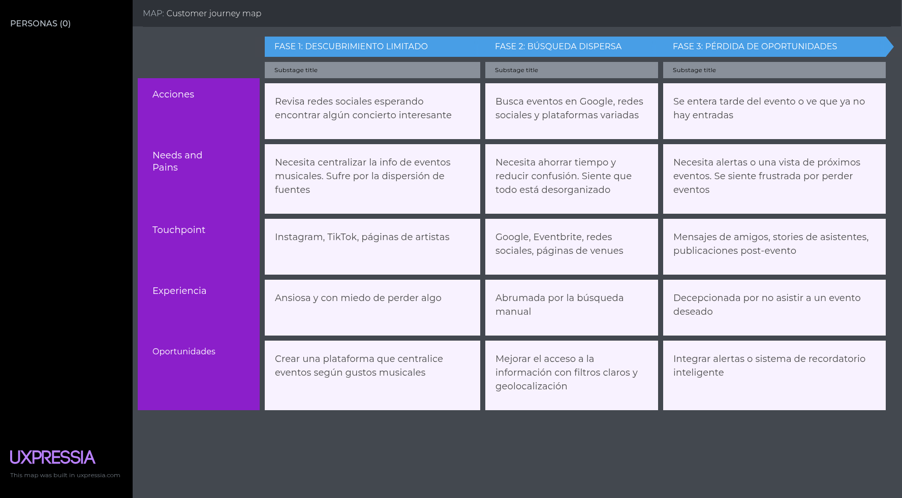

**Artistas emergentes**

  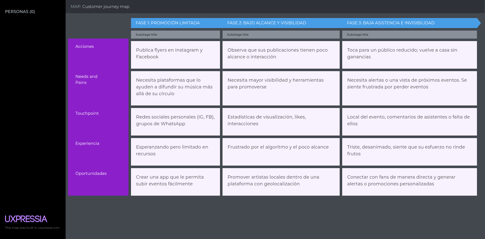

## 2.3.4. Empathy Mapping

**Diego Rivas**

</td>

**Valeria Torres**

</td>

## 2.3.5. Ubiquitous Language

<table>
  <thead>
    <tr>
      <th><strong>Término</strong></th>
      <th><strong>Definición/descripción</strong></th>
    </tr>
  </thead>
  <tbody>
    <tr>
      <td>GigMap</td>
      <td>Aplicación móvil que conecta a fans con conciertos en vivo, especialmente de la escena musical local e independiente</td>
    </tr>
    <tr>
      <td>Evento</td>
      <td>Cualquier concierto, tocada, jam session o presentación musical está listada en la aplicación Incluye ubicación, fecha, hora y artistas</td>
    </tr>
    <tr>
      <td>Mapa de conciertos</td>
      <td>Vista geolocalizada que muestra los eventos en tiempo real según la ubicación del usuario</td>
    </tr>
    <tr>
      <td>Fan</td>
      <td>Usuario interesado en asistir a conciertos y descubrir nueva música. Puede seguir artistas, activar notificaciones y guardar eventos</td>
    </tr>
    <tr>
      <td>Artista</td>
      <td>Músico independiente o banda que utiliza la aplicación para publicar y promocionar sus conciertos</td>
    </tr>
    <tr>
      <td>Comunidad local</td>
      <td>Red de usuarios y artistas que interactúan en una misma ciudad o región, promoviendo la música en vivo</td>
    </tr>
    <tr>
      <td>Exploración de evento</td>
      <td>Función que permite descubrir conciertos por género, zona, fecha o artista recomendado</td>
    </tr>
    <tr>
      <td>Evento destacado</td>
      <td>Concierto con mayor visibilidad en la app, ya sea por tendencia, ubicación o interés del usuario</td>
    </tr>
    <tr>
      <td>Promoción de eventos</td>
      <td>Difusión gratuita de eventos dentro de GigMap mediante algoritmos de afinidad y relevancia, sin necesidad de pagar publicidad</td>
    </tr>
    <tr>
      <td>Check-in</td>
      <td>Acción que realiza un fan al asistir a un evento, permitiendo registrar asistencia y generar recomendaciones futuras</td>
    </tr>
    <tr>
      <td>Perfil del artista</td>
      <td>Página dentro de la app donde el músico puede mostrar su biografía, próximos conciertos, redes sociales y contenido multimedia</td>
    </tr>
  </tbody>
</table>

# 2.4. Requirements Specification

## 2.4.1. User Stories

**Epics:**
| Epic ID | Título                                             | Descripción                                                                                                                                                                                       |
|---------|----------------------------------------------------|---------------------------------------------------------------------------------------------------------------------------------------------------------------------------------------------------|
| EP01    | Creación y descubrimiento de conciertos         | Esta épica se centra en permitir a los artistas registrar y gestionar conciertos en la aplicación, mientras que los usuarios podrán descubrir nuevos eventos según su ubicación, género musical y artistas favoritos. Se busca optimizar la experiencia de búsqueda y exploración para que los fans encuentren fácilmente conciertos relevantes y personalizados. |
| EP02    | Notificaciones personalizadas                      | Incluye el desarrollo de un sistema de alertas que informe a los usuarios sobre nuevos conciertos, cambios en eventos, promociones y recordatorios, todo basado en sus preferencias e historial de interacción. El objetivo es mantenerlos siempre actualizados y fomentar su participación activa en la aplicación.|
| EP03    | Interacción social y comunidades               | Esta épica permitirá a los usuarios interactuar con otros fans a través de comunidades dentro de la aplicación. Se busca construir un espacio social donde los usuarios compartan experiencias, recomendaciones y opiniones, fortaleciendo el sentido de comunidad alrededor de la música en vivo.|
| EP04    | Gestión de Identidad y Acceso (Registro y Autenticación) | Enfocada en el inicio de sesión y registro de usuarios, esta épica incluye autenticación mediante correo electrónico o redes sociales, recuperación de contraseñas y gestión de roles y permisos básicos. Su objetivo es garantizar la seguridad, privacidad y facilidad de acceso a la aplicación para todos los usuarios. |
| EP05    | Exploración y Gestión de Eventos Relacionados    | Esta épica se centra en permitir la creación y descubrimiento de eventos asociados a un concierto principal, como juntadas de fans en un parque, fiestas temáticas previas, actividades comunitarias o afterparties. Los usuarios podrán explorar, unirse y organizar este tipo de encuentros que enriquecen la experiencia musical más allá del show oficial. El objetivo es fomentar la interacción entre fans y ampliar el ecosistema de eventos alrededor de los conciertos.|
| EP06    | Desarrollo técnico del backend (RESTful API)       | Esta épica comprende la implementación de la infraestructura técnica que soportará la aplicación, incluyendo la base de datos, API, servicios en la nube y escalabilidad del sistema. El foco está en garantizar rendimiento, seguridad y estabilidad para manejar de manera eficiente las operaciones de usuarios y organizadores. |
| EP07    | Plataforma informativa (Landing Page)     | Se centra en el desarrollo de una landing page que funcione como punto de entrada informativo, presentando la propuesta de valor, características principales y beneficios de la aplicación. El objetivo es atraer nuevos usuarios, transmitiendo confianza y profesionalismo desde la primera interacción. |

**User Stories:**

<table>
  <thead>
    <tr>
      <th>Story ID</th>
      <th>User</th>
      <th>Priority</th>
      <th>Epic</th>
    </tr>
  </thead>
  <tbody>
    <tr>
      <td>US01</td>
      <td>Fan</td>
      <td>3</td>
      <td>EP01</td>
    </tr>
    <tr>
      <td><strong>Title</strong></td>
      <td colspan="3">Filtrar eventos por género musical</td>
    </tr>
    <tr>
      <td colspan="4"><strong>Description</strong></td>
    </tr>
    <tr>
      <td colspan="4">Como fan, quiero filtrar eventos por género para ver solo los que me interesan.</td>
    </tr>
    <tr>
      <td colspan="4"><strong>Acceptance Criteria</strong></td>
    </tr>
    <tr>
      <td colspan="4">
        <strong>Escenario: Uso del filtro de género</strong> 
        Dado que el usuario abre los filtros 
        Cuando selecciona un género 
        Entonces solo se muestran eventos relacionados.  
        <strong>Escenario: Interacción fluida con el filtrado</strong> 
        Dado que hay múltiples géneros disponibles 
        Cuando se elige uno 
        Entonces la vista se actualiza dinámicamente.
      </td>
    </tr>
  </tbody>
</table>

<table>
  <thead>
    <tr>
      <th>Story ID</th>
      <th>User</th>
      <th>Priority</th>
      <th>Epic</th>
    </tr>
  </thead>
  <tbody>
    <tr>
      <td>US02</td>
      <td>Artista</td>
      <td>5</td>
      <td>EP01</td>
    </tr>
    <tr>
      <td><strong>Title</strong></td>
      <td colspan="3">Publicar nuevo concierto</td>
    </tr>
    <tr>
      <td colspan="4"><strong>Description</strong></td>
    </tr>
    <tr>
      <td colspan="4">Como artista, quiero crear un evento para promocionar mi presentación.</td>
    </tr>
    <tr>
      <td colspan="4"><strong>Acceptance Criteria</strong></td>
    </tr>
    <tr>
      <td colspan="4">
        <strong>Escenario: Acceso al formulario de creación de evento</strong> 
        Dado que el artista inicia sesión 
        Cuando accede a "Crear evento" 
        Entonces puede ingresar datos y publicarlo en el mapa.  
        <strong>Escenario: Publicación inmediata y visible</strong> 
        Dado que los datos son válidos 
        Cuando se confirma la creación 
        Entonces el evento aparece visible en la aplicación
      </td>
    </tr>
  </tbody>
</table>

<table>
  <thead>
    <tr>
      <th>Story ID</th>
      <th>User</th>
      <th>Priority</th>
      <th>Epic</th>
    </tr>
  </thead>
  <tbody>
    <tr>
      <td>US03</td>
      <td>Artista</td>
      <td>3</td>
      <td>EP01</td>
    </tr>
    <tr>
      <td><strong>Title</strong></td>
      <td colspan="3">Medir asistencia estimada</td>
    </tr>
    <tr>
      <td colspan="4"><strong>Description</strong></td>
    </tr>
    <tr>
      <td colspan="4">Como artista, quiero ver cuántas personas marcaron asistencia para medir el interés.</td>
    </tr>
    <tr>
      <td colspan="4"><strong>Acceptance Criteria</strong></td>
    </tr>
    <tr>
      <td colspan="4">
        <strong>Escenario: Visualización de estadísticas de evento</strong> 
        Dado que el evento está publicado 
        Cuando abre las estadísticas 
        Entonces visualiza el número de asistentes confirmados.  
        <strong>Escenario: Reacción ante datos en tiempo real</strong> 
        Dado que los usuarios marcan "Asistiré" 
        Cuando se actualizan los datos 
        Entonces el artista ve reflejado el interés real.
      </td>
    </tr>
  </tbody>
</table>

<table>
  <thead>
    <tr>
      <th>Story ID</th>
      <th>User</th>
      <th>Priority</th>
      <th>Epic</th>
    </tr>
  </thead>
  <tbody>
    <tr>
      <td>US04</td>
      <td>Artista</td>
      <td>2</td>
      <td>EP03</td>
    </tr>
    <tr>
      <td><strong>Title</strong></td>
      <td colspan="3">Personalizar perfil de artista</td>
    </tr>
    <tr>
      <td colspan="4"><strong>Description</strong></td>
    </tr>
    <tr>
      <td colspan="4">Como artista, quiero personalizar mi perfil con mi nombre artístico y fotografía para conectar mejor con el público.</td>
    </tr>
    <tr>
      <td colspan="4"><strong>Acceptance Criteria</strong></td>
    </tr>
    <tr>
      <td colspan="4">
        <strong>Escenario: Edición del perfil</strong> 
        Dado que el artista abre su perfil 
        Cuando edita sus datos 
        Entonces puede foto y mis datos como nombre.  
        <strong>Escenario: Atractivo visual para fans</strong> 
        Dado que el perfil ha sido personalizado 
        Cuando un fan lo visita 
        Entonces puede conocer mejor al artista.
      </td>
    </tr>
  </tbody>
</table>

<table>
  <thead>
    <tr>
      <th>Story ID</th>
      <th>User</th>
      <th>Priority</th>
      <th>Epic</th>
    </tr>
  </thead>
  <tbody>
    <tr>
      <td>US05</td>
      <td>Usuario</td>
      <td>5</td>
      <td>EP03</td>
    </tr>
    <tr>
      <td><strong>Title</strong></td>
      <td colspan="3">Crear comunidad</td>
    </tr>
    <tr>
      <td colspan="4"><strong>Description</strong></td>
    </tr>
    <tr>
      <td colspan="4">Como usuario, quiero crear una comunidad temática para reunir a otros usuarios en torno a intereses compartidos.</td>
    </tr>
    <tr>
      <td colspan="4"><strong>Acceptance Criteria</strong></td>
    </tr>
    <tr>
      <td colspan="4">
        <strong>Escenario: Acceso a la opción de crear comunidad</strong> 
		Dado que el usuario ha iniciado sesión 
		Cuando accede a la sección de comunidades 
		Entonces puede ver y seleccionar la opción para crear una nueva comunidad.  
        <strong>Escenario: Creación de comunidad correcta</strong> 
		Dado que el usuario ha accedido al formulario de creación 
		Cuando completa los campos requeridos y confirma la acción 
		Entonces se crea la comunidad y queda visible para otros usuarios. 
      </td>
    </tr>
  </tbody>
</table>

<table>
  <thead>
    <tr>
      <th>Story ID</th>
      <th>User</th>
      <th>Priority</th>
      <th>Epic</th>
    </tr>
  </thead>
  <tbody>
    <tr>
      <td>US06</td>
      <td>Artista</td>
      <td>3</td>
      <td>EP03</td>
    </tr>
    <tr>
      <td><strong>Title</strong></td>
      <td colspan="3">Verificar comunidad</td>
    </tr>
    <tr>
      <td colspan="4"><strong>Description</strong></td>
    </tr>
    <tr>
      <td colspan="4">Como artista, quiero que al crear mi comunidad esta se verifique automáticamente para que mis seguidores tengan la certeza de que es una comunidad oficial.</td>
    </tr>
    <tr>
      <td colspan="4"><strong>Acceptance Criteria</strong></td>
    </tr>
    <tr>
      <td colspan="4">
        <strong>Escenario: Creación de comunidad oficial</strong> 
		Dado que el artista inicia sesión en su cuenta verificada 
		Cuando crea una nueva comunidad en GigMap 
		Entonces la comunidad se genera automáticamente con el distintivo de tener el icono de verificado.
      </td>
    </tr>
  </tbody>
</table>

<table>
  <thead>
    <tr>
      <th>Story ID</th>
      <th>User</th>
      <th>Priority</th>
      <th>Epic</th>
    </tr>
  </thead>
  <tbody>
    <tr>
      <td>US07</td>
      <td>Fan</td>
      <td>5</td>
      <td>EP01</td>
    </tr>
    <tr>
      <td><strong>Title</strong></td>
      <td colspan="3">Ver mapa con geolocalización</td>
    </tr>
    <tr>
      <td colspan="4"><strong>Description</strong></td>
    </tr>
    <tr>
      <td colspan="4">Como fan, quiero ver un mapa con mi ubicación y los conciertos cercanos marcados para explorar visualmente las opciones disponibles.</td>
    </tr>
    <tr>
      <td colspan="4"><strong>Acceptance Criteria</strong></td>
    </tr>
    <tr>
      <td colspan="4">
        <strong>Escenario: Visualización del mapa con eventos</strong> 
        Dado que el usuario está logueado y ha permitido el acceso a su ubicación 
        Cuando entra a la sección de mapa 
        Entonces visualiza su ubicación y los conciertos cercanos.  
        <strong>Escenario: Información de eventos en el mapa</strong> 
        Dado que el usuario interactúa con un marcador de evento 
        Cuando hace clic en un ícono del mapa 
        Entonces puede ver detalles del evento como nombre, hora y lugar.
      </td>
    </tr>
  </tbody>
</table>

<table>
  <thead>
    <tr>
      <th>Story ID</th>
      <th>User</th>
      <th>Priority</th>
      <th>Epic</th>
    </tr>
  </thead>
  <tbody>
    <tr>
      <td>US08</td>
      <td>Usuario</td>
      <td>2</td>
      <td>EP01</td>
    </tr>
    <tr>
      <td><strong>Title</strong></td>
      <td colspan="3">Buscar conciertos</td>
    </tr>
    <tr>
      <td colspan="4"><strong>Description</strong></td>
    </tr>
    <tr>
      <td colspan="4">Como usuario, quiero buscar conciertos por nombre o artista para encontrarlos fácilmente.</td>
    </tr>
    <tr>
      <td colspan="4"><strong>Acceptance Criteria</strong></td>
    </tr>
    <tr>
      <td colspan="4">
        <strong>Escenario: Búsqueda por palabra clave</strong> 
        Dado que el usuario accede al buscador de conciertos 
        Cuando escribe un nombre o artista 
        Entonces se muestran los conciertos coincidentes.
      </td>
    </tr>
  </tbody>
</table>

<table>
  <thead>
    <tr>
      <th>Story ID</th>
      <th>User</th>
      <th>Priority</th>
      <th>Epic</th>
    </tr>
  </thead>
  <tbody>
    <tr>
      <td>US09</td>
      <td>Usuario</td>
      <td>2</td>
      <td>EP03</td>
    </tr>
    <tr>
      <td><strong>Title</strong></td>
      <td colspan="3">Buscar comunidades</td>
    </tr>
    <tr>
      <td colspan="4"><strong>Description</strong></td>
    </tr>
    <tr>
      <td colspan="4">Como usuario, quiero buscar comunidades por nombre o temática para unirme a las que me interesen.</td>
    </tr>
    <tr>
      <td colspan="4"><strong>Acceptance Criteria</strong></td>
    </tr>
    <tr>
      <td colspan="4">
        <strong>Escenario: Búsqueda de comunidades</strong> 
        Dado que el usuario accede al buscador de comunidades 
        Cuando ingresa una palabra clave 
        Entonces ve las comunidades coincidentes.
      </td>
    </tr>
  </tbody>
</table>

<table>
  <thead>
    <tr>
      <th>Story ID</th>
      <th>User</th>
      <th>Priority</th>
      <th>Epic</th>
    </tr>
  </thead>
  <tbody>
    <tr>
      <td>US10</td>
      <td>Usuario registrado</td>
      <td>3</td>
      <td>EP04</td>
    </tr>
    <tr>
      <td><strong>Title</strong></td>
      <td colspan="3">Iniciar sesión en la app mobile</td>
    </tr>
    <tr>
      <td colspan="4"><strong>Description</strong></td>
    </tr>
    <tr>
      <td colspan="4">Como usuario registrado, quiero iniciar sesión desde la aplicación móvil para acceder a mi cuenta.</td>
    </tr>
    <tr>
      <td colspan="4"><strong>Acceptance Criteria</strong></td>
    </tr>
    <tr>
      <td colspan="4">
        <strong>Escenario: Ingreso exitoso desde app mobile</strong> 
        Dado que el usuario tiene una cuenta 
        Cuando accede al formulario de login y envía sus credenciales 
        Entonces accede correctamente a su perfil.
      </td>
    </tr>
  </tbody>
</table>

<table>
  <thead>
    <tr>
      <th>Story ID</th>
      <th>User</th>
      <th>Priority</th>
      <th>Epic</th>
    </tr>
  </thead>
  <tbody>
    <tr>
      <td>US11</td>
      <td>Artista</td>
      <td>3</td>
      <td>EP04</td>
    </tr>
    <tr>
      <td><strong>Title</strong></td>
      <td colspan="3">Registrarse como artista</td>
    </tr>
    <tr>
      <td colspan="4"><strong>Description</strong></td>
    </tr>
    <tr>
      <td colspan="4">Como nuevo usuario, quiero registrarme como artista para promocionar mis conciertos.</td>
    </tr>
    <tr>
      <td colspan="4"><strong>Acceptance Criteria</strong></td>
    </tr>
    <tr>
      <td colspan="4">
        <strong>Escenario: Registro como artista</strong> 
        Dado que el visitante accede al formulario de registro 
        Cuando selecciona la opción 'Artista' y completa sus datos 
        Entonces su cuenta es creada con perfil de artista.
      </td>
    </tr>
  </tbody>
</table>
<table>
  <thead>
    <tr>
      <th>Story ID</th>
      <th>User</th>
      <th>Priority</th>
      <th>Epic</th>
    </tr>
  </thead>
  <tbody>
    <tr>
      <td>US12</td>
      <td>Fan</td>
      <td>3</td>
      <td>EP04</td>
    </tr>
    <tr>
      <td><strong>Title</strong></td>
      <td colspan="3">Registrarse como fan</td>
    </tr>
    <tr>
      <td colspan="4"><strong>Description</strong></td>
    </tr>
    <tr>
      <td colspan="4">Como nuevo usuario, quiero registrarme como fan para participar en la comunidad y explorar conciertos.</td>
    </tr>
    <tr>
      <td colspan="4"><strong>Acceptance Criteria</strong></td>
    </tr>
    <tr>
      <td colspan="4">
        <strong>Escenario: Registro como fan</strong> 
        Dado que el visitante accede al formulario de registro 
        Cuando selecciona la opción 'Fan' y completa sus datos 
        Entonces su cuenta es creada con perfil de fan.
      </td>
    </tr>
  </tbody>
</table>

<table>
  <thead>
    <tr>
      <th>Story ID</th>
      <th>User</th>
      <th>Priority</th>
      <th>Epic</th>
    </tr>
  </thead>
  <tbody>
    <tr>
      <td>US13</td>
      <td>Fan</td>
      <td>2</td>
      <td>EP01</td>
    </tr>
    <tr>
      <td><strong>Title</strong></td>
      <td colspan="3">Zoom a concierto en el mapa</td>
    </tr>
    <tr>
      <td colspan="4"><strong>Description</strong></td>
    </tr>
    <tr>
      <td colspan="4">Como fan, quiero que al seleccionar un concierto en el mapa se haga zoom a su ubicación.</td>
    </tr>
    <tr>
      <td colspan="4"><strong>Acceptance Criteria</strong></td>
    </tr>
    <tr>
      <td colspan="4">
        <strong>Escenario: Zoom en mapa a concierto seleccionado</strong> 
        Dado que el usuario está en el mapa 
        Cuando hace touch en un concierto 
        Entonces el mapa se centra y hace zoom sobre su ubicación.
      </td>
    </tr>
  </tbody>
</table>
<table>
  <thead>
    <tr>
      <th>Story ID</th>
      <th>User</th>
      <th>Priority</th>
      <th>Epic</th>
    </tr>
  </thead>
  <tbody>
    <tr>
      <td>US14</td>
      <td>Usuario</td>
      <td>2</td>
      <td>EP01</td>
    </tr>
    <tr>
      <td><strong>Title</strong></td>
      <td colspan="3">Ver estado del concierto</td>
    </tr>
    <tr>
      <td colspan="4"><strong>Description</strong></td>
    </tr>
    <tr>
      <td colspan="4">Como usuario, quiero saber si un concierto está disponible o agotado para decidir si puedo asistir.</td>
    </tr>
    <tr>
      <td colspan="4"><strong>Acceptance Criteria</strong></td>
    </tr>
    <tr>
      <td colspan="4">
        <strong>Escenario: Visualización de estado del concierto</strong> 
        Dado que el usuario revisa la lista de conciertos 
        Cuando observa el estado de disponibilidad 
        Entonces puede ver si el evento está 'Disponible' o 'Agotado'.
      </td>
    </tr>
  </tbody>
</table>
<table>
  <thead>
    <tr>
      <th>Story ID</th>
      <th>User</th>
      <th>Priority</th>
      <th>Epic</th>
    </tr>
  </thead>
  <tbody>
    <tr>
      <td>US15</td>
      <td>Fan</td>
      <td>3</td>
      <td>EP01</td>
    </tr>
    <tr>
      <td><strong>Title</strong></td>
      <td colspan="3">Ver información detallada del concierto</td>
    </tr>
    <tr>
      <td colspan="4"><strong>Description</strong></td>
    </tr>
    <tr>
      <td colspan="4">Como fan, quiero ver la información completa de un concierto para decidir si asistir.</td>
    </tr>
    <tr>
      <td colspan="4"><strong>Acceptance Criteria</strong></td>
    </tr>
    <tr>
      <td colspan="4">
        <strong>Escenario: Acceso a detalles del concierto</strong> 
        Dado que el usuario selecciona un concierto 
        Cuando accede a su ficha de detalle 
        Entonces visualiza el artista, ubicación, fecha, hora, imagen, y descripción.
      </td>
    </tr>
  </tbody>
</table>
<table>
  <thead>
    <tr>
      <th>Story ID</th>
      <th>User</th>
      <th>Priority</th>
      <th>Epic</th>
    </tr>
  </thead>
  <tbody>
    <tr>
      <td>US16</td>
      <td>Fan</td>
      <td>3</td>
      <td>EP03</td>
    </tr>
    <tr>
      <td><strong>Title</strong></td>
      <td colspan="3">Unirse a una comunidad</td>
    </tr>
    <tr>
      <td colspan="4"><strong>Description</strong></td>
    </tr>
    <tr>
      <td colspan="4">Como fan, quiero unirme a una comunidad musical para interactuar con otros usuarios con intereses similares.</td>
    </tr>
    <tr>
      <td colspan="4"><strong>Acceptance Criteria</strong></td>
    </tr>
    <tr>
      <td colspan="4">
        <strong>Escenario: Unirse a comunidad</strong> 
        Dado que el fan accede a una comunidad disponible 
        Cuando presiona el botón 'Unirse' 
        Entonces queda registrado como miembro.
      </td>
    </tr>
  </tbody>
</table>
<table>
  <thead>
    <tr>
      <th>Story ID</th>
      <th>User</th>
      <th>Priority</th>
      <th>Epic</th>
    </tr>
  </thead>
  <tbody>
    <tr>
      <td>US17</td>
      <td>Fan</td>
      <td>3</td>
      <td>EP03</td>
    </tr>
    <tr>
      <td><strong>Title</strong></td>
      <td colspan="3">Publicar en la comunidad</td>
    </tr>
    <tr>
      <td colspan="4"><strong>Description</strong></td>
    </tr>
    <tr>
      <td colspan="4">Como fan, quiero crear publicaciones en la comunidad a la que me he unido, para compartir opiniones, fotos o recomendaciones con otros miembros.</td>
    </tr>
    <tr>
      <td colspan="4"><strong>Acceptance Criteria</strong></td>
    </tr>
    <tr>
      <td colspan="4">
        <strong>Escenario: Crear publicación exitosa</strong> 
        Dado que el usuario está unido a una comunidad, 
        Cuando accede a la comunidad y le da al botón agregar una nueva publicación y escribe un mensaje, 
        Entonces la publicación se guarda y se muestra en el feed de la comunidad.
      </td>
    </tr>
  </tbody>
</table>
<table>
  <thead>
    <tr>
      <th>Story ID</th>
      <th>User</th>
      <th>Priority</th>
      <th>Epic</th>
    </tr>
  </thead>
  <tbody>
    <tr>
      <td>US18</td>
      <td>Fan</td>
      <td>2</td>
      <td>EP03</td>
    </tr>
    <tr>
      <td><strong>Title</strong></td>
      <td colspan="3">Editar perfil personal</td>
    </tr>
    <tr>
      <td colspan="4"><strong>Description</strong></td>
    </tr>
    <tr>
      <td colspan="4">Como fan, quiero poder editar mi información de perfil (foto, nombre y nombre de usuario), para que los demás usuarios puedan reconocerme fácilmente y mantener mi perfil actualizado.</td>
    </tr>
    <tr>
      <td colspan="4"><strong>Acceptance Criteria</strong></td>
    </tr>
    <tr>
      <td colspan="4">
        <strong>Escenario: Actualizar información del perfil</strong> 
        Dado que el usuario accede a la sección "Mi Perfil", 
        Cuando le da al botón editar perfil, 
        Entonces puede editar su nombre, nombre de usuario y cambiar su foto de perfil.
      </td>
    </tr>
  </tbody>
</table>
<table>
  <thead>
    <tr>
      <th>Story ID</th>
      <th>User</th>
      <th>Priority</th>
      <th>Epic</th>
    </tr>
  </thead>
  <tbody>
    <tr>
      <td>US19</td>
      <td>Fan</td>
      <td>3</td>
      <td>EP01</td>
    </tr>
    <tr>
      <td><strong>Title</strong></td>
      <td colspan="3">Confirmar o marcar asistencia a un concierto</td>
    </tr>
    <tr>
      <td colspan="4"><strong>Description</strong></td>
    </tr>
    <tr>
      <td colspan="4">Como fan, quiero poder marcar un concierto como “Marcar asistencia”, para llevar un seguimiento de los conciertos que planeo asistir.</td>
    </tr>
    <tr>
      <td colspan="4"><strong>Acceptance Criteria</strong></td>
    </tr>
    <tr>
      <td colspan="4">
        <strong>Escenario: Confirmar asistencia a un evento</strong> 
        Dado que el usuario visualiza los detalles de un evento, 
        Cuando presiona el botón "Confirmar asistencia", 
        Entonces el evento se agrega a su lista de “Por asistir” y el botón cambia a "Cancelar asistencia".  
        <strong>Escenario: Cancelar asistencia</strong> 
        Dado que el evento ya está marcado como “Por asistir”, 
        Cuando presiona el botón "Cancelar asistencia", 
        Entonces el evento se elimina de su lista de eventos futuros y vuelve a estar disponible para confirmar.
      </td>
    </tr>
  </tbody>
</table>
<table>
  <thead>
    <tr>
      <th>Story ID</th>
      <th>User</th>
      <th>Priority</th>
      <th>Epic</th>
    </tr>
  </thead>
  <tbody>
    <tr>
      <td>US20</td>
      <td>Usuario</td>
      <td>2</td>
      <td>EP03</td>
    </tr>
    <tr>
      <td><strong>Title</strong></td>
      <td colspan="3">Ver comunidades accedidas</td>
    </tr>
    <tr>
      <td colspan="4"><strong>Description</strong></td>
    </tr>
    <tr>
      <td colspan="4">Como usuario, quiero visualizar en el apartado "Tus grupos" las comunidades a las que me he unido.</td>
    </tr>
    <tr>
      <td colspan="4"><strong>Acceptance Criteria</strong></td>
    </tr>
    <tr>
      <td colspan="4">
        <strong>Escenario: Visualización de comunidades unidas</strong> 
        Dado que el usuario ha ingresado a comunidades 
        Cuando accede a la sección "Tus grupos" 
        Entonces puede ver la lista de comunidades a las que pertenece.
      </td>
    </tr>
  </tbody>
</table>
<table>
  <thead>
    <tr>
      <th>Story ID</th>
      <th>User</th>
      <th>Priority</th>
      <th>Epic</th>
    </tr>
  </thead>
  <tbody>
    <tr>
      <td>US21</td>
      <td>Usuario</td>
      <td>2</td>
      <td>EP03</td>
    </tr>
    <tr>
      <td><strong>Title</strong></td>
      <td colspan="3">Reaccionar a publicaciones en comunidades</td>
    </tr>
    <tr>
      <td colspan="4"><strong>Description</strong></td>
    </tr>
    <tr>
      <td colspan="4">Como usuario, quiero poder reaccionar a publicaciones dentro de las comunidades.</td>
    </tr>
    <tr>
      <td colspan="4"><strong>Acceptance Criteria</strong></td>
    </tr>
    <tr>
      <td colspan="4">
        <strong>Escenario: Reacción a publicación</strong> 
        Dado que el usuario navega por una comunidad 
        Cuando encuentra una publicación 
        Entonces puede reaccionar con un emoji o símbolo.
      </td>
    </tr>
  </tbody>
</table>
<table>
  <thead>
    <tr>
      <th>Story ID</th>
      <th>User</th>
      <th>Priority</th>
      <th>Epic</th>
    </tr>
  </thead>
  <tbody>
    <tr>
      <td>US22</td>
      <td>Usuario</td>
      <td>2</td>
      <td>EP01</td>
    </tr>
    <tr>
      <td><strong>Title</strong></td>
      <td colspan="3">Calificar concierto</td>
    </tr>
    <tr>
      <td colspan="4"><strong>Description</strong></td>
    </tr>
    <tr>
      <td colspan="4">Como usuario, quiero calificar un concierto de 1 a 5 estrellas para compartir mi experiencia.</td>
    </tr>
    <tr>
      <td colspan="4"><strong>Acceptance Criteria</strong></td>
    </tr>
    <tr>
      <td colspan="4">
        <strong>Escenario: Valoración del concierto</strong> 
        Dado que el usuario asistió a un concierto 
        Cuando accede a su detalle 
        Entonces puede seleccionar una puntuación del 1 al 5.
      </td>
    </tr>
  </tbody>
</table>
<table>
  <thead>
    <tr>
      <th>Story ID</th>
      <th>User</th>
      <th>Priority</th>
      <th>Epic</th>
    </tr>
  </thead>
  <tbody>
    <tr>
      <td>US23</td>
      <td>Usuario</td>
      <td>3</td>
      <td>EP01</td>
    </tr>
    <tr>
      <td><strong>Title</strong></td>
      <td colspan="3">Ver usuarios que asistirán a concierto</td>
    </tr>
    <tr>
      <td colspan="4"><strong>Description</strong></td>
    </tr>
    <tr>
      <td colspan="4">Como usuario, quiero ver qué otros usuarios asistirán al mismo concierto que yo.</td>
    </tr>
    <tr>
      <td colspan="4"><strong>Acceptance Criteria</strong></td>
    </tr>
    <tr>
      <td colspan="4">
        <strong>Escenario: Visualizar asistentes</strong> 
        Dado que el usuario confirmó su asistencia 
        Cuando entra al evento 
        Entonces puede ver una lista de otros usuarios que también asistirán.
      </td>
    </tr>
  </tbody>
</table>
<table>
  <thead>
    <tr>
      <th>Story ID</th>
      <th>User</th>
      <th>Priority</th>
      <th>Epic</th>
    </tr>
  </thead>
  <tbody>
    <tr>
      <td>US24</td>
      <td>Usuario</td>
      <td>2</td>
      <td>EP03</td>
    </tr>
    <tr>
      <td><strong>Title</strong></td>
      <td colspan="3">Acceder a perfil de otros usuarios</td>
    </tr>
    <tr>
      <td colspan="4"><strong>Description</strong></td>
    </tr>
    <tr>
      <td colspan="4">Como usuario, quiero poder acceder al perfil de otros usuarios para conocer más sobre ellos.</td>
    </tr>
    <tr>
      <td colspan="4"><strong>Acceptance Criteria</strong></td>
    </tr>
    <tr>
      <td colspan="4">
        <strong>Escenario: Navegar al perfil de otro usuario</strong> 
        Dado que el usuario ve un nombre o avatar 
        Cuando hace clic sobre él 
        Entonces se redirige al perfil público de ese usuario.
      </td>
    </tr>
  </tbody>
</table>
<table>
  <thead>
    <tr>
      <th>Story ID</th>
      <th>User</th>
      <th>Priority</th>
      <th>Epic</th>
    </tr>
  </thead>
  <tbody>
    <tr>
      <td>US25</td>
      <td>Usuario</td>
      <td>2</td>
      <td>EP03</td>
    </tr>
    <tr>
      <td><strong>Title</strong></td>
      <td colspan="3">Ver publicaciones con like</td>
    </tr>
    <tr>
      <td colspan="4"><strong>Description</strong></td>
    </tr>
    <tr>
      <td colspan="4">Como usuario, quiero ver una lista de publicaciones a las que les he dado "like".</td>
    </tr>
    <tr>
      <td colspan="4"><strong>Acceptance Criteria</strong></td>
    </tr>
    <tr>
      <td colspan="4">
        <strong>Escenario: Historial de publicaciones favoritas</strong> 
        Dado que el usuario ha interactuado en comunidades 
        Cuando accede a su sección de favoritos 
        Entonces puede visualizar todas las publicaciones que le han gustado.
      </td>
    </tr>
  </tbody>
</table>
<table>
  <thead>
    <tr>
      <th>Story ID</th>
      <th>User</th>
      <th>Priority</th>
      <th>Epic</th>
    </tr>
  </thead>
  <tbody>
    <tr>
      <td>US26</td>
      <td>Usuario</td>
      <td>2</td>
      <td>EP01</td>
    </tr>
    <tr>
      <td><strong>Title</strong></td>
      <td colspan="3">Ver aplicaciiones de venta del concierto</td>
    </tr>
    <tr>
      <td colspan="4"><strong>Description</strong></td>
    </tr>
    <tr>
      <td colspan="4">Como usuario, quiero ver en qué aplicaciones puedo comprar entradas para un concierto.</td>
    </tr>
    <tr>
      <td colspan="4"><strong>Acceptance Criteria</strong></td>
    </tr>
    <tr>
      <td colspan="4">
        <strong>Escenario: Visualización de enlaces de venta</strong> 
        Dado que el usuario revisa un concierto 
        Cuando accede a su ficha de detalles 
        Entonces visualiza las aplicaciones donde están disponibles las entradas.
      </td>
    </tr>
  </tbody>
</table>
<table>
  <thead>
    <tr>
      <th>Story ID</th>
      <th>User</th>
      <th>Priority</th>
      <th>Epic</th>
    </tr>
  </thead>
  <tbody>
    <tr>
      <td>US27</td>
      <td>Usuario</td>
      <td>2</td>
      <td>EP01</td>
    </tr>
    <tr>
      <td><strong>Title</strong></td>
      <td colspan="3">Permitir acceso a ubicación</td>
    </tr>
    <tr>
      <td colspan="4"><strong>Description</strong></td>
    </tr>
    <tr>
      <td colspan="4">Como usuario, quiero que GigMap acceda a mi ubicación para recibir información personalizada.</td>
    </tr>
    <tr>
      <td colspan="4"><strong>Acceptance Criteria</strong></td>
    </tr>
    <tr>
      <td colspan="4">
        <strong>Escenario: Permiso de ubicación</strong> 
        Dado que el usuario entra a la app por primera vez 
        Cuando se le solicita permiso de ubicación 
        Entonces puede aceptar o denegar el acceso.
      </td>
    </tr>
  </tbody>
</table>
<table>
  <thead>
    <tr>
      <th>Story ID</th>
      <th>User</th>
      <th>Priority</th>
      <th>Epic</th>
    </tr>
  </thead>
  <tbody>
    <tr>
      <td>US28</td>
      <td>Usuario</td>
      <td>3</td>
      <td>EP01</td>
    </tr>
    <tr>
      <td><strong>Title</strong></td>
      <td colspan="3">Mostrar conciertos cercanos</td>
    </tr>
    <tr>
      <td colspan="4"><strong>Description</strong></td>
    </tr>
    <tr>
      <td colspan="4">Como usuario, quiero que GigMap me muestre conciertos cercanos a mi ubicación actual.</td>
    </tr>
    <tr>
      <td colspan="4"><strong>Acceptance Criteria</strong></td>
    </tr>
    <tr>
      <td colspan="4">
        <strong>Escenario: Conciertos basados en geolocalización</strong> 
        Dado que el usuario ha otorgado permisos de ubicación 
        Cuando accede al mapa 
        Entonces se muestran conciertos próximos geográficamente.
      </td>
    </tr>
  </tbody>
</table>
<table>
  <thead>
    <tr>
      <th>Story ID</th>
      <th>User</th>
      <th>Priority</th>
      <th>Epic</th>
    </tr>
  </thead>
  <tbody>
    <tr>
      <td>US29</td>
      <td>Usuario</td>
      <td>2</td>
      <td>EP03</td>
    </tr>
    <tr>
      <td><strong>Title</strong></td>
      <td colspan="3">Ver miembros de comunidad</td>
    </tr>
    <tr>
      <td colspan="4"><strong>Description</strong></td>
    </tr>
    <tr>
      <td colspan="4">Como usuario, quiero ver la lista de miembros que pertenecen a una comunidad.</td>
    </tr>
    <tr>
      <td colspan="4"><strong>Acceptance Criteria</strong></td>
    </tr>
    <tr>
      <td colspan="4">
        <strong>Escenario: Listado de miembros</strong> 
        Dado que el usuario ha ingresado a una comunidad 
        Cuando accede a la sección de miembros 
        Entonces puede visualizar los usuarios que la integran.
      </td>
    </tr>
  </tbody>
</table>
<table>
  <thead>
    <tr>
      <th>Story ID</th>
      <th>User</th>
      <th>Priority</th>
      <th>Epic</th>
    </tr>
  </thead>
  <tbody>
    <tr>
      <td>US30</td>
      <td>Usuario</td>
      <td>3</td>
      <td>EP03</td>
    </tr>
    <tr>
      <td><strong>Title</strong></td>
      <td colspan="3">Subir imágenes en comunidades</td>
    </tr>
    <tr>
      <td colspan="4"><strong>Description</strong></td>
    </tr>
    <tr>
      <td colspan="4">Como usuario, quiero subir imágenes en publicaciones de comunidad para compartir experiencias visuales.</td>
    </tr>
    <tr>
      <td colspan="4"><strong>Acceptance Criteria</strong></td>
    </tr>
    <tr>
      <td colspan="4">
        <strong>Escenario: Publicación con imagen</strong> 
        Dado que el usuario quiere compartir contenido 
        Cuando crea una publicación 
        Entonces puede adjuntar una o más imágenes que se muestren en el feed.
      </td>
    </tr>
  </tbody>
</table>
<table>
  <thead>
    <tr>
      <th>Story ID</th>
      <th>User</th>
      <th>Priority</th>
      <th>Epic</th>
    </tr>
  </thead>
  <tbody>
    <tr>
      <td>US31</td>
      <td>Usuario</td>
      <td>3</td>
      <td>EP03</td>
    </tr>
    <tr>
      <td><strong>Title</strong></td>
      <td colspan="3">Seguir usuarios</td>
    </tr>
    <tr>
      <td colspan="4"><strong>Description</strong></td>
    </tr>
    <tr>
      <td colspan="4">Como usuario, quiero poder seguir a otros usuarios para poder ver sus actualizaciones, publicaciones o actividades y mantenerme al tanto de su contenido.</td>
    </tr>
    <tr>
      <td colspan="4"><strong>Acceptance Criteria</strong></td>
    </tr>
    <tr>
      <td colspan="4">
        <strong>Escenario: Seguir a un usuario exitosamente</strong> 
        Dado que estoy autenticado en la aplicación 
        Y estoy en el perfil de otro usuario 
        Cuando hago touch en el botón "Seguir" 
        Entonces el sistema muestra que ahora sigo a ese usuario 
        Y el botón cambia a "Siguiendo".
      </td>
    </tr>
  </tbody>
</table>
<table>
  <thead>
    <tr>
      <th>Story ID</th>
      <th>User</th>
      <th>Priority</th>
      <th>Epic</th>
    </tr>
  </thead>
  <tbody>
    <tr>
      <td>US32</td>
      <td>Usuario de GigMap</td>
      <td>3</td>
      <td>EP05</td>
    </tr>
    <tr>
      <td><strong>Title</strong></td>
      <td colspan="3">Ver eventos asociados</td>
    </tr>
    <tr>
      <td colspan="4"><strong>Description</strong></td>
    </tr>
    <tr>
      <td colspan="4">Como usuario de GigMap, quiero ver un apartado de eventos relacionados en el perfil de un concierto, para conocer actividades cercanas en tiempo y lugar (pre/after/meetups) que podría realizar.</td>
    </tr>
    <tr>
      <td colspan="4"><strong>Acceptance Criteria</strong></td>
    </tr>
    <tr>
      <td colspan="4">
        <strong>Escenario: Ver eventos relacionados exitosamente</strong> 
        Dado que estoy autenticado 
        Y estoy en el perfil de un concierto 
        Cuando desplazo la vista hasta el apartado “Eventos relacionados” 
        Entonces veo una lista de eventos con título, fecha/hora y distancia 
        Y puedo abrir el detalle de cualquier evento desde su tarjeta.
      </td>
    </tr>
  </tbody>
</table>
<table>
  <thead>
    <tr>
      <th>Story ID</th>
      <th>User</th>
      <th>Priority</th>
      <th>Epic</th>
    </tr>
  </thead>
  <tbody>
    <tr>
      <td>US33</td>
      <td>Usuario</td>
      <td>2</td>
      <td>EP05</td>
    </tr>
    <tr>
      <td><strong>Title</strong></td>
      <td colspan="3">Confirmar o marcar asistencia a eventos asociados</td>
    </tr>
    <tr>
      <td colspan="4"><strong>Description</strong></td>
    </tr>
    <tr>
      <td colspan="4">Como usuario, quiero poder marcar mi asistencia a un evento asociado, para que pueda llevar un seguimiento de los eventos asociados que planeo asistir.</td>
    </tr>
    <tr>
      <td colspan="4"><strong>Acceptance Criteria</strong></td>
    </tr>
    <tr>
      <td colspan="4">
        <strong>Escenario: Confirmar asistencia</strong> 
        Dado que el usuario visualiza los detalles de un evento asociado, 
        Cuando presiona el botón "Confirmar asistencia", 
        Entonces el evento asociado se agrega a su lista de “Por asistir” y el botón cambia a "Cancelar asistencia".  
        <strong>Escenario: Cancelar asistencia</strong> 
        Dado que el evento asociado ya está marcado como “Confirmar asistencia”, 
        Cuando presiona el botón "Cancelar asistencia", 
        Entonces el evento asociado se elimina de su lista de eventos futuros y vuelve a estar disponible para confirmar.
      </td>
    </tr>
  </tbody>
</table>
<table>
  <thead>
    <tr>
      <th>Story ID</th>
      <th>User</th>
      <th>Priority</th>
      <th>Epic</th>
    </tr>
  </thead>
  <tbody>
    <tr>
      <td>US34</td>
      <td>Usuario</td>
      <td>2</td>
      <td>EP03</td>
    </tr>
    <tr>
      <td><strong>Title</strong></td>
      <td colspan="3">Visualizar el contenido de las comunidades pertenecientes</td>
    </tr>
    <tr>
      <td colspan="4"><strong>Description</strong></td>
    </tr>
    <tr>
      <td colspan="4">Como usuario, quiero poder visualizar las publicaciones y anuncios de las comunidades que sigo en la pantalla de “Mis comunidades”.</td>
    </tr>
    <tr>
      <td colspan="4"><strong>Acceptance Criteria</strong></td>
    </tr>
    <tr>
      <td colspan="4">
        <strong>Escenario: Visualizar el contenido de las comunidades exitosamente</strong> 
        Dado que un usuario sigue una o más comunidades 
        Cuando accede a la pantalla "Mis comunidades" 
        Entonces el sistema muestra las publicaciones y anuncios más recientes de esas comunidades.
      </td>
    </tr>
  </tbody>
</table>
<table>
  <thead>
    <tr>
      <th>Story ID</th>
      <th>User</th>
      <th>Priority</th>
      <th>Epic</th>
    </tr>
  </thead>
  <tbody>
    <tr>
      <td>US35</td>
      <td>Usuario</td>
      <td>5</td>
      <td>EP02</td>
    </tr>
    <tr>
      <td><strong>Title</strong></td>
      <td colspan="3">Recibir recordatorio de concierto por asistir</td>
    </tr>
    <tr>
      <td colspan="4"><strong>Description</strong></td>
    </tr>
    <tr>
      <td colspan="4">Como usuario, quiero recibir la notificación de recordatorio del concierto al que confirme mi asistencia cuando la fecha de presentación esté cercana.</td>
    </tr>
    <tr>
      <td colspan="4"><strong>Acceptance Criteria</strong></td>
    </tr>
    <tr>
      <td colspan="4">
        <strong>Escenario: Recordatorio antes del evento</strong> 
        Dado que el usuario confirmó asistencia a un concierto en GigMap 
        Cuando falten 24 horas para la fecha del evento 
        Entonces recibe una notificación con el nombre, lugar y hora del concierto.
      </td>
    </tr>
  </tbody>
</table>
<table>
  <thead>
    <tr>
      <th>Story ID</th>
      <th>User</th>
      <th>Priority</th>
      <th>Epic</th>
    </tr>
  </thead>
  <tbody>
    <tr>
      <td>US36</td>
      <td>Usuario registrado</td>
      <td>5</td>
      <td>EP02</td>
    </tr>
    <tr>
      <td><strong>Title</strong></td>
      <td colspan="3">Recibir notificaciones de conciertos cercanos</td>
    </tr>
    <tr>
      <td colspan="4"><strong>Description</strong></td>
    </tr>
    <tr>
      <td colspan="4">Como usuario registrado, quiero recibir notificaciones sobre conciertos cerca de mi ubicación para no perderme eventos de mi interés.</td>
    </tr>
    <tr>
      <td colspan="4"><strong>Acceptance Criteria</strong></td>
    </tr>
    <tr>
      <td colspan="4">
        <strong>Escenario: Notificación de un concierto cercano disponible</strong> 
        Dado que el usuario tiene activadas las notificaciones 
        Cuando se registre un nuevo concierto en un radio de 5 km de su ubicación 
        Entonces recibe una notificación en su dispositivo con el nombre, fecha y lugar del evento.
      </td>
    </tr>
  </tbody>
</table>
<table>
  <thead>
    <tr>
      <th>Story ID</th>
      <th>User</th>
      <th>Priority</th>
      <th>Epic</th>
    </tr>
  </thead>
  <tbody>
    <tr>
      <td>US37</td>
      <td>Usuario</td>
      <td>5</td>
      <td>EP02</td>
    </tr>
    <tr>
      <td><strong>Title</strong></td>
      <td colspan="3">Recibir notificaciones por interacciones sociales</td>
    </tr>
    <tr>
      <td colspan="4"><strong>Description</strong></td>
    </tr>
    <tr>
      <td colspan="4">Como usuario, quiero recibir notificaciones cuando alguien interactúe con mis publicaciones (comentarios, likes, etc.) para mantenerme al tanto de la actividad en mi perfil.</td>
    </tr>
    <tr>
      <td colspan="4"><strong>Acceptance Criteria</strong></td>
    </tr>
    <tr>
      <td colspan="4">
        <strong>Escenario: Notificación por comentario recibido</strong> 
        Dado que el usuario ha publicado un contenido en una comunidad 
        Cuando otro usuario comente en su publicación 
        Entonces recibe una notificación indicando quién comentó y un acceso directo para ver el comentario.  
        <strong>Escenario: Notificación por like recibido</strong> 
        Dado que el usuario ha compartido una publicación o confirmado asistencia a un evento 
        Cuando otro usuario dé "like" a esa publicación 
        Entonces recibe una notificación con el nombre del usuario que reaccionó.
      </td>
    </tr>
  </tbody>
</table>
<table>
  <thead>
    <tr>
      <th>Story ID</th>
      <th>User</th>
      <th>Priority</th>
      <th>Epic</th>
    </tr>
  </thead>
  <tbody>
    <tr>
      <td>US38</td>
      <td>Fan</td>
      <td>2</td>
      <td>EP05</td>
    </tr>
    <tr>
      <td><strong>Title</strong></td>
      <td colspan="3">Ver información detallada del evento asociado</td>
    </tr>
    <tr>
      <td colspan="4"><strong>Description</strong></td>
    </tr>
    <tr>
      <td colspan="4">Como fan, quiero ver la información completa de un concierto para decidir si asistir.</td>
    </tr>
    <tr>
      <td colspan="4"><strong>Acceptance Criteria</strong></td>
    </tr>
    <tr>
      <td colspan="4">
        <strong>Escenario: Acceso a detalles del evento asociado</strong> 
        Dado que el usuario selecciona un evento asociado 
        Cuando accede a su ficha de detalle 
        Entonces visualiza la temática, ubicación, fecha, hora, imagen, y descripción.
      </td>
    </tr>
  </tbody>
</table>
<table>
  <thead>
    <tr>
      <th>Story ID</th>
      <th>User</th>
      <th>Priority</th>
      <th>Epic</th>
    </tr>
  </thead>
  <tbody>
    <tr>
      <td>US39</td>
      <td>Visitante (Fan)</td>
      <td>1</td>
      <td>EP07</td>
    </tr>
    <tr>
      <td><strong>Title</strong></td>
      <td colspan="3">Ver beneficios para fans</td>
    </tr>
    <tr>
      <td colspan="4"><strong>Description</strong></td>
    </tr>
    <tr>
      <td colspan="4">Como visitante del segmento fan, quiero conocer los beneficios de la app para mí, para decidir registrarme.</td>
    </tr>
    <tr>
      <td colspan="4"><strong>Acceptance Criteria</strong></td>
    </tr>
    <tr>
      <td colspan="4">
        <strong>Escenario: Acceso a sección para fans</strong> 
        Dado que el visitante accede a la landing page 
        Cuando visualiza la sección "Para fans de la música" 
        Entonces puede leer los beneficios de unirse a la app.  
        <strong>Escenario: Decisión de registro influenciada por beneficios</strong> 
        Dado que el visitante revisa los beneficios presentados 
        Cuando encuentra opciones que se alinean con sus intereses 
        Entonces aumenta su intención de registrarse en la aplicación
      </td>
    </tr>
  </tbody>
</table>
<table>
  <thead>
    <tr>
      <th>Story ID</th>
      <th>User</th>
      <th>Priority</th>
      <th>Epic</th>
    </tr>
  </thead>
  <tbody>
    <tr>
      <td>US40</td>
      <td>Visitante (Artista)</td>
      <td>1</td>
      <td>EP07</td>
    </tr>
    <tr>
      <td><strong>Title</strong></td>
      <td colspan="3">Ver beneficios para artista</td>
    </tr>
    <tr>
      <td colspan="4"><strong>Description</strong></td>
    </tr>
    <tr>
      <td colspan="4">Como visitante del segmento artista, quiero ver cómo la app me ayuda a promocionar mis eventos.</td>
    </tr>
    <tr>
      <td colspan="4"><strong>Acceptance Criteria</strong></td>
    </tr>
    <tr>
      <td colspan="4">
        <strong>Escenario: Acceso a sección para artistas</strong> 
        Dado que el visitante está en la landing page 
        Cuando revisa la sección "Para artistas" 
        Entonces puede visualizar herramientas y ventajas destacadas.  
        <strong>Escenario: Evaluación del valor de la app</strong> 
        Dado que el visitante es un artista emergente 
        Cuando analiza las herramientas promocionales disponibles 
        Entonces comprende cómo GigMap puede ayudarle a crecer.
      </td>
    </tr>
  </tbody>
</table>
<table>
  <thead>
    <tr>
      <th>Story ID</th>
      <th>User</th>
      <th>Priority</th>
      <th>Epic</th>
    </tr>
  </thead>
  <tbody>
    <tr>
      <td>US41</td>
      <td>Visitante</td>
      <td>1</td>
      <td>EP07</td>
    </tr>
    <tr>
      <td><strong>Title</strong></td>
      <td colspan="3">Acceder a testimonios</td>
    </tr>
    <tr>
      <td colspan="4"><strong>Description</strong></td>
    </tr>
    <tr>
      <td colspan="4">Como visitante, quiero leer testimonios de usuarios reales para aumentar mi confianza en la app.</td>
    </tr>
    <tr>
      <td colspan="4"><strong>Acceptance Criteria</strong></td>
    </tr>
    <tr>
      <td colspan="4">
        <strong>Escenario: Visualización de comentarios de usuarios</strong> 
        Dado que el visitante navega por la landing 
        Cuando encuentra la sección de testimonios 
        Entonces puede leer comentarios y valoraciones de otros usuarios.  
        <strong>Escenario: Confianza reforzada por experiencias ajenas</strong> 
        Dado que el visitante tiene dudas sobre la app 
        Cuando lee testimonios positivos 
        Entonces se siente más confiado para unirse.
      </td>
    </tr>
  </tbody>
</table>

**Technical Stories:**

| Story ID | Título                                         | Descripción                                                                                 | Criterios de Aceptación                                                                                                                                                                                                                                                                                                                                                                             | Relacionado con (Epic ID) |
| -------- | ---------------------------------------------- | ------------------------------------------------------------------------------------------- | --------------------------------------------------------------------------------------------------------------------------------------------------------------------------------------------------------------------------------------------------------------------------------------------------------------------------------------------------------------------------------------------------- | ------------------------- |
| TS-01    | Endpoint para crear conciertos                    | Como developer, quiero un endpoint POST para crear eventos musicales                        | **Escenario: Creación exitosa de evento (POST)** Dado que el cliente envía una petición POST a /api/conciertos con body válido Cuando los datos están completos Entonces el servidor responde 201 y guarda el evento  **Escenario: Respuesta con evento registrado** Dado que el evento fue creado Cuando se revisa la base de datos Entonces aparece con los campos ingresados | EP06                      |
| TS-02    | Endpoint para obtener eventos por ubicación    | Como developer, quiero un endpoint GET que devuelva eventos cerca de una lat/lon            | **Escenario: Consulta exitosa por lat/lon (GET)** Dado que el usuario envía lat/lon como query params Cuando hay eventos cercanos Entonces devuelve una lista de eventos georreferenciados  **Escenario: Consulta sin resultados** Dado que no hay eventos en la zona Cuando se hace la petición Entonces el servidor responde con lista vacía                              | EP06               |
| TS-03    | Endpoint para registrar asistencia             | Como developer, quiero que los usuarios puedan confirmar asistencia a eventos               | **Escenario: Confirmación registrada** Dado que el usuario hace clic en "Asistiré" Cuando se envía el POST Entonces se actualiza el conteo en la base de datos  **Escenario: Asistencia ya registrada** Dado que el usuario ya marcó su asistencia Cuando intenta hacerlo otra vez Entonces se impide duplicar el registro                                                  | EP06               |
| TS-04    | Endpoint para valorar un evento                | Como developer, quiero permitir que el usuario envíe una calificación y comentario          | **Escenario: Envío de valoración válida** Dado que el evento ya ocurrió Cuando el usuario hace un POST con la valoración Entonces se guarda y actualiza el perfil del evento  **Escenario: Prevención de múltiples valoraciones** Dado que el usuario ya valoró Cuando lo intenta de nuevo Entonces se actualiza o da error                                                 | EP06               |
| TS-05    | Validaciones para crear eventos                | Como developer, quiero validar que los campos obligatorios estén presentes al crear eventos | **Escenario: Body incompleto al crear evento** Dado que el body del POST está incompleto Cuando falta título o ubicación Entonces el servidor responde 400 Bad Request  **Escenario: Datos correctos aceptados** Dado que el body contiene todos los campos Cuando se realiza el POST Entonces el servidor responde con éxito                                               | EP06                      |
| TS-06    | Endpoint para crear publicaciones en comunidad | Como developer, quiero permitir que un usuario cree publicaciones en comunidades            | **Escenario: Publicación creada** Dado que el usuario está en una comunidad Cuando hace un POST con el mensaje y/o imagen Entonces se guarda correctamente y aparece en el feed  **Escenario: Validación de campos** Cuando falta el contenido mínimo Entonces se devuelve un error con código 400                                                                             | EP06               |
| TS-07    | Endpoint para reaccionar a publicaciones       | Como developer, quiero permitir agregar reacciones a publicaciones de comunidad             | **Escenario: Reacción registrada** Dado que el usuario está autenticado Cuando da clic en una reacción Entonces se actualiza el conteo en la base de datos  **Escenario: Reacción duplicada** Dado que ya reaccionó Cuando intenta hacer lo mismo Entonces se actualiza o se revierte la reacción previa                                                                    |  EP06               |
| TS-8    | Endpoint para listar comunidades de usuario    | Como developer, quiero obtener las comunidades a las que un usuario pertenece               | **Escenario: Listado de comunidades** Dado que el usuario está logueado Cuando hace una petición GET a /api/users/{id}/communities Entonces recibe la lista de comunidades donde está unido                                                                                                                                                                                                |  EP06               |
| TS-9    | Endpoint para ver asistentes de concierto      | Como developer, quiero permitir ver qué usuarios asistirán a un evento                      | **Escenario: Ver asistentes** Dado que el evento tiene usuarios registrados Cuando se consulta el endpoint GET /api/events/{id}/attendees Entonces devuelve lista de usuarios con sus nombres de usuario o perfil                                                                                                                                                                          |  EP06               |
| TS-10    | Endpoint para ver perfiles públicos            | Como developer, quiero permitir ver el perfil público de otros usuarios                     | **Escenario: Acceso a perfil público** Dado que un usuario hace clic en otro Cuando accede a /api/users/{id} Entonces ve nombre, foto y comunidades visibles                                                                                                                                                                                                                               | EP06               |
| TS-11    | Endpoint para subir imágenes a publicaciones   | Como developer, quiero permitir que los usuarios suban imágenes en publicaciones            | **Escenario: Imagen aceptada** Dado que el usuario adjunta una imagen al crear publicación Cuando el archivo es válido Entonces se guarda y muestra en el frontend  **Escenario: Archivo inválido** Cuando sube un archivo no permitido Entonces se devuelve un error con código y mensaje                                                                                     |  EP06               |
| TS-12    | Endpoint para registrar usuario          | Como developer, quiero un endpoint POST para registrar usuarios en la base de datos con contraseña encriptada | **Escenario: Registro exitoso** Dado que el usuario envía su correo y contraseña Cuando la petición POST a /api/authentication/sign-in contiene datos válidos Entonces se guarda el usuario con la contraseña encriptada usando hashing (ej. bcrypt)  **Escenario: Email duplicado** Dado que el email ya existe Cuando se intenta registrar Entonces se devuelve un error de conflicto (409) |  EP06               |
| TS-13    | Endpoint para login seguro               | Como developer, quiero un endpoint POST para permitir el login con verificación de contraseña encriptada | **Escenario: Login exitoso** Dado que el usuario ya está registrado Cuando hace POST a /api/authentication/sign-up con las credenciales correctas Entonces recibe un token de autenticación JWT  **Escenario: Credenciales inválidas** Dado que los datos son incorrectos Cuando intenta loguearse Entonces se devuelve un error 401 con mensaje adecuado                         | EP06               |
| TS-14 | Endpoint para obtener todos los conciertos | Como developer, quiero un endpoint GET en /api/v1/concerts/list que devuelva todos los conciertos públicos para mostrarlos en la sección de exploración de conciertos. | **Escenario: Lista de conciertos pública** Dado que el usuario visita la página principal Cuando se llama a /api/v1/concerts/list Entonces se devuelve una lista con los conciertos disponibles | EP06 |
| TS-15 | Confirmar asistencia a concierto | Como developer, quiero un endpoint POST en /api/v1/concerts/{concertId}/attend para que los usuarios puedan confirmar su asistencia a un concierto. | **Escenario: Asistencia confirmada** Dado que el usuario da clic en "Asistiré" Cuando se hace POST al endpoint Entonces se registra su asistencia en la base de datos |  EP06 |
| TS-16 | Cancelar asistencia a concierto | Como developer, quiero un endpoint DELETE en /api/v1/concerts/{concertId}/attend para que los usuarios puedan cancelar su asistencia. | **Escenario: Asistencia cancelada** Dado que el usuario ya está registrado en un concierto Cuando hace DELETE al endpoint Entonces se elimina su asistencia del registro |  EP06 |
| TS-17 | Obtener comunidades | Como developer, quiero un endpoint GET en /api/v1/communities que devuelva todas las comunidades disponibles para unirse. | **Escenario: Listado de comunidades** Dado que el usuario está en la vista de comunidades Cuando hace una petición GET Entonces recibe la lista completa de comunidades |  EP06 |
| TS-18 | Unirse a una comunidad | Como developer, quiero un endpoint POST en /api/v1/communities/{communityId}/join que permita a los usuarios unirse a una comunidad. | **Escenario: Unión a comunidad** Dado que el usuario desea unirse Cuando hace POST al endpoint Entonces queda registrado como miembro de la comunidad |  EP06 |
| TS-19 | Salir de una comunidad | Como developer, quiero un endpoint DELETE en /api/v1/communities/{communityId}/join para permitir que los usuarios abandonen una comunidad. | **Escenario: Salida de comunidad** Dado que el usuario ya pertenece a una comunidad Cuando hace DELETE al endpoint Entonces se elimina su membresía | EP06 |
| TS-20 | Crear concierto | Como developer, quiero un endpoint POST en /api/v1/concerts para registrar un nuevo concierto en la base de datos. | **Escenario: Creación exitosa de evento** Dado que el usuario envía un body válido Cuando se realiza el POST Entonces se registra el concierto y se devuelve un 201 | EP06 |
| TS-21 | Obtener concierto por ID | Como developer, quiero un endpoint GET en /api/v1/concerts/{id} que devuelva los datos de un concierto específico. | **Escenario: Consulta de evento existente** Dado que el ID es válido Cuando se llama al endpoint Entonces se devuelven los datos del concierto |  EP06 |
| TS-22 | Eliminar concierto por ID | Como developer, quiero un endpoint DELETE en /api/v1/concerts/{id} que permita eliminar un concierto de la base de datos. | **Escenario: Eliminación de concierto** Dado que el concierto existe Cuando se hace DELETE Entonces el evento se elimina correctamente | EP06 |
| TS-23 | Toggle asistencia a concierto | Como developer, quiero un endpoint POST en /api/v1/concerts/{concertId}/toggle-attendance para alternar asistencia de un usuario a un concierto. | **Escenario: Alternancia de estado** Dado que el usuario no ha asistido Cuando llama al endpoint Entonces se registra su asistencia **Escenario 2: Ya asistió** Dado que el usuario ya había confirmado Cuando vuelve a llamar Entonces se elimina su asistencia del registro |  EP06 |
| TS-24 | Cambiar estado de concierto | Como developer, quiero un endpoint PUT en /api/v1/concerts/{id}/status que permita actualizar el estado del concierto (activo, cancelado, etc.). | **Escenario: Estado actualizado** Dado que el usuario es organizador Cuando hace el PUT Entonces se guarda el nuevo estado del evento | EP06 |
| TS-25 | Buscar conciertos por plataforma | Como developer, quiero un endpoint GET en /api/v1/concerts/by-platform/{platform} que devuelva conciertos según su plataforma (Joinnus, Teleticket, etc.). | **Escenario: Filtro por plataforma** Dado que se especifica una plataforma Cuando se hace GET Entonces se devuelven solo los conciertos que la usan | EP06 |
| TS-26 | Obtener usuario por ID | Como developer, quiero un endpoint GET en /api/v1/users/{id} para ver el perfil público de un usuario. | **Escenario: Acceso a perfil** Dado que el ID es válido Cuando se consulta Entonces devuelve nombre, imagen y comunidades visibles | EP06 |
| TS-27 | Actualizar perfil de usuario | Como developer, quiero un endpoint PUT en /api/v1/users/{id} para permitir al usuario modificar su información personal. | **Escenario: Edición correcta** Dado que el usuario envía un body válido Cuando se hace PUT Entonces se actualiza su perfil | EP06 |
| TS-28 | Obtener todos los usuarios | Como developer, quiero un endpoint GET en /api/v1/users que liste todos los usuarios registrados en la aplicación. | **Escenario: Listado de usuarios** Dado que se consulta el endpoint Cuando se hace GET Entonces se devuelve la lista completa de usuarios | EP06 |
| TS-29 | Dar like a publicación | Como developer, quiero un endpoint POST en /api/v1/users/{userId}/like que registre un like del usuario a un post. | **Escenario: Like aplicado** Dado que el usuario quiere reaccionar Cuando hace POST Entonces se incrementa el contador de likes |  EP06 |
| TS-30 | Quitar like a publicación | Como developer, quiero un endpoint DELETE en /api/v1/users/{userId}/like para eliminar el like de un usuario a una publicación. | **Escenario: Like eliminado** Dado que ya reaccionó Cuando hace DELETE Entonces se reduce el contador de likes | EP06 |
| TS-31 | Crear publicación en comunidad | Como developer, quiero un endpoint POST en /api/v1/post/communities/{communityId}/posts que permita crear publicaciones nuevas. | **Escenario: Publicación creada** Dado que el usuario está en una comunidad Cuando envía texto o imagen Entonces se guarda y aparece en el feed | EP04 / EP06 |
| TS-32 | Ver publicación por ID | Como developer, quiero un endpoint GET en /api/v1/post/{id} para obtener el detalle de una publicación. | **Escenario: Consulta de publicación** Dado que el ID es válido Cuando se hace GET Entonces se devuelven los detalles | EP06 |
| TS-33 | Eliminar publicación por ID | Como developer, quiero un endpoint DELETE en /api/v1/post/{id} para permitir que un usuario borre su publicación. | **Escenario: Eliminación exitosa** Dado que es el autor Cuando hace DELETE Entonces el post se elimina | EP06 |
| TS-34 | Ver publicaciones por comunidad | Como developer, quiero un endpoint GET en /api/v1/post/by-community/{communityId} que liste todas las publicaciones de una comunidad. | **Escenario: Listado por comunidad** Dado que el usuario accede a una comunidad Cuando hace GET Entonces se muestran sus publicaciones | EP06 |
| TS-35 | Registro de usuario | Como developer, quiero un endpoint POST en /api/v1/authentication/sign-up para registrar nuevos usuarios con contraseña encriptada. | **Escenario: Registro exitoso** Dado que el usuario envía datos válidos Cuando se hace POST Entonces se guarda y se aplica hashing (bcrypt) **Escenario: Email duplicado** Dado que el correo ya existe Cuando se intenta registrar Entonces el servidor responde 409 |  EP06 |
| TS-36 | Login de usuario | Como developer, quiero un endpoint POST en /api/v1/authentication/sign-in que permita iniciar sesión con validación de credenciales. | **Escenario: Login exitoso** Dado que los datos son correctos Cuando hace POST Entonces se retorna un JWT **Escenario: Fallo de autenticación** Dado que las credenciales no son válidas Entonces retorna error 401 | EP06 |

**Spike Stories:**
| Story ID | Título                                       | Descripción                                                                                                                                                                                                                         | Criterios de Aceptación                                                                                                                                                                                                                                                                                                                                                                             | Relacionado con (Epic ID) |
|----------|-----------------------------------------------|-------------------------------------------------------------------------------------------------------------------------------------------------------------------------------------------------------------------------------------|------------------------------------------------------------------------------------------------------------------------------------------------------------------------------------------------------------------------------------------------------------------------------------------------------------------------------------------------------------------------------------------------------|----------------------------|
| SP-01    | Integración de mapa para conciertos          | Como miembro del equipo, quiero investigar las distintas APIs de mapas disponibles (como Google Maps, Mapbox y Leaflet) para identificar cuál se adapta mejor a las necesidades de la aplicación en cuanto a visualización de eventos en vivo. | - Comparar Google Maps, Mapbox y Leaflet en términos de facilidad de uso, precio y personalización.   - Validar capacidad de mostrar múltiples marcadores.   - Explorar funcionalidades como clustering y geofencing.   - Desarrollar un prototipo básico con eventos mockeados en el mapa.                                                                                                  | EP01                     |
| SP-02    | Viabilidad de notificaciones personalizadas  | Como miembro del equipo, quiero investigar las opciones existentes para enviar notificaciones push personalizadas a los usuarios de la aplicación para alertar cuando haya conciertos nuevos de artistas que siguen, cambios de eventos o actividades relevantes en su área. | - Evaluar OneSignal para notificaciones push.   - Revisar si permite segmentación por intereses (artistas, ubicación, etc.).   - Probar envío y recepción en Android/iOS.   - Verificar límites gratuitos y escalabilidad.                                                                                                                           | EP02                      |
| SP-03    | Seguimiento de artistas y usuarios           | Como miembro del equipo, quiero investigar cómo construir un sistema eficiente y escalable que permita a los usuarios seguir a sus artistas favoritos o a otros usuarios dentro de la app, para ofrecer experiencias personalizadas como recomendaciones, notificaciones y actividad en el feed. | - Diseñar modelos de relaciones en MySQL para representar acciones de seguimiento entre usuarios y artistas.   - Implementar prototipo básico en Spring con endpoints de follow/unfollow.   - Evaluar impacto en el feed personalizado del usuario.   - Explorar mecanismos para sincronización en tiempo real como WebSockets o servicios externos. | EP03                      |
| SP-04    | Interacción en comunidades                   | Como miembro del equipo, quiero investigar cómo implementar una funcionalidad de comunidades dentro de la aplicación, donde los usuarios puedan comentar, compartir experiencias, reaccionar o iniciar conversaciones relacionadas con conciertos y artistas. | - Diseñar modelo relacional en MySQL para representar comunidades, posts, comentarios y reacciones.   - Desarrollar un prototipo básico de comunidad por concierto.   - Evaluar estrategias de moderación: reglas básicas, reportes de contenido y flags en base de datos.                                                                                | EP03                      |
| SP-05    | Modo offline para exploración de eventos     | Como miembro del equipo, quiero investigar la posibilidad de ofrecer un modo offline dentro de la aplicación que permita a los usuarios acceder a la información básica de conciertos y mapas, incluso sin conexión a internet. | - Comparar opciones de almacenamiento local (IndexedDB, SQLite, etc.).   - Probar cacheo de eventos y mapas.   - Validar sincronización de datos al reconectarse.   - Identificar limitaciones por aplicación.                                                                                                   | EP06                      |
| SP-06    | Revisión legal sobre datos de ubicación      | Como miembro del equipo, quiero investigar la normativa vigente sobre el uso de datos de geolocalización y almacenamiento de información personal en aplicaciones móviles para asegurar el cumplimiento legal y proteger la privacidad de los usuarios. | - Revisar la Ley N.º 29733 y su reglamento vigente en Perú.   - Identificar requisitos para recolectar y almacenar datos de ubicación de usuarios.   - Determinar si se requiere consentimiento explícito y cómo solicitarlo.   - Analizar políticas de privacidad de apps locales.   - Documentar buenas prácticas legales. | EP06                      |

## 2.4.2. Impact Mapping

**Fans de la Música:**

**Artistas emergentes y bandas independientes:**

## 2.4.3. Product Backlog

El siguiente Product Backlog reúne y prioriza todas las historias de usuario identificadas para el sistema, organizadas con su descripción y estimación de esfuerzo en Story Points siguiendo la escala de Fibonacci. Este backlog servirá como guía para la planificación de sprints, permitiendo al equipo de desarrollo gestionar el trabajo de manera incremental y enfocarse en entregar valor al usuario final en cada iteración.

| # Orden | User Story Id | Título                                   | Description                                                                                                                | Story Points (1/2/3/5/8) |
|---------|--------------|-----------------------------------------|----------------------------------------------------------------------------------------------------------------------------|--------------------------|
| 1       | US01         | Filtrar eventos por género musical       | Como fan, quiero filtrar eventos por género, para ver solo los que me interesan.                                           | 3                        |
| 2       | US02         | Publicar nuevo concierto                 | Como artista, quiero crear un evento para promocionar mi presentación.                                                     | 5                        |
| 3       | US03         | Medir asistencia estimada                | Como artista, quiero ver cuántas personas marcaron asistencia para medir el interés.                                       | 3                        |
| 4       | US04         | Personalizar perfil de artista           | Como artista, quiero personalizar mi perfil con mi nombre artístico y fotografía para conectar mejor con el público.        | 2                        |
| 5       | US05         | Crear comunidad                          | Como usuario, quiero crear una comunidad temática para reunir a otros usuarios en torno a intereses compartidos.           | 5                        |
| 6       | US06         | Verificar comunidad                      | Como artista, quiero que al crear mi comunidad esta se verifique automáticamente para que mis seguidores tengan la certeza de que es una comunidad oficial. | 3 |
| 7       | US07         | Ver mapa con geolocalización             | Como fan, quiero ver un mapa con mi ubicación y los conciertos cercanos marcados para explorar visualmente las opciones.    | 5                        |
| 8       | US08         | Buscar conciertos                        | Como usuario, quiero buscar conciertos por nombre o artista para encontrarlos fácilmente.                                  | 2                        |
| 9       | US09         | Buscar comunidades                       | Como usuario, quiero buscar comunidades por nombre o temática para unirme a las que me interesen.                          | 2                        |
| 10      | US10         | Iniciar sesión en la app mobile          | Como usuario registrado, quiero iniciar sesión desde la aplicación móvil para acceder a mi cuenta.                         | 3                        |
| 11      | US11         | Registrarse como artista                 | Como nuevo usuario, quiero registrarme como artista para promocionar mis conciertos.                                       | 3                        |
| 12      | US12         | Registrarse como fan                     | Como nuevo usuario, quiero registrarme como fan para participar en la comunidad y explorar conciertos.                      | 3                        |
| 13      | US13         | Zoom a concierto en el mapa              | Como fan, quiero que al seleccionar un concierto en el mapa se haga zoom a su ubicación.                                   | 2                        |
| 14      | US14         | Ver estado del concierto                 | Como usuario, quiero saber si un concierto está disponible o agotado para decidir si puedo asistir.                        | 2                        |
| 15      | US15         | Ver información detallada del concierto  | Como fan, quiero ver la información completa de un concierto para decidir si asistir.                                      | 3                        |
| 16      | US16         | Unirse a una comunidad                   | Como fan, quiero unirme a una comunidad musical para interactuar con otros usuarios con intereses similares.                | 3                        |
| 17      | US17         | Publicar en la comunidad                 | Como fan, quiero crear publicaciones en la comunidad a la que me he unido, para compartir opiniones, fotos o recomendaciones.| 3                        |
| 18      | US18         | Editar perfil personal                   | Como fan, quiero poder editar mi información de perfil (foto, nombre y nombre de usuario).                                  | 2                        |
| 19      | US19         | Confirmar o marcar asistencia a un evento| Como fan, quiero poder marcar un evento como “Por asistir” o “Asistido”.                                                    | 3                        |
| 20      | US20         | Ver comunidades accedidas                | Como usuario, quiero visualizar en el apartado "Tus grupos" las comunidades a las que me he unido.                         | 2                        |
| 21      | US21         | Reaccionar a publicaciones en comunidades| Como usuario, quiero poder reaccionar a publicaciones dentro de las comunidades.                                           | 2                        |
| 22      | US22         | Calificar concierto                      | Como usuario, quiero calificar un concierto de 1 a 5 estrellas para compartir mi experiencia.                              | 2                        |
| 23      | US23         | Ver usuarios que asistirán a concierto   | Como usuario, quiero ver qué otros usuarios asistirán al mismo concierto que yo.                                           | 3                        |
| 24      | US24         | Acceder a perfil de otros usuarios       | Como usuario, quiero poder acceder al perfil de otros usuarios para conocer más sobre ellos.                               | 2                        |
| 25      | US25         | Ver publicaciones con like               | Como usuario, quiero ver una lista de publicaciones a las que les he dado "like".                                          | 2                        |
| 26      | US26         | Ver plataformas de venta del concierto   | Como usuario, quiero ver en qué plataformas puedo comprar entradas para un concierto.                                      | 2                        |
| 27      | US27         | Permitir acceso a ubicación              | Como usuario, quiero que GigMap acceda a mi ubicación para recibir información personalizada.                              | 2                        |
| 28      | US28         | Mostrar conciertos cercanos              | Como usuario, quiero que GigMap me muestre conciertos cercanos a mi ubicación actual.                                     | 3                        |
| 29      | US29         | Ver miembros de comunidad                | Como usuario, quiero ver la lista de miembros que pertenecen a una comunidad.                                              | 2                        |
| 30      | US30         | Subir imágenes en comunidades            | Como usuario, quiero subir imágenes en publicaciones de comunidad para compartir experiencias visuales.                    | 3                        |
| 31      | US31         | Seguir usuarios                          | Como usuario, quiero poder seguir a otros usuarios para poder ver sus actualizaciones, publicaciones o actividades y mantenerme al tanto de su contenido. | 3 |
| 32      | US32         | Ver eventos asociados                  | Como usuario de GigMap, quiero ver un apartado de eventos relacionados en el perfil de un concierto, para conocer actividades cercanas en tiempo y lugar (pre/after/meetups) que podría realizar. | 3 |
| 33      | US33         | Confirmar o marcar asistencia a eventos asociados |Como usuario, quiero poder marcar mi asistencia a un evento asociado, para que pueda llevar un seguimiento de los eventos asociados que planeo asistir. | 2                        |
| 34      | US34         | Visualizar el contenido de las comunidades pertenecientes | Como usuario, quiero poder visualizar las publicaciones y anuncios de las comunidades que sigo en la pantalla de “Mis comunidades”. | 2                        |
| 35      | US35         | Recibir recordatorio de concierto por asistir | Como usuario, quiero recibir la notificación de recordatorio del concierto al que confirme mi asistencia cuando la fecha de presentación esté cercana.   | 5           |
| 36      | US36         | Recibir notificaciones de conciertos cercanos | Como usuario registrado, quiero recibir notificaciones sobre conciertos cerca de mi ubicación para no perderme eventos de mi interés. | 5                      |
| 37      | US37         | Recibir notificaciones por interacciones sociales | Como usuario, quiero recibir notificaciones cuando alguien interactúe con mis publicaciones (comentarios, likes, etc.) para mantenerme al tanto de la actividad en mi perfil.| 5       |
| 38      | US38         | Ver información detallada del evento asociado | Como fan, quiero ver la información completa de un concierto para decidir si asistir. | 2               |
| 39      | US39         | Ver beneficios para fans | Como visitante del segmento fan, quiero conocer los beneficios de la app para mí, para decidir registrarme. | 1               |
| 40      | US40         | Ver beneficios para artista | Como visitante del segmento artista, quiero ver cómo la app me ayuda a promocionar mis eventos. | 1               |
| 41      | US41         | Acceder a testimonios | Como visitante, quiero leer testimonios de usuarios reales para aumentar mi confianza en la app. | 1               |
| 42      | TS-01        | Endpoint para crear conciertos                 | Como developer, quiero un endpoint POST para crear eventos musicales.                        | 3            |
| 43      | TS-02        | Endpoint para obtener eventos por ubicación    | Como developer, quiero un endpoint GET que devuelva eventos cerca de una lat/lon.            | 3            |
| 44      | TS-03    	 | Endpoint para registrar asistencia             | Como developer, quiero que los usuarios puedan confirmar asistencia a eventos.               | 2            |
| 45      | TS-04    	 | Endpoint para valorar un evento                | Como developer, quiero permitir que el usuario envíe una calificación y comentario.          | 3            |
| 46      | TS-05    	 | Validaciones para crear eventos                | Como developer, quiero validar que los campos obligatorios estén presentes al crear eventos. | 2            |
| 47      | TS-06    	 | Endpoint para crear publicaciones en comunidad | Como developer, quiero permitir que un usuario cree publicaciones en comunidades.            | 3            |
| 48      | TS-07    	 | Endpoint para reaccionar a publicaciones       | Como developer, quiero permitir agregar reacciones a publicaciones de comunidad.             | 2            |
| 49      | TS-08    	 | Endpoint para listar comunidades de usuario    | Como developer, quiero obtener las comunidades a las que un usuario pertenece.               | 2            |
| 50      | TS-09    	 | Endpoint para ver asistentes de concierto      | Como developer, quiero permitir ver qué usuarios asistirán a un evento.                      | 2            |
| 51      | TS-10    	 | Endpoint para ver perfiles públicos            | Como developer, quiero permitir ver el perfil público de otros usuarios.                     | 1            |
| 52      | TS-11    	 | Endpoint para subir imágenes a publicaciones   | Como developer, quiero permitir que los usuarios suban imágenes en publicaciones.            | 3            |
| 53      | TS-12    	 | Endpoint para registrar usuario                | Como developer, quiero permitir que un usuario se registre con seguridad.                    | 3            |
| 54      | TS-13    	 | Endpoint para login seguro                     | Como developer, quiero permitir que un usuario inicie sesión con validación segura.          | 3            |
| 55      | TS-14          | Endpoint para obtener conciertos        | Como developer, quiero permitir listar todos los conciertos públicos disponibles.                        | 2                        |
| 56      | TS-15          | Endpoint para confirmar asistencia      | Como developer, quiero permitir que un usuario confirme su asistencia a un evento.                       | 3                        |
| 57      | TS-16          | Endpoint para cancelar asistencia       | Como developer, quiero permitir que un usuario cancele su asistencia a un evento.                        | 2                        |
| 58      | TS-17          | Endpoint para obtener comunidades       | Como developer, quiero permitir listar todas las comunidades disponibles.                                | 1                        |
| 59      | TS-18          | Endpoint para unirse a comunidad        | Como developer, quiero permitir que un usuario se una a una comunidad.                                   | 2                        |
| 60      | TS-19          | Endpoint para salir de comunidad        | Como developer, quiero permitir que un usuario abandone una comunidad.                                   | 2                        |
| 61      | TS-20          | Endpoint para crear concierto           | Como developer, quiero permitir registrar un nuevo concierto en la aplicación.                           | 3                        |
| 62      | TS-21          | Endpoint para ver concierto por ID      | Como developer, quiero permitir consultar los detalles de un concierto específico.                       | 1                        |
| 63      | TS-22          | Endpoint para eliminar concierto        | Como developer, quiero permitir eliminar un concierto registrado.                                        | 2                        |
| 64      | TS-23          | Endpoint para alternar asistencia       | Como developer, quiero permitir alternar el estado de asistencia del usuario a un concierto.             | 3                        |
| 65      | TS-24          | Endpoint para actualizar estado         | Como developer, quiero permitir modificar el estado actual de un concierto (activo, cancelado, etc.).    | 3                        |
| 66      | TS-25          | Endpoint para buscar por plataforma     | Como developer, quiero permitir filtrar conciertos según la plataforma (Joinnus, Teleticket, etc.).      | 2                        |
| 67      | TS-26          | Endpoint para ver perfil de usuario     | Como developer, quiero permitir consultar el perfil público de un usuario.                               | 1                        |
| 68      | TS-27          | Endpoint para actualizar perfil         | Como developer, quiero permitir que un usuario edite su perfil.                                          | 2                        |
| 69      | TS-28          | Endpoint para listar usuarios           | Como developer, quiero permitir listar todos los usuarios registrados.                                   | 1                        |
| 70      | TS-29          | Endpoint para dar like                  | Como developer, quiero permitir que un usuario reaccione con un like a una publicación.                  | 2                        |
| 71      | TS-30          | Endpoint para quitar like               | Como developer, quiero permitir que un usuario elimine su like de una publicación.                       | 2                        |
| 72      | TS-31          | Endpoint para crear publicación         | Como developer, quiero permitir que un usuario publique texto o imagen en una comunidad.                 | 3                        |
| 73      | TS-32          | Endpoint para ver publicación por ID    | Como developer, quiero permitir consultar el contenido de una publicación específica.                    | 1                        |
| 74      | TS-33          | Endpoint para eliminar publicación      | Como developer, quiero permitir que un usuario elimine una publicación propia.                           | 2                        |
| 75      | TS-34          | Endpoint para ver publicaciones por comunidad | Como developer, quiero permitir ver todas las publicaciones asociadas a una comunidad.             | 2                        |
| 76      | TS-35          | Endpoint para registro de usuario       | Como developer, quiero permitir que un nuevo usuario se registre con seguridad.                          | 3                        |
| 77      | TS-36          | Endpoint para login de usuario          | Como developer, quiero permitir que un usuario inicie sesión con validación segura.                      | 3                        |
| 78      | SP-01          | Integración de mapa para conciertos          | Como miembro del equipo, quiero investigar las distintas APIs de mapas disponibles en el mercado                       | 5                        |
| 79      | SP-02          | Viabilidad de notificaciones personalizadas          | Como miembro del equipo, quiero investigar las opciones existentes.                     | 3                        |
| 80      | SP-03          | Seguimiento de artistas y usuarios   | Como miembro del equipo, quiero investigar cómo construir un sistema eficiente y escalable que permita a los usuarios seguir a sus artistas favoritos o a otros usuarios dentro de la app.  | 3   |
| 81      | SP-04          | Interacción en comunidades          | Como miembro del equipo, quiero investigar cómo implementar una funcionalidad de comunidades dentro de la aplicación.                      | 3                        |
| 82      | SP-05          | Modo offline para exploración de eventos          | Como miembro del equipo, quiero investigar la posibilidad de ofrecer un modo offline dentro de la aplicación que permita a los usuarios acceder a la información básica de conciertos y mapas, incluso sin conexión a internet.                      | 3                        |
| 83      | SP-06          | Revisión legal sobre datos de ubicación          | Como miembro del equipo, quiero investigar la normativa vigente sobre el uso de datos de geolocalización y almacenamiento de información personal en aplicaciones móviles                      | 3                   |

# 2.5. Strategic-Level Domain-Driven Design

En esta sección se describe el enfoque aplicado para guiar las decisiones estratégicas en el desarrollo de GigMap, tomando como base los principios del Domain-Driven Design (DDD). El propósito central fue identificar y definir los límites naturales del dominio, dividiendo la solución en distintos Bounded Contexts.

Para esta descomposición, el equipo utilizó herramientas colaborativas como Event Storming, que facilitó la representación y análisis de los flujos de eventos, comandos y actores del dominio; y el Bounded Context Canvas, empleado para detallar los elementos clave de cada contexto, incluyendo su propósito, modelos, responsabilidades y relaciones.

Este proceso permitió estructurar GigMap de manera coherente y alineada con los objetivos del negocio, asegurando además una comunicación clara y efectiva entre todos los actores involucrados en el proyecto.

## 2.5.1. EventStorming

En esta sección se presenta el proceso de Event Storming realizado por el equipo, cuyo objetivo fue obtener una primera visión del modelado global del dominio en estudio. Esta metodología, enfocada en reconocer los eventos más significativos dentro del sistema, permitió recopilar el conocimiento compartido entre los participantes y generar discusiones valiosas acerca del comportamiento esperado en distintos escenarios.

La sesión se planificó con una duración aproximada de una a dos horas. Para su desarrollo se utilizaron notas digitales que representaban eventos y comandos, lo que facilitó un análisis visual y progresivo del flujo de trabajo.

### 2.5.1.1. Candidate Context Discovery

Al concluir la sesión de Event Storming, se llevó a cabo un análisis detallado de los eventos registrados, con la finalidad de detectar los posibles contextos candidatos dentro del dominio del problema. Este trabajo incluyó la identificación de relaciones y patrones entre los eventos, así como la valoración de su impacto en el sistema. Como resultado, se organizaron listados de eventos agrupados según los procesos de acción a los que pertenecían dentro de la aplicación.

A continuación se muestra con detalle las líneas de acción creadas:

**Creación de concierto**

**Registro de usuario**

**Ingresar comunidad**

**Visualizacion de conciertos**

**Selección de evento relacionado**

**Creación de comunidad**

**Envió de notificaciones**

Una vez definidas las líneas de acción, se procedió a identificar los pain points, es decir, las dificultades o fricciones que afectan la experiencia de los usuarios. Entre los más relevantes se encontraron:

- Falta de explicación clara sobre el uso de la ubicación.

- No se reconocen cuáles son los campos obligatorios en algunos formularios.

- Se pierden funcionalidades si no se activa la ubicación.

- No existe redirección automática hacia la aplicación externa de compra de entradas.

- Dificultades en la moderación de contenidos dentro de las comunidades.

- Ausencia de confirmación visual al registrar la asistencia a un evento o concierto.

Posteriormente, se identificaron los pivotal points, entendidos como aquellos eventos clave capaces de alterar el flujo de la aplicación. Los detectados fueron:

- El registro de un usuario.

- La creación de un concierto.

- La creación de una comunidad.

- El inicio de sesión de un usuario.

- La creación de un comentario o publicación.

- La creación de un evento relacionado.

Gracias a este análisis, se pudo determinar cómo estos puntos críticos y problemáticos se distribuyen entre distintos contextos del sistema, tales como: Registro y Autenticación, Conciertos, Comunidades, Eventos relacionados y Notificaciones.

**Conciertos**

**Comunidades**

**Eventos relacionados**

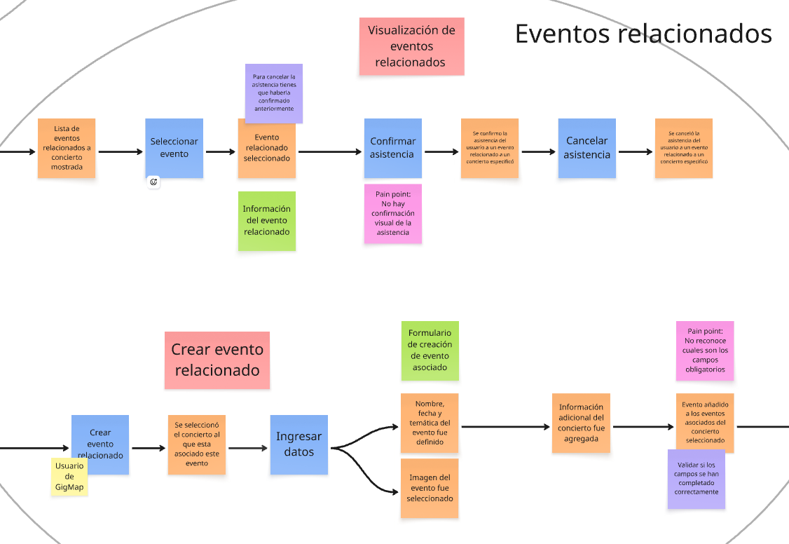

**Registro y autenticación**

**Notificaciones**

### 2.5.1.2. Domain Message Flows Modeling

El siguiente modelo describe cómo fluyen los mensajes y acciones entre los distintos bounded contexts de la aplicación móvil. Cada contexto encapsula una parte del dominio, y se comunican entre sí a través de eventos y comandos de dominio. Los usuarios interactúan desde la app móvil (ya sean artistas o fans), y esas interacciones desencadenan mensajes que conectan los contextos.

**Registro y Autenticación y Conciertos:**

Al iniciar sesión en la aplicación, el usuario puede acceder a los conciertos disponibles para buscar presentaciones existentes y también visualizarlas en el mapa. Si el usuario tiene el rol de artista, puede crear nuevos conciertos que luego estarán visibles para otros usuarios en el mapa.

**Registro y Autenticación y Comunidades:**

Al iniciar sesión en la aplicación, el usuario puede acceder a la sección de comunidades para explorar las que ya existen o crear una nueva. Puede completar la información necesaria para formar o crear su propia comunidad, la cual quedará visible para otros usuarios que también hayan iniciado sesión.

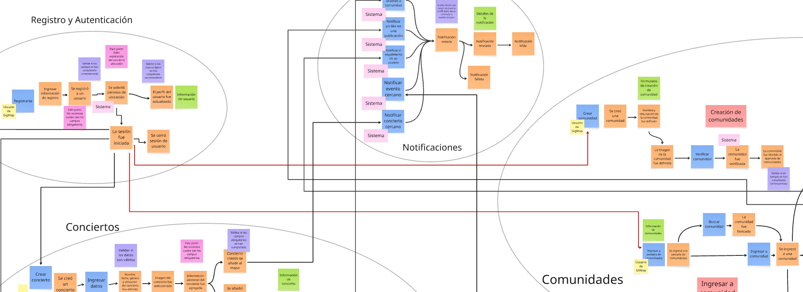

**Conciertos y Eventos relacionados:**

Cuando un usuario selecciona un concierto, puede ver la lista de eventos relacionados que han sido asociados a ese concierto. Además, tanto los fans como los artistas pueden crear nuevos eventos relacionados que quedarán vinculados al concierto seleccionado, permitiendo ampliar la información y las actividades en torno a ese concierto.

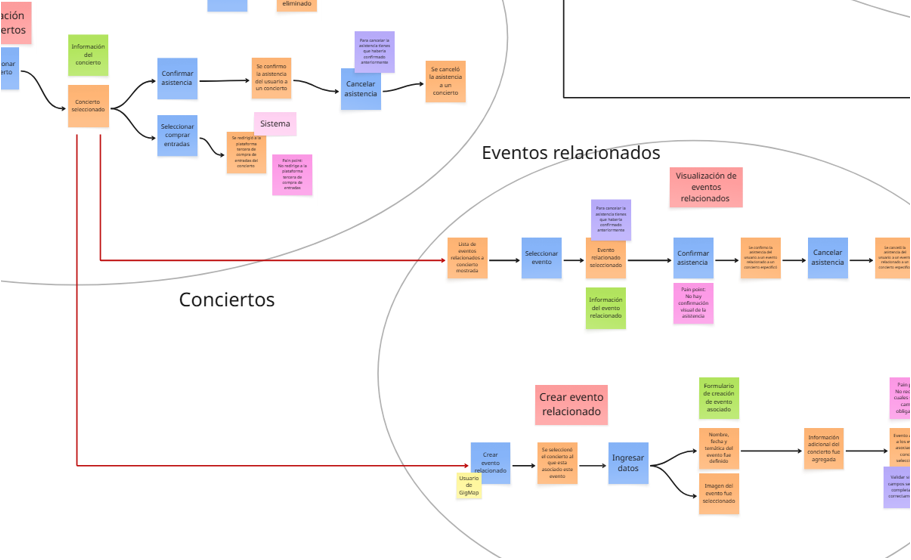

**Notificaciones y eventos relacionados:**

Cuando se añade un evento relacionado a un concierto seleccionado, se envía una notificación a los usuarios cercanos para informarles sobre la nueva actividad vinculada a ese concierto.

**Conciertos y notificaciones:**

Cuando se crea un concierto y se añade al mapa, se envía una notificación a los usuarios cercanos para informarles sobre el nuevo concierto disponible en su zona.

**Comunidades y notificaciones:**

Cuando un usuario publica un comentario en una publicación, se envía una notificación al autor de la publicación. Si un usuario da like a una publicación, se envía una notificación a su creador. Además, cuando un usuario comienza a seguir a otro, se envía una notificación al usuario seguido para informarle.

**Vista completa:**

Este modelo corresponde al Event Storming de la aplicación de GigMap, utilizado para identificar los flujos principales del dominio y agruparlos en bounded contexts que delimitan responsabilidades y reducen la complejidad. La aplicación se organiza en distintos bounded contexts: Registro y Autenticación, que gestiona el registro, inicio de sesión y perfiles de usuario; Conciertos, donde los artistas crean, modifican y eliminan conciertos y los usuarios pueden buscarlos o visualizarlos en el mapa; Eventos relacionados, que permite añadir actividades complementarias a los conciertos; Comunidades, que permite crear y gestionar comunidades temáticas para que los usuarios interactúen; y Notificaciones, que informa a los usuarios sobre nuevas actividades relevantes como conciertos, eventos cercanos, seguidores, likes o comentarios en publicaciones.

URL del Miro board: `https://miro.com/app/board/uXjVJJVTxdE=/?share_link_id=263549564316`

### 2.5.1.3. Bounded Context Canvases

En esta sección, definimos los Bounded Contexts que estructuran el dominio principal de Gigmap. El diseño de estos contextos se realiza siguiendo un enfoque iterativo que busca asegurar claridad conceptual, separación de responsabilidades y alineamiento con las necesidades del negocio. Para cada contexto se desarrolla un Bounded Context Canvas, el cual nos permite capturar su propósito, reglas de negocio, capacidades, dependencias y lenguaje ubicuo.

El proceso seguido incluye los siguientes pasos clave:

- **Context Overview Definition:** Se define el alcance y propósito del contexto, detallando qué problema resuelve y cómo se conecta con la visión general del sistema.

- **Business Rules Distillation & Ubiquitous Language Capture:** Se identifican las reglas de negocio propias del contexto y se establece un lenguaje común (ubiquitous language) compartido por desarrolladores y expertos del dominio, evitando ambigüedades.

- **Capability Analysis:** Se descomponen las funcionalidades principales del contexto en capacidades concretas que este debe proveer para cumplir con su propósito.

- **Capability Layering:** Se organiza cada capacidad en capas (por ejemplo: núcleo de dominio, soporte o interfaz), identificando qué es esencial y qué es complementario.

- **Dependencies Capture:** Se identifican las relaciones y dependencias con otros Bounded Contexts, señalando flujos de datos o integraciones necesarias.

- **Design Critique:** Se realiza una evaluación crítica del diseño, verificando si el contexto está bien delimitado, si su lenguaje es claro y si no existen solapamientos con otros contextos.

A continuación, se muestra cada Bounded Context Canvas para cada uno de nuestros bounded context.

**Conciertos**: Aquí se centraliza la gestión de los eventos musicales principales. Incluye la creación, registro, detalles, fechas, localización y datos clave de conciertos, funcionando como el eje central de descubrimiento de eventos musicales.

**Comunidades**: Este contexto gestiona los espacios de interacción entre los usuarios, permitiendo la creación, administración y participación en comunidades relacionadas con intereses musicales. Representa el núcleo social de la aplicación, donde se agrupan fans y artistas.

**Eventos relacionados**: Este contexto permite la creación y coordinación de eventos secundarios vinculados a un concierto (ejemplo: reuniones de fans antes de un show). Extiende la experiencia principal, reforzando la interacción y la vivencia en torno a un concierto.

**Registro y Autenticación**: Este contexto se encarga de la gestión de identidades y accesos. Define la autenticación de usuarios, los niveles de permisos y el control de seguridad que regula cómo los diferentes actores interactúan con el sistema.

**Notificaciones**: Este contexto cubre la comunicación proactiva hacia los usuarios, enviando recordatorios, alertas y actualizaciones relevantes sobre conciertos, comunidades o eventos relacionados.

## 2.5.2. Context Mapping

El Context Mapping es una técnica estratégica dentro del enfoque de Domain-Driven Design (DDD) que permite visualizar cómo interactúan los distintos Bounded Contexts dentro de un sistema complejo. Mediante este mapeo se identifican las relaciones, dependencias y flujos de información, así como los patrones de colaboración utilizados entre contextos (como Customer/Supplier, Conformist, Partnership o Anticorruption Layer). Esta herramienta permite mantener una arquitectura modular, favoreciendo que cada contexto evolucione de forma autónoma sin generar acoplamientos innecesarios.

En la aplicación GigMap se identificaron cinco bounded contexts principales: Registro y Autenticación, Conciertos, Eventos relacionados, Comunidades y Notificaciones.
El contexto de Registro y Autenticación actúa como un Open Host Service (OHS) al ser el proveedor central de información de usuarios y roles, mientras que los demás contextos consumen estos datos. Conciertos permite a los artistas crear presentaciones y actúa como upstream para Eventos relacionados (que se asocian a un concierto) y para Notificaciones (que avisa sobre nuevos conciertos). Comunidades permite la interacción social entre usuarios y también envía eventos a Notificaciones cuando ocurren likes, comentarios o seguimientos. Eventos relacionados no depende de Registro y Autenticación directamente, sino que obtiene su contexto desde Conciertos y envía sus propios eventos a Notificaciones.

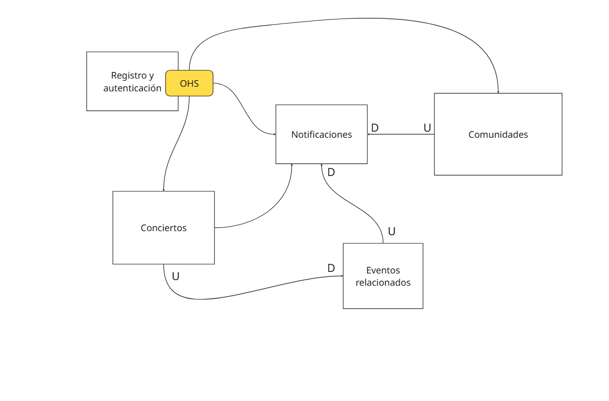

<table>
  <thead>
    <tr>
      <th>Destino (Downstream)</th>
      <th>Origen (Upstream)</th>
      <th>Tipo de Relación</th>
      <th>¿OHS?</th>
      <th>Comentario</th>
    </tr>
  </thead>
  <tbody>
    <tr>
      <td>Conciertos</td>
      <td>Registro y Autenticación</td>
      <td>Customer/Supplier</td>
      <td>Sí</td>
      <td>Consume información de usuarios y roles para permitir creación de conciertos.</td>
    </tr>
    <tr>
      <td>Comunidades</td>
      <td>Registro y Autenticación</td>
      <td>Customer/Supplier</td>
      <td>Sí</td>
      <td>Requiere información de perfil para creación y administración de comunidades.</td>
    </tr>
    <tr>
      <td>Notificaciones</td>
      <td>Registro y Autenticación</td>
      <td>Customer/Supplier</td>
      <td>Sí</td>
      <td>Utiliza datos del usuario (nombre, token, ubicación) para enviar notificaciones.</td>
    </tr>
    <tr>
      <td>Eventos relacionados</td>
      <td>Conciertos</td>
      <td>Customer/Supplier</td>
      <td>No</td>
      <td>Necesita datos del concierto seleccionado para asociar eventos.</td>
    </tr>
    <tr>
      <td>Notificaciones</td>
      <td>Conciertos</td>
      <td>Partnership</td>
      <td>No</td>
      <td>Recibe eventos de creación/modificación de conciertos para notificar usuarios.</td>
    </tr>
    <tr>
      <td>Notificaciones</td>
      <td>Eventos relacionados</td>
      <td>Partnership</td>
      <td>No</td>
      <td>Recibe eventos de nuevos eventos relacionados para notificar usuarios.</td>
    </tr>
    <tr>
      <td>Notificaciones</td>
      <td>Comunidades</td>
      <td>Partnership</td>
      <td>No</td>
      <td>Notifica likes, comentarios y nuevos seguidores en comunidades.</td>
    </tr>
  </tbody>
</table>

## 2.5.3. Software Architecture

### 2.5.3.1. Software Architecture Context Level Diagrams

El diagrama de contexto de GigMap muestra cómo la aplicación se relaciona con sus principales actores: Fans y Artistas. Los fans descubren conciertos cercanos, reciben alertas y comparten asistencia, mientras que los artistas publican y editan shows para interactuar con su audiencia. GigMap actúa como sistema central que conecta a ambos, facilitando la gestión y difusión de eventos musicales.

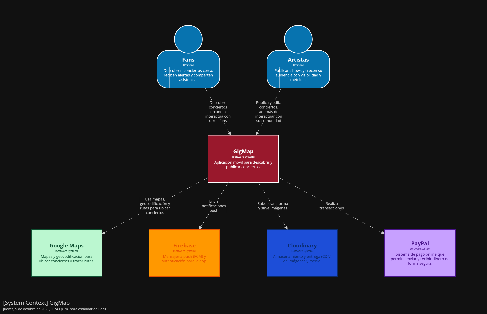

### 2.5.3.2. Software Architecture Container Level Diagrams

El diagrama de contenedores detalla los elementos internos de GigMap. La aplicación móvil (Flutter/React Native) permite a los usuarios descubrir y gestionar conciertos, consumiendo los servicios expuestos por una API REST (Node.js/Spring Boot). Esta API coordina la lógica del sistema y persiste datos en una base MySQL. Además, se incluye una Landing Page (Next.js/React) que facilita el acceso rápido a información y registro de usuarios.

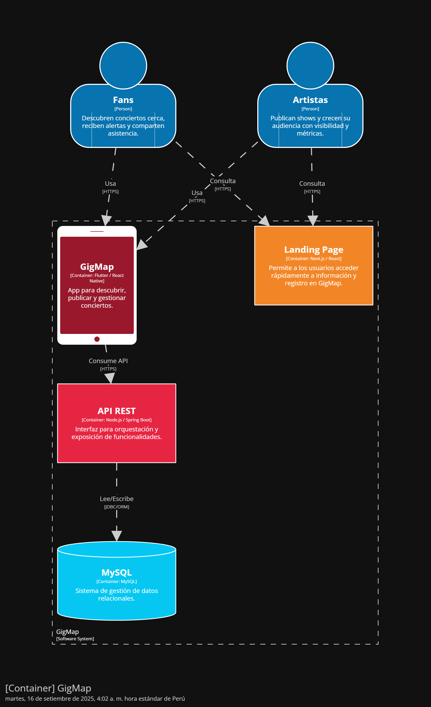

### 2.5.3.3. Software Architecture Deployment Diagrams

El diagrama de despliegue describe la infraestructura de GigMap en producción. La aplicación móvil se comunica vía HTTPS con la API REST desplegada en contenedores Docker sobre instancias AWS EC2. La API interactúa con una base de datos MySQL gestionada en AWS RDS, que almacena de manera confiable la información de conciertos, usuarios y comunidades.

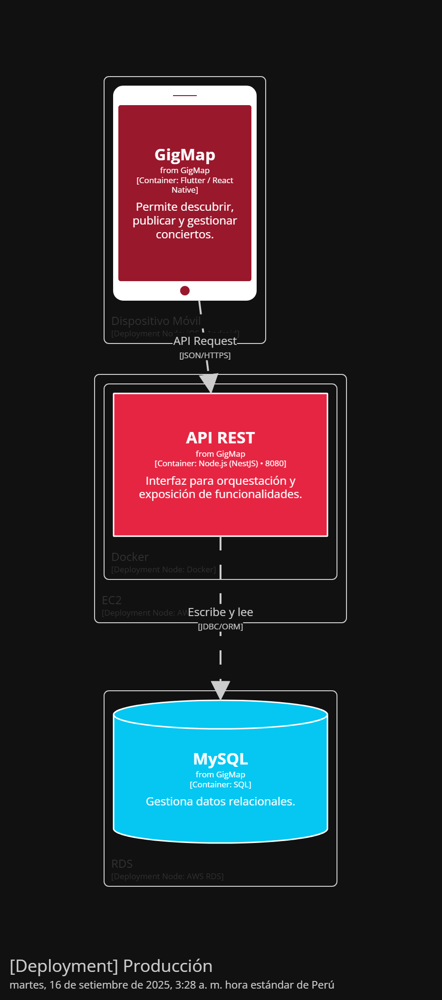

# 2.6. Tactical-Level Domain-Driven Design
## 2.6.1. Bounded Context: Conciertos
### 2.6.1.1. Domain Layer

El Domain Layer en el bounded context Conciertos modela el núcleo del negocio centrado en la gestión de conciertos y sus características principales.
Este contexto permite que los artistas creen conciertos, que los usuarios los descubran mediante búsquedas o filtros, y que se garantice la consistencia de la información (fecha, lugar, género, etc.).

Se implementó el Aggregate principal:

- Concert: agrupa la información y comportamiento relacionado con los conciertos, incluyendo título, descripción, artista, género musical, ubicación, fecha, capacidad y precio de entrada. También valida reglas de negocio como la existencia de otro concierto en la misma fecha y lugar.

Las reglas de negocio y la orquestación de acciones en el contexto de Conciertos se manejan a través de Domain Services, divididos en servicios de comandos y de consultas. Los Command Services gestionan operaciones que modifican el estado del dominio, como la creación, actualización, eliminación y publicación de conciertos mediante el `ConcertCommandService`. Por su parte, los Query Services se enfocan en el acceso a información de solo lectura, como el `ConcertQueryService`, que recupera conciertos filtrados por criterios como artista, género, fecha o ubicación

<h3>Aggregate: ConcertAggregate</h3>

<strong>Descripción:</strong>  Representa un concierto programado en la aplicación, incluyendo su capacidad, fecha, recinto, ubicación y artistas participantes. Emite eventos de dominio a lo largo de su ciclo de vida.

<h4>Entity: Concert</h4>
<table>
  <thead>
    <tr>
      <th>Atributos</th>
      <th>Tipo</th>
      <th>Descripción</th>
    </tr>
  </thead>
  <tbody>
    <tr>
      <td>id</td>
      <td>UUID</td>
      <td>Identificador único del concierto.</td>
    </tr>
    <tr>
      <td>name</td>
      <td>String</td>
      <td>Título o nombre público del concierto.</td>
    </tr>
    <tr>
      <td>datehour</td>
      <td>LocalDateTime</td>
      <td>Fecha y hora de inicio del concierto.</td>
    </tr>
    <tr>
      <td>venue</td>
      <td>Venue</td>
      <td>Latitud/longitud y dirección del evento.</td>
    </tr>
    <tr>
      <td>estado</td>
      <td>ConcertStatus</td>
      <td>Estado del concierto (BORRADOR, PROGRAMADO, PUBLICADO, …).</td>
    </tr>
    <tr>
      <td>artist</td>
      <td>Artist</td>
      <td>Artistas/performances asociados al concierto.</td>
    </tr>
    <tr>
      <td>genre</td>
      <td>Genre</td>
      <td>Género musical (K-pop, Pop, Rock, etc)</td>
    </tr>
    <tr>
      <td>created_at</td>
      <td>LocalDateTime</td>
      <td>Marca de tiempo de creación.</td>
    </tr>
    <tr>
      <td>updated_at</td>
      <td>LocalDateTime</td>
      <td>Última modificación.</td>
    </tr>
  </tbody>
</table>

<h4>Entity: Artist</h4>
<table>
  <thead>
    <tr>
      <th>Atributos</th>
      <th>Tipo</th>
      <th>Descripción</th>
    </tr>
  </thead>
  <tbody>
    <tr>
      <td>id</td>
      <td>UUID</td>
      <td>Identificador del artista dentro del concierto.</td>
    </tr>
    <tr>
      <td>name</td>
      <td>String</td>
      <td>Nombre artístico.</td>
    </tr>
    <tr>
      <td>description</td>
      <td>String</td>
      <td>Reseña breve.</td>
    </tr>
    <tr>
      <td>genre</td>
      <td>Genre</td>
      <td>Géneros musicales asociados.</td>
    </tr>
  </tbody>
</table>

<h3>ValueObject: Venue</h3>

<strong>Descripción:</strong> Representa el lugar físico donde se llevará a cabo un concierto. Contiene información relevante como el nombre del recinto, la dirección, la capacidad y las coordenadas geográficas (latitud y longitud). 

<table>
  <tr>
    <th>Atributos</th>
    <th>Tipo</th>
    <th>Descripción</th>
  </tr>
  <tr>
    <td>latitud</td>
    <td>double</td>
    <td>Latitud geográfica.</td>
  </tr>
  <tr>
    <td>longitud</td>
    <td>double</td>
    <td>Longitud geográfica.</td>
  </tr>
  <tr>
    <td>direccion</td>
    <td>String</td>
    <td>Dirección del recinto.</td>
  </tr>
  <tr>
    <td>capacidad</td>
    <td>String</td>
    <td>Capacidad del concierto.</td>
  </tr>
</table>

<h3>Enumeration</h3>
<table>
  <tr>
    <th>Enumeración</th>
    <th>Valores</th>
  </tr>
  <tr>
    <td>Status</td>
    <td>BORRADOR, PROGRAMADO, PUBLICADO, ENCURSO, FINALIZADO, CANCELADO</td>
  </tr>
  <tr>
    <td>Genre</td>
    <td>ROCK, POP, ELECTRONICA, URBANO, JAZZ, INDIE, CLASICO, METAL, FOLK, OTROS (extensible)</td>
  </tr>
</table>

<h3>Domain Services</h3>
<table>
  <tr>
    <th>Nombre</th>
    <th>Responsabilidad</th>
    <th>Reglas Aplicadas y Métodos</th>
  </tr>
  <tr>
    <td>ConcertCommandService</td>
    <td>Gestionar la creación, actualización y eliminación de conciertos.</td>
    <td>
      - Solo artistas registrados pueden crear conciertos. 
      - Validar que no haya conciertos en el mismo recinto, día y hora. 
      - Métodos: createConcert(), updateConcert(), deleteConcert().
    </td>
  </tr>
  <tr>
    <td>ConcertQueryService</td>
    <td>Obtener conciertos por diferentes criterios de búsqueda.</td>
    <td>
      - Consultas de solo lectura sin modificar el estado. 
      - Métodos: getConcertById(), getConcertsByArtist(), getConcertsByGenre(), getConcertsByDate(), getAllConcerts().
    </td>
  </tr>
</table>

### 2.6.1.2. Interface Layer

La Interface/Presentation Layer constituye la puerta de entrada al sistema, permitiendo la interacción de clientes externos como aplicaciones móviles, aplicaciones web y consumidores de servicios externos con el dominio de Conciertos dentro de GigMap.
En esta capa se exponen los endpoints REST, implementados a través de controladores, que encapsulan las operaciones de consulta y modificación del agregado Concierto y sus entidades asociadas.

<h2>Controllers</h3>
<h3>ConcertsController</h3>
<table>
  <tr>
    <th>Nombre</th>
    <th>Método</th>
    <th>Ruta</th>
    <th>Descripción</th>
  </tr>
  <tr>
    <td>createConcert</td>
    <td>POST</td>
    <td>/api/v1/concerts</td>
    <td>Crea un nuevo concierto a partir de los datos recibidos (nombre, fecha, ubicación, capacidad, artista).</td>
  </tr>
  <tr>
    <td>getAllConcerts</td>
    <td>GET</td>
    <td>/api/v1/concerts</td>
    <td>Recupera la lista completa de conciertos disponibles en la aplicación</td>
  </tr>
  <tr>
    <td>getConcertById</td>
    <td>GET</td>
    <td>/api/v1/concerts/{id}</td>
    <td>Obtiene los detalles de un concierto específico mediante su identificador único.</td>
  </tr>
  <tr>
    <td>getConcertsByArtist</td>
    <td>GET</td>
    <td>/api/v1/concerts/artist/{artistId}</td>
    <td>Devuelve todos los conciertos asociados a un artista en particular.</td>
  </tr>
  <tr>
    <td>getConcertsByGenre</td>
    <td>GET</td>
    <td>/api/v1/concerts/genre/{genre}</td>
    <td>Filtra y devuelve conciertos según el género musical especificado.</td>
  </tr>
  <tr>
    <td>getConcertsByDate</td>
    <td>GET</td>
    <td>/api/v1/concerts/date/{yyyy-MM-dd}</td>
    <td>Lista conciertos programados para una fecha determinada.</td>
  </tr>
  <tr>
    <td>updateConcert</td>
    <td>PUT</td>
    <td>/api/v1/concerts/{id}</td>
    <td>Actualiza los datos de un concierto en estado BORRADOR o PROGRAMADO (nombre, capacidad, artistas).</td>
  </tr>
  <tr>
    <td>deleteConcert</td>
    <td>DELETE</td>
    <td>/api/v1/concerts/{id}</td>
    <td>Elimina un concierto si aún no ha sido publicado ni ejecutado.</td>
  </tr>
</table>

### 2.6.1.3. Application Layer

En esta capa se gestionan los flujos de procesos de negocio relacionados al bounded context de Conciertos.

Se utilizan Command Handlers para procesar comandos que representan acciones explícitas solicitadas por los usuarios o sistemas externos, y Event Handlers para reaccionar a eventos generados dentro del dominio.

Los Command Handlers son responsables de orquestar las operaciones necesarias, interactuar con el Domain Layer y asegurar la ejecución correcta de las reglas de negocio.

Clases principales:

- ConcertCommandHandler: encargado de manejar los comandos relacionados con la creación, actualización y eliminación de conciertos.
- ConcertEventHandler: maneja los eventos que se generan tras una acción en el dominio (ejemplo: un concierto creado o actualizado).

<h3>Concert Command Handler</h3>
<table>
  <tr>
    <th>Capability</th>
    <th>Command Handler</th>
    <th>Descripción</th>
  </tr>
  <tr>
    <td>Crear concierto</td>
    <td>ConcertCommandServiceImpl.handle(CreateConcertCommand)</td>
    <td>Gestiona la creación de un nuevo concierto con sus datos principales.</td>
  </tr>
  <tr>
    <td>Actualizar concierto</td>
    <td>ConcertCommandServiceImpl.handle(UpdateConcertCommand)</td>
    <td>Permite modificar la información de un concierto existente.</td>
  </tr>
  <tr>
    <td>Eliminar concierto</td>
    <td>ConcertCommandServiceImpl.handle(DeleteConcertCommand)</td>
    <td>Gestiona la eliminación lógica o física de un concierto.</td>
  </tr>
</table>

<h3>Concert Event Handler</h3>
<table>
  <tr>
    <th>Evento</th>
    <th>Event Handler</th>
    <th>Descripción</th>
  </tr>
  <tr>
    <td>Concierto creado</td>
    <td>ConcertEventHandler.handle(ConcertCreatedEvent)</td>
    <td>Reacciona a la creación de un nuevo concierto y puede notificar a otros sistemas o actualizar proyecciones.</td>
  </tr>
  <tr>
    <td>Concierto actualizado</td>
    <td>ConcertEventHandler.handle(ConcertUpdatedEvent)</td>
    <td>Maneja el evento de actualización de un concierto, asegurando que los cambios se reflejen en el sistema.</td>
  </tr>
  <tr>
    <td>Concierto eliminado</td>
    <td>ConcertEventHandler.handle(ConcertDeletedEvent)</td>
    <td>Responde a la eliminación de un concierto y gestiona las consecuencias (ej. remover proyecciones o notificar).</td>
  </tr>
</table>

### 2.6.1.4 Infrastructure Layer

En esta capa se implementa el acceso a los servicios externos que necesita el sistema para funcionar. Su principal responsabilidad es garantizar la persistencia de los datos y la comunicación con recursos externos como bases de datos, sistemas de mensajería o servicios de terceros, siempre respetando los contratos definidos en el Domain Layer.

Dentro del bounded context de Conciertos, la clase principal es:

- ConcertRepositoryImpl: implementación concreta de la interfaz ConcertRepository. Esta clase se encarga de administrar el ciclo de vida de los conciertos en la base de datos, proporcionando operaciones como guardar, actualizar, buscar o eliminar conciertos. Asimismo, incluye validaciones para asegurar la consistencia de los datos, como evitar conciertos duplicados en la misma fecha y lugar, o verificar la existencia de un artista antes de asociarlo a un evento.

<h3>Repositories</h3>
<h4>ConcertRepository</h4>
<table>
  <tr>
    <th>Método</th>
    <th>Descripción</th>
  </tr>
  <tr>
    <td>save(Concert concert)</td>
    <td>Persiste un nuevo concierto en la base de datos o actualiza uno existente.</td>
  </tr>
  <tr>
    <td>findById(Long id)</td>
    <td>Busca y retorna un concierto según su identificador único.</td>
  </tr>
  <tr>
    <td>findByArtist(String artistName)</td>
    <td>Retorna todos los conciertos asociados a un artista específico.</td>
  </tr>
  <tr>
    <td>findByGenre(String genre)</td>
    <td>Obtiene la lista de conciertos filtrados por género musical.</td>
  </tr>
  <tr>
    <td>deleteById(Long id)</td>
    <td>Elimina un concierto específico según su identificador.</td>
  </tr>
  <tr>
    <td>existsByName(String name)</td>
    <td>Verifica si existe un concierto con un nombre determinado.</td>
  </tr>
  <tr>
    <td>existsByDateAndLocation(Date date, String location)</td>
    <td>Comprueba si ya existe un concierto en la misma fecha y lugar (evita duplicados).</td>
  </tr>
  <tr>
    <td>findUpcomingConcerts()</td>
    <td>Lista todos los conciertos futuros ordenados por fecha.</td>
  </tr>
  <tr>
    <td>findPastConcerts()</td>
    <td>Lista todos los conciertos pasados para historial o analítica.</td>
  </tr>
</table>

### 2.6.1.5. Bounded Context Software Architecture Component Level Diagrams

El diagrama de componentes del bounded context de Conciertos muestra cómo se organiza el sistema en controladores, servicios y repositorios. Los Controllers exponen endpoints HTTP para crear, actualizar, consultar o eliminar conciertos. Los Services manejan la lógica de negocio, separando los comandos (acciones que cambian el estado del sistema) de las consultas (lecturas sin modificar datos). Los Repositories, como ConcertRepositoryImpl, se encargan de la persistencia y recuperación de conciertos en la base de datos. Finalmente, el contenedor Database representa la infraestructura donde se almacena la información. Esta vista permite entender de manera clara cómo se conectan las partes internas sin depender directamente unas de otras.

### 2.6.1.6. Bounded Context Software Architecture Code Level Diagrams
#### 2.6.1.6.1. Bounded Context Domain Layer Class Diagrams

El siguiente diagrama de clases representa el bounded context Conciertos y muestra como agregado principal a Concert, acompañado del agregado Artist y el value object Venue. Además, se incluyen las interfaces de repositorio ConcertRepository y ArtistRepository.

El agregado Concert tiene atributos como id: UUID, name: String, capacity: Integer, dateHour: LocalDateTime, venue: Venue, status: ConcertStatus, artist: Artist, createdAt: LocalDateTime y updatedAt: LocalDateTime. Representa un evento musical programado en el sistema. Sus métodos incluyen scheduleConcert(), updateConcert(), publishConcert(), cancelConcert() y isDuplicateByDateAndVenue(), los cuales permiten gestionar el ciclo de vida de un concierto, desde su creación hasta su finalización o cancelación.

El value object Venue encapsula los datos de ubicación y capacidad de un evento. Posee atributos como latitude: double, longitude: double, address: String y capacity: Integer, que describen dónde se llevará a cabo el concierto y cuántos asistentes permite.

La value object enum ConcertStatus modela el estado de un concierto (BORRADOR, PROGRAMADO, PUBLICADO, EN_CURSO, FINALIZADO, CANCELADO) y la enumeración Genre clasifica los géneros musicales (ROCK, POP, ELECTRÓNICA, URBANO, JAZZ, INDIE, CLÁSICO, METAL, FOLK, OTROS).

La interfaz ConcertRepository define operaciones de acceso a datos para conciertos, como findById(), findByArtist(), findByGenre(), findByDate(), existsByName(), existsByDateAndVenue(), findUpcomingConcerts() y findPastConcerts(). La interfaz ArtistRepository se encarga de la gestión de artistas, con métodos como save(), findById(), findByGenre() y findAll().

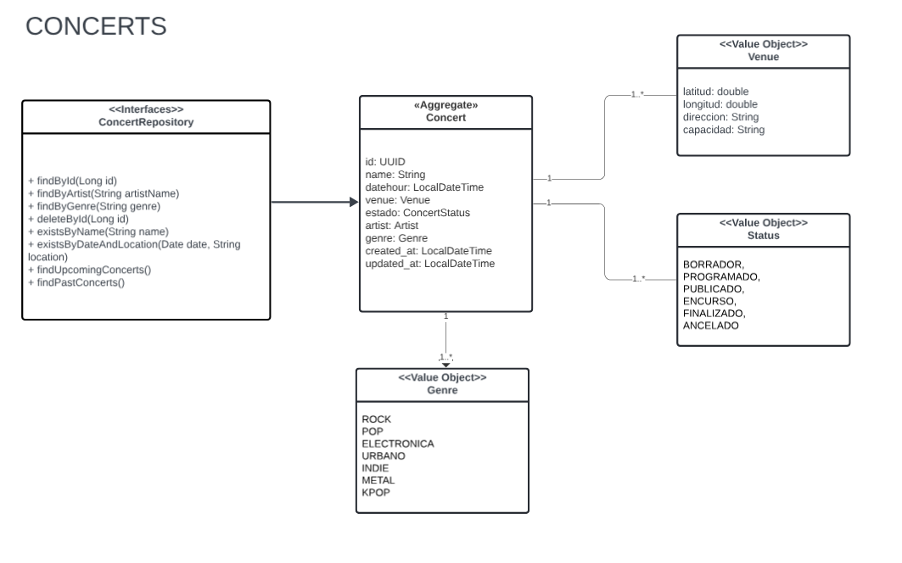

#### 2.6.1.6.2. Bounded Context Database Design Diagram

El modelo entidad–relación del bounded context de Conciertos está conformado por las entidades Artist, Venues, Concerts y la tabla relacional ConcertAttendees. La entidad Artist almacena los géneros musicales y la descripción de los intérpretes, mientras que Venues representa los espacios físicos con datos como dirección, capacidad y coordenadas geográficas.

El núcleo lo constituye Concerts, encargado de gestionar la información esencial de cada evento (nombre, género, fecha, estado, descripción, imagen, plataforma, creación y actualización), además de establecer la relación con un venue y con los artistas participantes. Por su parte, ConcertAttendees registra la asistencia de usuarios mediante una relación de muchos a muchos con los conciertos, permitiendo medir participación y habilitar funciones de interacción social.

En conjunto, este diseño posibilita administrar conciertos, vincularlos con artistas y venues, y dar seguimiento a la asistencia, asegurando consistencia de datos y soporte para los principales casos de uso de la aplicación.

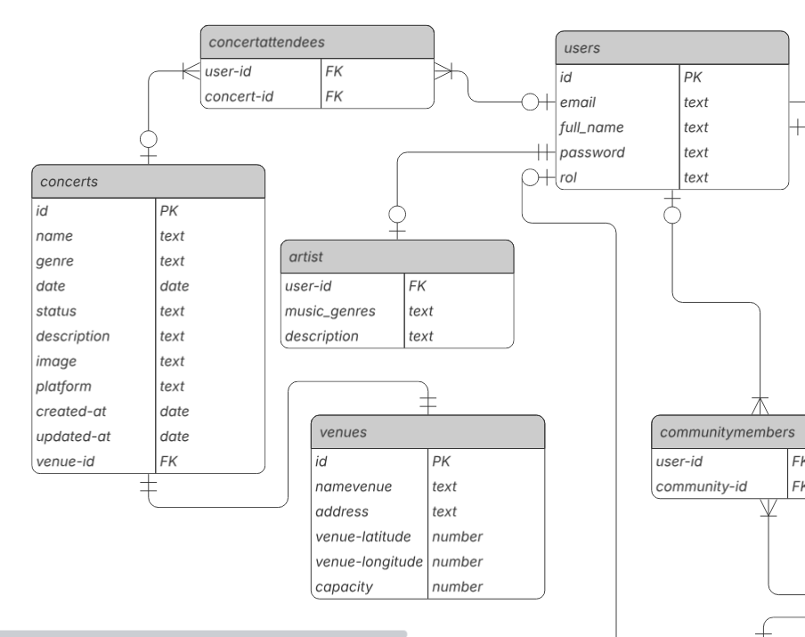

## 2.6.2. Bounded Context: Comunidades
### 2.6.2.1. Domain Layer
El Domain Layer en el bounded context Comunidades modela el núcleo del negocio centrado en la creación de comunidades y la interacción social entre sus miembros y los artistas. Este contexto permite que los usuarios creen comunidades, se unan a ellas, y publiquen contenido que puede recibir likes de otros miembros, fomentando así la participación e intercambio dentro de cada comunidad.

Se implementan dos Aggregates principales: Community y Post.
	- Community: agrupa la información y el comportamiento relacionado a las comunidades, incluyendo su nombre, descripción, imagen y lista de miembros y publicaciones.
	- Post: representa las publicaciones realizadas dentro de una comunidad, asociadas a un autor y que pueden recibir likes de otros miembros.

Para modelar la interacción social, se añade además el Value Object Like, que encapsula la acción de un usuario al reaccionar a una publicación.
 
Las reglas de negocio y la orquestación de acciones se manejan a través de `Command Services`, que procesan comandos como `CreateCommunityCommand`, `JoinCommunityCommand`, `CreatePostCommand` o `LikePostCommand`para cambiar el estado del dominio, y Query Services, que permiten acceder a la información existente mediante consultas como `GetAllCommunitiesQuery`, `GetCommunityByIdQuery` o `GetAllPostsByCommunityQuery`.

<h3>Aggregate: CommunityAggregate</h3>

<strong>Descripción:</strong> Agregado raíz que gestiona la creación de comunidades, la administración de sus miembros y la publicación de contenido, garantizando las reglas de negocio de participación e interacción entre miembros y artistas.

<h4>Entity: Community</h4>
<table>
  <thead>
    <tr>
      <th>Atributo</th>
      <th>Tipo</th>
      <th>Descripción</th>
    </tr>
  </thead>
  <tbody>
    <tr>
      <td>id</td>
      <td>UUID</td>
      <td>Identificador único de la comunidad</td>
    </tr>
    <tr>
      <td>name</td>
      <td>String</td>
      <td>Nombre de la comunidad</td>
    </tr>
    <tr>
      <td>description</td>
      <td>String</td>
      <td>Descripción de la comunidad</td>
    </tr>
    <tr>
      <td>imageUrl</td>
      <td>String</td>
      <td>Imagen representativa de la comunidad</td>
    </tr>
    <tr>
      <td>members</td>
      <td>Set&lt;User&gt;</td>
      <td>Miembros actuales de la comunidad</td>
    </tr>
    <tr>
      <td>posts</td>
      <td>List&lt;Post&gt;</td>
      <td>Publicaciones creadas dentro de la comunidad</td>
    </tr>
  </tbody>
</table>

<h3>Aggregate: PostAggregate</h3>

<strong>Descripción:</strong> Agregado raíz que gestiona las publicaciones realizadas dentro de una comunidad, permitiendo interacciones sociales como likes de otros miembros.

<h4>Entity: Post</h4>
<table>
  <thead>
    <tr>
      <th>Atributo</th>
      <th>Tipo</th>
      <th>Descripción</th>
    </tr>
  </thead>
  <tbody>
    <tr>
      <td>id</td>
      <td>UUID</td>
      <td>Identificador único de la publicación</td>
    </tr>
    <tr>
      <td>content</td>
      <td>String</td>
      <td>Contenido textual del post</td>
    </tr>
    <tr>
      <td>imageUrl</td>
      <td>String</td>
      <td>Imagen asociada a la publicación</td>
    </tr>
    <tr>
      <td>community</td>
      <td>Community</td>
      <td>Comunidad a la que pertenece el post</td>
    </tr>
    <tr>
      <td>user</td>
      <td>User</td>
      <td>Usuario o artista que creó la publicación</td>
    </tr>
  </tbody>
</table>

<h3>ValueObject: Like</h3>

<strong>Descripción:</strong> Objeto de valor que representa la acción de un usuario al dar like a una publicación. 

<table>
  <thead>
    <tr>
      <th>Atributo</th>
      <th>Tipo</th>
      <th>Descripción</th>
    </tr>
  </thead>
  <tbody>
	   <tr>
      <td>userId</td>
      <td>UUID</td>
      <td>Identificador único del usuario</td>
    </tr>
    <tr>
      <td>postId</td>
      <td>UUID</td>
      <td>Identificador único de la publicación</td>
    </tr>
	<tr>
      <td>createdAt</td>
      <td>Instant</td>
      <td>Fecha y hora en que el usuario realizó el like</td>
    </tr>
  </tbody>
</table>

<h3>Domain Services</h3>
<table>
  <thead>
    <tr>
      <th>Nombre</th>
      <th>Responsabilidad</th>
      <th>Reglas Aplicadas y Métodos</th>
    </tr>
  </thead>
  <tbody>
    <tr>
      <td>CommunityCommandService</td>
      <td>Gestionar la creación de comunidades y la unión o salida de miembros.</td>
      <td>
        - Solo usuarios registrados pueden crear o unirse. 
        - Un usuario no puede unirse dos veces.
      </td>
    </tr>
    <tr>
      <td>PostCommandService</td>
      <td>Gestionar la creación de publicaciones y la interacción con likes.</td>
      <td>
        - Solo miembros pueden publicar o dar like. 
        - No se permiten likes duplicados.
      </td>
    </tr>
    <tr>
      <td>CommunityQueryService</td>
      <td>Obtener comunidades existentes o una comunidad específica.</td>
      <td>- Consultas de solo lectura sin modificar estado del dominio.</td>
    </tr>
    <tr>
      <td>PostQueryService</td>
      <td>Obtener publicaciones por comunidad o por ID.</td>
      <td>- Consultas de solo lectura sin modificar estado del dominio.</td>
    </tr>
  </tbody>
</table>

### 2.6.2.2. Interface Layer

La Interface Layer del bounded context Comunidades actúa como el punto de entrada entre los usuarios de la aplicación y la lógica de dominio.
Su función es recibir solicitudes HTTP, validar los datos básicos y transformarlos en comandos que la capa de dominio pueda procesar, delegando toda la lógica de negocio a los servicios de aplicación (Command y Query Services).

También es responsable de retornar las respuestas en formato estandarizado (JSON) y gestionar códigos de estado HTTP adecuados (201, 200, 404, 400, etc.), protegiendo el dominio de los detalles técnicos del transporte (protocolo HTTP, formato de entrada, etc.).
<h2>Controllers</h3>
<h3>CommunitiesController</h3>
<table>
  <thead>
    <tr>
      <th>Nombre</th>
      <th>Método</th>
      <th>Ruta</th>
      <th>Descripción</th>
    </tr>
  </thead>
  <tbody>
    <tr>
      <td>createCommunity</td>
      <td>POST</td>
      <td>/api/v1/communities</td>
      <td>Crea una nueva comunidad a partir de los datos enviados por el usuario.</td>
    </tr>
    <tr>
      <td>getAllCommunities</td>
      <td>GET</td>
      <td>/api/v1/communities</td>
      <td>Obtiene todas las comunidades registradas en el sistema.</td>
    </tr>
    <tr>
      <td>getCommunityById</td>
      <td>GET</td>
      <td>/api/v1/communities/{communityId}</td>
      <td>Obtiene los detalles de una comunidad específica por su ID.</td>
    </tr>
    <tr>
      <td>joinCommunity</td>
      <td>POST</td>
      <td>/api/v1/communities/{communityId}/join?userId=</td>
      <td>Permite que un usuario se una a una comunidad existente.</td>
    </tr>
    <tr>
      <td>leaveCommunity</td>
      <td>DELETE</td>
      <td>/api/v1/communities/{communityId}/leave?userId=</td>
      <td>Permite que un usuario abandone una comunidad existente.</td>
    </tr>
  </tbody>
</table>

<h3>PostsController</h3>
<table>
  <thead>
    <tr>
      <th>Nombre</th>
      <th>Método</th>
      <th>Ruta</th>
      <th>Descripción</th>
    </tr>
  </thead>
  <tbody>
    <tr>
      <td>createPost</td>
      <td>POST</td>
      <td>/api/v1/posts</td>
      <td>Crea una nueva publicación dentro de una comunidad.</td>
    </tr>
    <tr>
      <td>getAllPosts</td>
      <td>GET</td>
      <td>/api/v1/posts?communityId=</td>
      <td>Obtiene todas las publicaciones, opcionalmente filtradas por comunidad.</td>
    </tr>
    <tr>
      <td>getPostById</td>
      <td>GET</td>
      <td>/api/v1/posts/{postId}</td>
      <td>Obtiene los detalles de una publicación específica por su ID.</td>
    </tr>
    <tr>
      <td>likePost</td>
      <td>POST</td>
      <td>/api/v1/posts/{postId}/like?userId=</td>
      <td>Permite a un usuario dar like a una publicación.</td>
    </tr>
    <tr>
      <td>unlikePost</td>
      <td>DELETE</td>
      <td>/api/v1/posts/{postId}/like?userId=</td>
      <td>Permite a un usuario quitar su like de una publicación.</td>
    </tr>
  </tbody>
</table>

### 2.6.2.3. Application Layer

La Application Layer del bounded context Comunidades gestiona los flujos de negocio relacionados con la creación de comunidades, la membresía de usuarios y la publicación e interacción con contenido.
Esta capa orquesta los procesos de negocio a través de Command Handlers, que transforman los comandos recibidos desde la capa de interfaz en acciones del dominio, garantizando que las reglas de negocio se apliquen correctamente.
Esta capa es crucial porque centraliza la lógica de negocio de aplicación y separa las responsabilidades de orquestación de la interacción con el dominio, permitiendo mantener el código escalable y facilitar futuras extensiones (como el manejo de eventos o integración con otros bounded contexts).

<h3>Community Command Handler</h3>
<table>
  <thead>
    <tr>
      <th>Capability</th>
      <th>Command Handler</th>
      <th>Descripción</th>
    </tr>
  </thead>
  <tbody>
    <tr>
      <td>Crear comunidad</td>
      <td>CommunityCommandServiceImpl.handle(CreateCommunityCommand)</td>
      <td>Maneja la creación de nuevas comunidades, validando que el nombre no esté duplicado y guardando la entidad.</td>
    </tr>
    <tr>
      <td>Unirse a comunidad</td>
      <td>CommunityCommandServiceImpl.handle(JoinCommunityCommand)</td>
      <td>Maneja la unión de un usuario a una comunidad existente, validando su existencia y actualizando ambas entidades.</td>
    </tr>
    <tr>
      <td>Salir de comunidad</td>
      <td>CommunityCommandServiceImpl.handle(LeaveCommunityCommand)</td>
      <td>Maneja la salida de un usuario de una comunidad, actualizando listas de miembros y persistiendo los cambios.</td>
    </tr>
  </tbody>
</table>

<h3>Post Command Handler</h3>
<table>
  <thead>
    <tr>
      <th>Capability</th>
      <th>Command Handler</th>
      <th>Descripción</th>
    </tr>
  </thead>
  <tbody>
    <tr>
      <td>Crear publicación</td>
      <td>PostCommandServiceImpl.handle(CreatePostCommand)</td>
      <td>Maneja la creación de un post dentro de una comunidad, validando comunidad y usuario antes de guardarlo.</td>
    </tr>
    <tr>
      <td>Dar like a publicación</td>
      <td>PostCommandServiceImpl.handle(LikePostCommand)</td>
      <td>Maneja la adición de un like de un usuario a un post existente.</td>
    </tr>
    <tr>
      <td>Quitar like de publicación</td>
      <td>PostCommandServiceImpl.handle(UndoLikePostCommand)</td>
      <td>Maneja la eliminación de un like previamente otorgado por un usuario a un post.</td>
    </tr>
  </tbody>
</table>

<h3>Community Event Handler</h3>
<table>
  <thead>
    <tr>
      <th>Capability</th>
      <th>Event Handler</th>
      <th>Descripción</th>
    </tr>
  </thead>
  <tbody>
    <tr>
      <td>Comunidad creada</td>
      <td>CommunityCreatedEventHandler</td>
      <td>Maneja el evento de creación de una nueva comunidad, enviando notificaciones a los usuarios interesados.</td>
    </tr>
    <tr>
      <td>Usuario se une a comunidad</td>
      <td>UserJoinedCommunityEventHandler</td>
      <td>Maneja el evento de unión de un usuario a una comunidad, notificando a los demás miembros.</td>
    </tr>
    <tr>
      <td>Usuario sale de comunidad</td>
      <td>UserLeftCommunityEventHandler</td>
      <td>Maneja el evento de salida de un usuario, actualizando el listado de miembros y enviando alertas.</td>
    </tr>
  </tbody>
</table>

<h3>Post Event Handler</h3>
<table>
  <thead>
    <tr>
      <th>Capability</th>
      <th>Event Handler</th>
      <th>Descripción</th>
    </tr>
  </thead>
  <tbody>
    <tr>
      <td>Post creado</td>
      <td>PostCreatedEventHandler</td>
      <td>Maneja el evento de creación de un nuevo post, notificando a los miembros de la comunidad.</td>
    </tr>
    <tr>
      <td>Like agregado a post</td>
      <td>PostLikedEventHandler</td>
      <td>Maneja el evento de que un usuario dio like a un post, notificando al autor de la publicación.</td>
    </tr>
    <tr>
      <td>Like removido de post</td>
      <td>PostUnlikedEventHandler</td>
      <td>Maneja el evento de eliminación de un like, actualizando métricas de interacción.</td>
    </tr>
  </tbody>
</table>

### 2.6.2.4 Infrastructure Layer

La Infrastructure Layer del bounded context Comunidadesse encarga de implementar las dependencias externas necesarias para el funcionamiento del sistema, especialmente el acceso a la base de datos relacional mediante Spring Data JPA</strong>.  
Aquí se desarrollan las clases concretas que cumplen con los contratos definidos en el Domain Layer, permitiendo que los Command Handlers y Query Handlers interactúen con el almacenamiento persistente.
Esta capa permite mantener una arquitectura desacoplada, separando la lógica de dominio de los detalles técnicos de persistencia. Gracias a ello se facilita el mantenimiento, la escalabilidad y la posibilidad de reemplazar tecnologías sin afectar el núcleo del negocio.

<h3>Repositories</h3>

<h4>CommunityRepository</h4>
<table>
  <thead>
    <tr>
      <th>Método</th>
      <th>Descripción</th>
    </tr>
  </thead>
  <tbody>
    <tr>
      <td>save</td>
      <td>Guarda una nueva comunidad o actualiza una existente en la base de datos.</td>
    </tr>
    <tr>
      <td>findById</td>
      <td>Busca una comunidad por su identificador único (ID).</td>
    </tr>
    <tr>
      <td>findAll</td>
      <td>Recupera todas las comunidades almacenadas.</td>
    </tr>
    <tr>
      <td>deleteById</td>
      <td>Elimina una comunidad de la base de datos utilizando su ID.</td>
    </tr>
    <tr>
      <td>existsByName</td>
      <td>Verifica si ya existe una comunidad registrada con el nombre especificado.</td>
    </tr>
    <tr>
      <td>findMembersByCommunityId</td>
      <td>Recupera todos los miembros asociados a una comunidad específica.</td>
    </tr>
  </tbody>
</table>

<h4>PostRepository</h4>
<table>
  <thead>
    <tr>
      <th>Método</th>
      <th>Descripción</th>
    </tr>
  </thead>
  <tbody>
    <tr>
      <td>save</td>
      <td>Guarda una nueva publicación o actualiza una existente en la base de datos.</td>
    </tr>
    <tr>
      <td>findById</td>
      <td>Busca una publicación por su identificador único (ID).</td>
    </tr>
    <tr>
      <td>findAll</td>
      <td>Recupera todas las publicaciones almacenadas.</td>
    </tr>
    <tr>
      <td>deleteById</td>
      <td>Elimina una publicación de la base de datos utilizando su ID.</td>
    </tr>
    <tr>
      <td>findAllByCommunity</td>
      <td>Recupera todas las publicaciones asociadas a una comunidad específica.</td>
    </tr>
  </tbody>
</table>

### 2.6.2.5. Bounded Context Software Architecture Component Level Diagrams

El diagrama de componentes muestra cómo el bounded context de Comunidades se organiza en torno a controladores, servicios de comando/consulta y repositorios. Los Controllers exponen endpoints HTTP para que el usuario interactúe con comunidades y publicaciones; los Services encapsulan la lógica de aplicación, diferenciando entre comandos y consultas; y los Repositories implementan el acceso a la base de datos relacional mediante Spring Data JPA. Finalmente, el contenedor Database representa la infraestructura persistente. Esta vista C4 ilustra las responsabilidades y relaciones entre los elementos internos, facilitando la comprensión de cómo la lógica de negocio se conecta con la infraestructura sin acoplarse directamente a ella.

### 2.6.2.6. Bounded Context Software Architecture Code Level Diagrams
#### 2.6.2.6.1. Bounded Context Domain Layer Class Diagrams

El siguiente diagrama de clases representa el bounded context Comunidades y muestra dos agregados principales: Community y Post. Además, se incluye el value object Like y las interfaces de repositorio CommunityRepository y PostRepository.

El agregado Comunidad tiene atributos como id: UUID, name: String, description: String, imageUrl: String, posts: List<Post> y members: Set<User>. Representa una comunidad en la que los usuarios pueden participar creando publicaciones y uniéndose como miembros. Sus métodos incluyen addPost(), removePost(), addMember(), removeMember() y hasMember(), los cuales permiten administrar tanto las publicaciones como la membresía de usuarios.

El agregado Post representa una publicación dentro de una comunidad. Sus atributos son id: UUID, content: String, imageUrl: String, community: Community, user: User y likedBy: List<Like>. Permite gestionar interacciones sociales mediante métodos como addLike(), removeLike(), countLikes() y hasLikeFrom().

El value object Like encapsula la acción de un usuario sobre una publicación. Posee los atributos userId: UUID, postId: UUID y createdAt: Instant, que permiten identificar al usuario que realizó la interacción, la publicación afectada y la fecha de la acción.

La interfaz CommunityRepository define operaciones de acceso a datos para las comunidades, como findById(), findAll(), existsByName() y findMembersByCommunityId(). La interfaz PostRepository especifica métodos para gestionar publicaciones, tales como save(), findById(), findAllByCommunity() y findAll().

Las relaciones entre las clases incluyen la asociación entre Comunidad y Post (una comunidad puede contener múltiples publicaciones) y la composición entre Post y Like (un like no existe sin la publicación asociada).

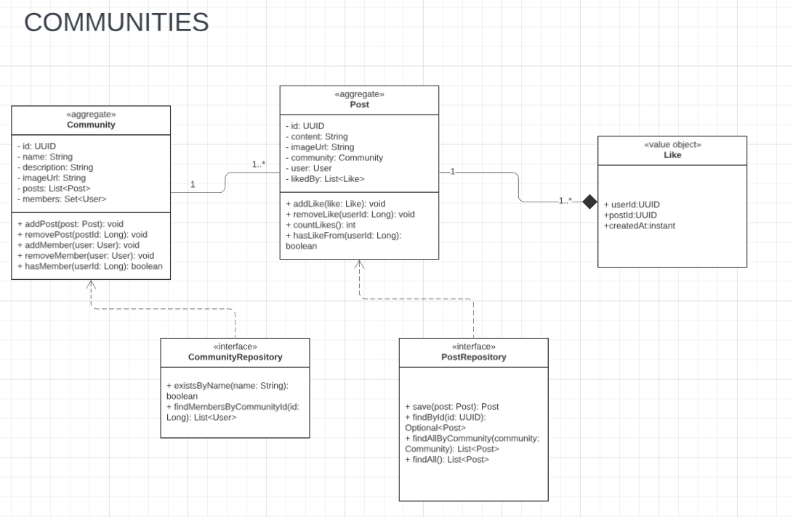

#### 2.6.2.6.2. Bounded Context Database Design Diagram

El modelo entidad-relación correspondiente al bounded context de Comunidades está compuesto por tres entidades principales: Communities, Posts y Likes. La entidad Communities constituye el núcleo del modelo, ya que almacena la información esencial de cada comunidad, incluyendo su identificador único, nombre, imagen representativa, descripción y las fechas de creación y actualización. A partir de esta entidad se establece la relación con Posts, que representa las publicaciones generadas dentro de una comunidad. Cada Post se encuentra vinculado tanto a una comunidad como a un usuario, y contiene atributos como el contenido, la imagen asociada, la fecha de publicación y la última actualización, garantizando así la trazabilidad de la interacción social.

Por otro lado, la entidad Likes se define como un objeto relacional destinado a registrar las interacciones de los usuarios con las publicaciones. Sus atributos principales son el identificador del usuario, el identificador del post y la marca temporal (createdAt) que permite conocer el momento en el que se realizó la acción. De esta manera, se establece una relación de muchos a muchos entre usuarios y publicaciones, controlada mediante la tabla Likes.

En conjunto, este submodelo permite gestionar la creación de comunidades, la publicación de contenido y la interacción social mediante likes, lo que fortalece la dinámica de participación activa dentro del sistema y fomenta el sentido de pertenencia entre los usuarios.

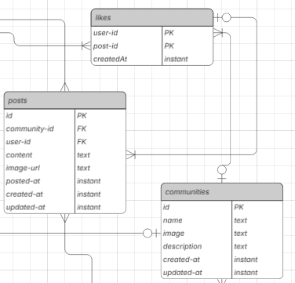

 
## 2.6.3. Bounded Context: Eventos relacionados
### 2.6.3.1. Domain Layer

El Domain Layer en el bounded context **Eventos Relacionados** modela el núcleo del negocio centrado en la gestión de actividades comunitarias que giran alrededor de un concierto oficial.  
Este contexto permite que los usuarios creen eventos gratuitos, que otros los descubran mediante búsquedas o filtros, y que se garantice la consistencia de la información.

Se implementó el Aggregate principal:

Las reglas de negocio y la orquestación de acciones en el contexto de Eventos Relacionados se manejan a través de **Domain Services**, divididos en servicios de comandos y de consultas.  
Los **Command Services** gestionan operaciones que modifican el estado del dominio como la creación, actualización, publicación, cancelación, apertura/cierre de inscripciones mediante el `RelatedEventCommandService`.  
Por su parte, los **Query Services** se enfocan en solo lectura, como el `RelatedEventQueryService`, que recupera eventos filtrados por concierto, tipo, fecha, ciudad/proximidad, estado, etc., y permite listar participantes de un evento.

<h3>Aggregate: RelatedEvent</h3>

<strong>Atributos principales</strong>

<table>
  <tr><th>Atributo</th><th>Tipo</th><th>Descripción</th></tr>
  <tr><td>id</td><td>UUID</td><td>Identificador único del evento relacionado.</td></tr>
  <tr><td>concertId</td><td>Concert</td><td>Concierto oficial asociado.</td></tr>
  <tr><td>titulo</td><td>String</td><td>Título del evento relacionado.</td></tr>
  <tr><td>descripcion</td><td>String</td><td>Descripción breve.</td></tr>
  <tr><td>tipo</td><td>Enum</td><td>PREVIA, AFTERPARTY.</td></tr>
  <tr><td>location</td><td>Location</td><td>Ubicación geográfica.</td></tr>
  <tr><td>estado</td><td>Enum</td><td>BORRADOR, PUBLICADO, ENCURSO, FINALIZADO, CANCELADO.</td></tr>
  <tr><td>organizadorId</td><td>UserId</td><td>Usuario creador/organizador.</td></tr>
  <tr><td>participantes</td><td>List&lt;UserId&gt;</td><td>Lista de usuarios inscritos.</td></tr>
  <tr><td>createdAt</td><td>Date</td><td>Marca de tiempo de creación.</td></tr>
</table>

<h4>Entity: Participante</h4>
<table>
  <tr><th>Atributo</th><th>Tipo</th><th>Descripción</th></tr>
  <tr><td>usuarioId</td><td>UserId</td><td>Identificador del participante.</td></tr>
  <tr><td>inscritoEn</td><td>DateTime</td><td>Fecha de inscripción.</td></tr>
  <tr><td>estado</td><td>Enum</td><td>ACTIVO, RETIRADO, BLOQUEADO.</td></tr>
</table>

<strong>Métodos:</strong> retirarse(), bloquearPorModeracion().

<h3>Value Objects</h3>

<table>
  <tr>
    <th>Value Object</th>
    <th>Atributos / Restricciones</th>
    <th>Descripción</th>
  </tr>
  <tr>
    <td>Ubicacion</td>
    <td>Location</td>
    <td>Representa la ubicación geográfica de un evento relacionado.</td>
  </tr>
</table>

<h3>Enums</h3>
<table>
  <tr><th>Enumeración</th><th>Valores</th></tr>
  <tr><td>Estado</td><td>BORRADOR, PUBLICADO, ENCURSO, FINALIZADO, CANCELADO</td></tr>
  <tr><td>Tipo</td><td>PREVIA, AFTERPARTY</td></tr>
</table>

<h3>Domain Services</h3>
<table>
  <tr><th>Nombre</th><th>Responsabilidad</th><th>Reglas / Métodos</th></tr>
  <tr>
    <td>RelatedEventCommandService</td>
    <td>Gestionar creación, actualización, publicación y cancelación de eventos; inscripciones (RSVP); apertura/cierre de inscripciones.</td>
    <td>
      - Solo usuarios registrados pueden crear eventos. 
      - Debe existir conciertoId válido. 
      - Ventana temporal cercana al concierto. 
      - Siempre gratis. 
      - Ubicación válida. 
      - Aforo válido si aplica. 
      - Estados válidos: BORRADOR → PUBLICADO → (ENCURSO → FINALIZADO).
    </td>
  </tr>
  <tr>
    <td>RelatedEventQueryService</td>
    <td>Obtener eventos relacionados y participantes por criterios de búsqueda (solo lectura).</td>
    <td>
      Métodos: getRelatedEventById(), getRelatedEventsByConcert(), searchRelatedEvents(filters), getRelatedEventsByDate(), getRelatedEventsByCity(), getRelatedEventsByProximity(), getParticipants(), getAllRelatedEvents().
    </td>
  </tr>
</table>

### 2.6.3.2. Interface Layer

La Interface/Presentation Layer permite interacción de apps móviles, web y consumidores internos con el dominio de Eventos Relacionados.  
Los endpoints REST se implementan mediante controladores.

<h3>RelatedEventController</h3>
<table>
  <tr><th>Método</th><th>Ruta</th><th>Descripción</th></tr>
  <tr><td>POST</td><td>/api/v1/related-events</td><td>Crear evento relacionado.</td></tr>
  <tr><td>GET</td><td>/api/v1/related-events/{id}</td><td>Detalle de un evento.</td></tr>
  <tr><td>GET</td><td>/api/v1/concerts/{conciertoId}/related-events</td><td>Eventos por concierto.</td></tr>
  <tr><td>GET</td><td>/api/v1/related-events/search</td><td>Filtros: tipo, proximidad, fecha/ciudad, texto.</td></tr>
  <tr><td>PUT</td><td>/api/v1/related-events/{id}</td><td>Actualizar evento relacionado.</td></tr>
  <tr><td>DELETE</td><td>/api/v1/related-events/{id}</td><td>Borrar evento (si BORRADOR).</td></tr>
  <tr><td>POST</td><td>/api/v1/related-events/{id}/cancel</td><td>Cancelar evento.</td></tr>
  <tr><td>POST</td><td>/api/v1/related-events/{id}/join</td><td>Unirse (RSVP).</td></tr>
  <tr><td>POST</td><td>/api/v1/related-events/{id}/leave</td><td>Retirarse (cancelar RSVP).</td></tr>
  <tr><td>GET</td><td>/api/v1/related-events/{id}/participants</td><td>Listar participantes.</td></tr>
  <tr><td>POST</td><td>/api/v1/related-events/{id}/report</td><td>Reportes de moderación.</td></tr>
</table>

### 2.6.3.3. Application Layer

En esta capa se gestionan los flujos de negocio del Bounded Context de Eventos Relacionados.  
Se utilizan **Command Handlers** y **Event Handlers**.

<h3>RelatedEvent Command Handler</h3>
<table>
  <tr><th>Capability</th><th>Command Handler</th><th>Descripción</th></tr>
  <tr><td>Crear evento</td><td>handle(CreateRelatedEventCommand)</td><td>Crea evento gratuito vinculado a concierto; valida ventana y ubicación.</td></tr>
  <tr><td>Actualizar evento</td><td>handle(UpdateRelatedEventCommand)</td><td>Modifica campos respetando invariantes.</td></tr>
  <tr><td>Publicar evento</td><td>handle(PublishRelatedEventCommand)</td><td>PUBLICADO si cumple requisitos mínimos.</td></tr>
  <tr><td>Cancelar evento</td><td>handle(CancelRelatedEventCommand)</td><td>Cancela evento y emite dominio.</td></tr>
  <tr><td>Abrir inscripciones</td><td>handle(OpenRegistrationsCommand)</td><td>Habilita RSVP.</td></tr>
  <tr><td>Cerrar inscripciones</td><td>handle(CloseRegistrationsCommand)</td><td>Deshabilita RSVP.</td></tr>
  <tr><td>Unirse</td><td>handle(JoinRelatedEventCommand)</td><td>Registra participación; valida estado/aforo.</td></tr>
  <tr><td>Retirarse</td><td>handle(LeaveRelatedEventCommand)</td><td>Retira participación y libera cupo.</td></tr>
</table>

<h3>RelatedEvent Event Handler</h3>
<table>
  <tr><th>Evento</th><th>Event Handler</th><th>Descripción</th></tr>
  <tr><td>Evento creado</td><td>handle(RelatedEventCreatedEvent)</td><td>Actualiza proyecciones y notifica interesados.</td></tr>
  <tr><td>Evento publicado</td><td>handle(RelatedEventPublishedEvent)</td><td>Notifica y lo incorpora al feed.</td></tr>
  <tr><td>Evento actualizado</td><td>handle(RelatedEventUpdatedEvent)</td><td>Refleja cambios en vistas.</td></tr>
  <tr><td>Participante inscrito</td><td>handle(ParticipantJoinedEvent)</td><td>Notifica organizador, ajusta métricas.</td></tr>
  <tr><td>Participante retirado</td><td>handle(ParticipantLeftEvent)</td><td>Actualiza contadores.</td></tr>
  <tr><td>Evento cancelado</td><td>handle(RelatedEventCanceledEvent)</td><td>Notifica participantes, desactiva listados.</td></tr>
  <tr><td>Evento finalizado</td><td>handle(RelatedEventFinishedEvent)</td><td>Cierra inscripciones, dispara post-evento.</td></tr>
</table>

### 2.6.3.4 Infrastructure Layer

Esta capa implementa el acceso a servicios externos y persistencia de datos, siempre respetando los contratos definidos en el Domain Layer.

- **RelatedEventRepositoryImpl**: maneja ciclo de vida de eventos relacionados; evita duplicados alrededor del mismo concierto/ventana.  
- **ParticipationRepositoryImpl** (opcional): maneja persistencia de inscripciones (RSVP).

<h3>Repositories</h3>
<h4>RelatedEventRepository</h4>
<table>
  <tr><th>Método</th><th>Descripción</th></tr>
  <tr><td>save(RelatedEvent event)</td><td>Persiste o actualiza evento.</td></tr>
  <tr><td>findById(UUID id)</td><td>Busca evento por id.</td></tr>
  <tr><td>findByConcert(UUID concertId)</td><td>Eventos de un concierto.</td></tr>
  <tr><td>findByType(String type)</td><td>Filtra por tipo (PREVIA, AFTERPARTY).</td></tr>
  <tr><td>findByStatus(RelatedEventStatus status)</td><td>Lista por estado.</td></tr>
  <tr><td>findByDate(LocalDate date)</td><td>Eventos en fecha.</td></tr>
  <tr><td>findByCity(String city)</td><td>Eventos en ciudad.</td></tr>
  <tr><td>findByProximity(double lat, double lon, double radiusKm)</td><td>Eventos por proximidad.</td></tr>
  <tr><td>deleteById(UUID id)</td><td>Eliminar evento (si BORRADOR).</td></tr>
</table>

### 2.6.3.5. Bounded Context Software Architecture Component Level Diagrams

El diagrama de componentes del bounded context de **Eventos Relacionados** muestra cómo se organiza el sistema en controladores, servicios y repositorios.  
Los **Controllers** exponen endpoints HTTP para crear, actualizar, consultar o eliminar eventos relacionados, así como gestionar inscripciones de participantes.  
Los **Services** manejan la lógica de negocio, separando los comandos (acciones que cambian el estado del sistema, como publicar, cancelar o unirse a un evento) de las consultas (lecturas sin modificar datos, como buscar eventos por concierto, ciudad o proximidad).  
Los **Repositories**, como RelatedEventRepositoryImpl se encargan de la persistencia y recuperación de eventos relacionados y sus inscripciones en la base de datos.  
Finalmente, el contenedor **Database** representa la infraestructura donde se almacena la información.  
Esta vista permite entender de manera clara cómo se conectan las partes internas sin depender directamente unas de otras.

### 2.6.3.6. Bounded Context Software Architecture Code Level Diagrams
#### 2.6.3.6.1. Bounded Context Domain Layer Class Diagrams

El siguiente diagrama de clases representa el bounded context **Eventos Relacionados** y muestra como agregado principal a RelatedEvent, acompañado de la entidad Participante y los value objects Ubicacion, Type y Status.  

El agregado **RelatedEvent** tiene atributos como id: UUID, concertId: UUID, titulo: String, descripcion: String, tipo:Type, ubicacion: Ubicacion, estado: Status, organizadorId: UserId, participantes: List<UserId] y createdAt: Date.  
Representa un evento gratuito vinculado a un concierto, ya sea antes (PREVIA) o después (AFTERPARTY).  

Este agregado permite modelar la relación entre usuarios y eventos, así como sus cambios de estado en el tiempo.

Los value objects **Ubicacion**, **Type** y **Status** encapsulan restricciones propias del dominio:  
- **Ubicacion**: latitud y longitud válidas más dirección del evento.  
- **Type**: Referido al tipo de envento como puede ser PREVIA o AFTER PARTY.
- **Status**: Siendo el estado en el que se encuentra el evento como BORRADOR, PROGRAMADO, PUBLICADO, ENCURSO, FINALIZADO O ANCELADO

La interfaz RelatedEventRepository define operaciones de acceso a datos para los eventos como save(RelatedEvent event), findById(UUID id), findByConcert(UUID concertId), findByType(String type), findByStatus(RelatedEventStatus status), findByDate(LocalDate date), findByCity(String city), findByProximity(double lat, double lon, double radiusKm) y deleteById(UUID id).

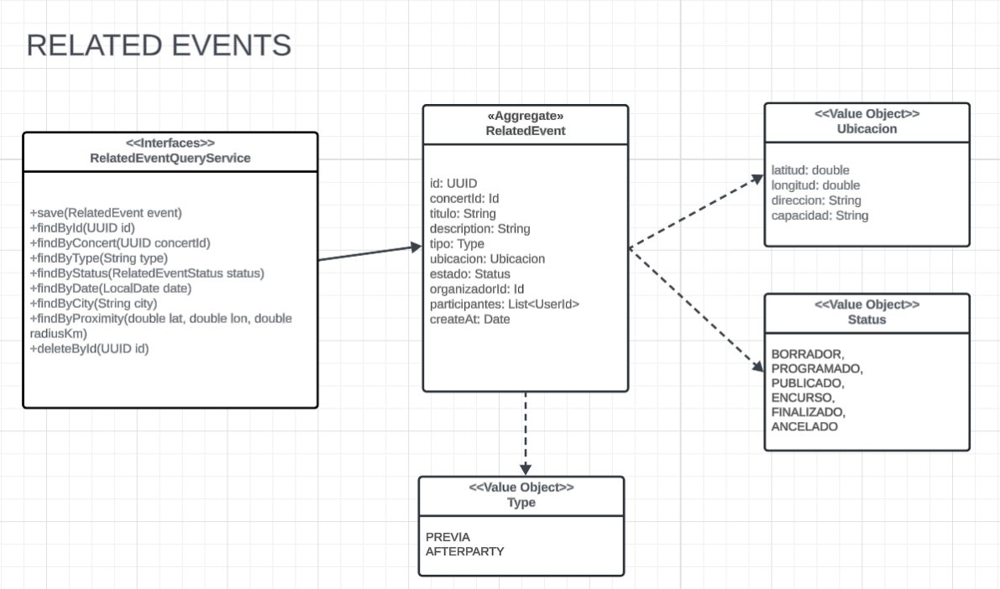

#### 2.6.3.6.2. Bounded Context Database Design Diagram

El modelo entidad–relación del bounded context de Eventos Relacionados se compone de tres entidades: related_events, users y la tabla asociativa event_attendees. La entidad related_events concentra la información esencial de cada evento comunitario—id (PK), music_genres, status, date y description—y representa el núcleo del submodelo al catalogar las actividades (previas, afters, meetups) que orbitan a un concierto. La entidad users registra a los participantes del sistema mediante id (PK), email, full_name, password y rol, sirviendo como fuente de identidad para creadores y asistentes.

Por su parte, event_attendees materializa la relación muchos a muchos entre users y related_events, almacenando las claves foráneas user_id y event_id. Esta tabla funciona como registro de asistencia, asegurando integridad referencial y evitando duplicidades mediante la combinación única de ambas claves. En conjunto, el submodelo permite gestionar la creación de eventos, su descubrimiento y la inscripción de usuarios, garantizando trazabilidad básica del vínculo usuario–evento dentro del sistema.

## 2.6.4. Bounded Context: Notificaciones
### 2.6.4.1. Domain Layer

En el Domain Layer del bounded context de Notificaciones, el agregador principal es Notification. Estos representan los elementos clave para gestionar la entrega de mensajes dentro de la aplicación e informan a los usuarios sobre eventos musicales cercanos, interacciones dentro de comunidades o actualizaciones relevantes de artistas seguidos.
Las notificaciones (Notification) encapsulan toda la información necesaria para ser entregadas de forma efectiva como el tipo de evento (nuevo concierto, comentario), su estado de lectura y el contenido personalizado. La lógica de negocio relacionada con la creación y envío de notificaciones se concentra en los servicios de dominio NotificationCommandService y NotificationQueryService.

**Justificación:**

Este enfoque permite desacoplar la lógica de notificaciones del resto del sistema, facilitando su reutilización tanto para alertas de conciertos como para interacciones sociales. Al centralizar las reglas de envío en un servicio de dominio, se asegura que las notificaciones sean relevantes y entregadas adecuadamente. Asimismo, mantiene una experiencia consistente en distintos flujos de la aplicación.

**Aggregate: Notification**

**Descripción:** Representa un mensaje generado por el sistema destinado a un usuario específico con el fin de informar sobre eventos musicales, actividades en comunidades o interacciones relevantes dentro de la aplicación.

**Atributos**

<table>
  <thead>
    <tr>
      <th>Atributo</th>
      <th>Tipo de dato</th>
      <th>Visibilidad</th>
      <th>Descripción</th>
    </tr>
  </thead>
  <tbody>
    <tr>
      <td>id</td>
      <td>UUID</td>
      <td>Private</td>
      <td>Identificador único de la notificación</td>
    </tr>
    <tr>
      <td>userId</td>
      <td>UUID</td>
      <td>Private</td>
      <td>Identificador único del usuario destinatario de la notificación</td>
    </tr>
    <tr>
      <td>communityId</td>
      <td>UUID</td>
      <td>Private</td>
      <td>Identificador único de la comunidad relacionada, si aplica</td>
    </tr>
    <tr>
      <td>concertId</td>
      <td>UUID</td>
      <td>Private</td>
      <td>Identificador único del concierto relacionado, si aplica</td>
    </tr>
    <tr>
      <td>relatedUserId</td>
      <td>UUID</td>
      <td>Private</td>
      <td>Identificador del usuario que generó la acción que origina la notificación</td>
    </tr>
    <tr>
      <td>title</td>
      <td>String</td>
      <td>Private</td>
      <td>Encabezado breve que resume el contenido del mensaje</td>
    </tr>
    <tr>
      <td>content</td>
      <td>String</td>
      <td>Private</td>
      <td>Cuerpo principal del mensaje que será mostrado al usuario</td>
    </tr>
    <tr>
      <td>type</td>
      <td>NotificationType</td>
      <td>Private</td>
      <td>Tipo de notificación</td>
    </tr>
    <tr>
      <td>status</td>
      <td>NotificationStatus</td>
      <td>Private</td>
      <td>Estado actual de la notificación (por ejemplo: nueva, leída, archivada)</td>
    </tr>
    <tr>
      <td>createdAt</td>
      <td>LocalDateTime</td>
      <td>Private</td>
      <td>Fecha y hora de generación de la notificación</td>
    </tr>
    <tr>
      <td>updatedAt</td>
      <td>LocalDateTime</td>
      <td>Private</td>
      <td>Fecha y hora de actualización de la notificación</td>
    </tr>
  </tbody>
</table>

**Métodos**

<table>
  <thead>
    <tr>
      <th>Método</th>
      <th>Tipo de retorno</th>
      <th>Visibilidad</th>
      <th>Descripción</th>
    </tr>
  </thead>
  <tbody>
    <tr>
      <td>markAsRead()</td>
      <td>void</td>
      <td>Public</td>
      <td>Cambia el estado de la notificación a "leída".</td>
    </tr>
    <tr>
      <td>isRead()</td>
      <td>boolean</td>
      <td>Public</td>
      <td>Devuelve true si la notificación ya fue leída.</td>
    </tr>
  </tbody>
</table>

**Value Object: NotificationType**

**Descripción:** Representa la categoría o naturaleza del contenido de la notificación enviada, determinando su propósito dentro de la aplicación.

<table>
  <thead>
    <tr>
      <th>Nombre</th>
      <th>Descripción</th>
    </tr>
  </thead>
  <tbody>
    <tr>
      <td>INFO</td>
      <td>Notificación informativa general, sin requerir acción inmediata.</td>
    </tr>
    <tr>
      <td>REMINDER</td>
      <td>Recordatorio relacionado con un concierto próximo o actividad planificada.</td>
    </tr>
    <tr>
      <td>SOCIAL</td>
      <td>Notificación originada por una interacción entre usuarios (ej. nuevo seguidor).</td>
    </tr>
    <tr>
      <td>COMMUNITY</td>
      <td>Notificación relacionada con publicaciones o menciones dentro de una comunidad.</td>
    </tr>
    <tr>
      <td>ARTIST_UPDATE</td>
      <td>Novedades o contenidos compartidos por artistas seguidos por el usuario.</td>
    </tr>
    <tr>
      <td>ALERT</td>
      <td>Mensaje importante que requiere atención (ej. cancelación de evento, cambio de horario).</td>
    </tr>
  </tbody>
</table>

**Value Object: NotificationStatus**

**Descripción:** Representa el estado actual de una notificación en relación con su ciclo de vida y visibilidad para el usuario.

<table>
  <thead>
    <tr>
      <th>Nombre</th>
      <th>Descripción</th>
    </tr>
  </thead>
  <tbody>
    <tr>
      <td>UNREAD</td>
      <td>La notificación ha sido creada y aún no ha sido leída por el usuario.</td>
    </tr>
    <tr>
      <td>READ</td>
      <td>El usuario ya ha visualizado la notificación.</td>
    </tr>
  </tbody>
</table>

**Domain Service: NotificationCommandService**

**Descripción:** Encapsula las operaciones de escritura relacionadas con notificaciones, como crear, actualizar estado o eliminar. Define la lógica de negocio necesaria para modificar el estado de las notificaciones de acuerdo a las reglas del dominio.

**Métodos**

<table>
  <thead>
    <tr>
      <th>Método</th>
      <th>Tipo de retorno</th>
      <th>Descripción</th>
    </tr>
  </thead>
  <tbody>
    <tr>
      <td>createNotification()</td>
      <td>Notification</td>
      <td>Envía una notificación de acuerdo al tipo y contexto</td>
    </tr>
    <tr>
      <td>markNotificationAsRead(UUID notificationId)</td>
      <td>void</td>
      <td>Marca una notificación como leída por el usuario.</td>
    </tr>
    <tr>
      <td>deleteNotification(UUID notificationId)</td>
      <td>void</td>
      <td>Elimina una notificación del buzón del usuario.</td>
    </tr>
  </tbody>
</table>

**Domain Service: NotificationQueryService**

**Descripción:** Recupera notificaciones desde la perspectiva del usuario. Proporciona acceso filtrado, paginado o contextual a las notificaciones almacenadas, sin modificar su estado.

**Métodos**

<table>
  <thead>
    <tr>
      <th>Método</th>
      <th>Tipo de retorno</th>
      <th>Descripción</th>
    </tr>
  </thead>
  <tbody>
    <tr>
      <td>getNotificationsByUserId(UUID userId)</td>
      <td>List&lt;Notification&gt;</td>
      <td>Retorna todas las notificaciones visibles para el usuario.</td>
    </tr>
    <tr>
      <td>getUnreadNotificationsByUserId(UUID userId)</td>
      <td>List&lt;Notification&gt;</td>
      <td>Retorna solo las notificaciones que no han sido leídas por el usuario.</td>
    </tr>
    <tr>
      <td>getNotificationById(UUID notificationId)</td>
      <td>Optional&lt;Notification&gt;</td>
      <td>Busca una notificación por su identificador.</td>
    </tr>
    <tr>
      <td>countUnreadNotificationsByUserId(UUID userId)</td>
      <td>int</td>
      <td>Devuelve la cantidad de notificaciones sin leer del usuario.</td>
    </tr>
  </tbody>
</table>

### 2.6.4.2. Interface Layer

Dentro del bounded context de Notificaciones, la clase principal en esta capa es NotificationsController, la cual ofrece endpoints destinados a listar notificaciones, marcarlas como leídas y crear nuevas. Estos puntos de acceso son consumidos tanto por la aplicación móvil como por otros servicios de la misma.

**Justificación:**

Esta capa de presentación actúa como intermediaria entre el dominio y los consumidores externos. A través de un servicio web RESTful bien definido y seguro, facilita la incorporación de funcionalidades como notificaciones en tiempo real y recordatorios programados.

**Controller: NotificationsController**

**Atributos**

<table>
  <thead>
    <tr>
      <th>Tipo de dato</th>
      <th>Nombre</th>
      <th>Visibilidad</th>
      <th>Descripción</th>
    </tr>
  </thead>
  <tbody>
    <tr>
      <td>NotificationQueryService</td>
      <td>notificationQueryService</td>
      <td>Private</td>
      <td>Servicio encargado de la recuperación de notificaciones</td>
    </tr>
    <tr>
      <td>NotificationCommandService</td>
      <td>notificationCommandService</td>
      <td>Private</td>
      <td>Servicio responsable de la emisión y modificación de notificaciones</td>
    </tr>
  </tbody>
</table>

**Métodos**

<table>
  <thead>
    <tr>
      <th>Método</th>
      <th>Tipo de retorno</th>
      <th>Visibilidad</th>
      <th>Descripción</th>
    </tr>
  </thead>
  <tbody>
    <tr>
      <td>getUnreadNotificationsByUserId(UUID userId)</td>
      <td>List</td>
      <td>Public</td>
      <td>Obtiene el listado de notificaciones sin leer por el usuario.</td>
    </tr>
    <tr>
      <td>getNotificationsByUserId(userId)</td>
      <td>List</td>
      <td>Public</td>
      <td>Obtiene el listado de notificaciones correspondientes al usuario.</td>
    </tr>
    <tr>
      <td>markNotificationAsRead(notificationId)</td>
      <td>void</td>
      <td>Public</td>
      <td>Cambia el estado de una notificación a "leída".</td>
    </tr>
    <tr>
      <td>deleteNotification(UUID userId)</td>
      <td>void</td>
      <td>Public</td>
      <td>Elimina la notificación deseada.</td>
    </tr>
  </tbody>
</table>

### 2.6.4.3. Application Layer

Se implementan los servicios encargados de orquestar la lógica relacionada con el envío, consulta y actualización del estado de las notificaciones, así como la reacción ante eventos relevantes del sistema.
El servicio NotificationQueryServiceImpl permite recuperar todas las notificaciones asociadas a un usuario y aplicar filtros por estado o tipo, mientras que NotificationCommandServiceImpl se encarga de crear nuevas notificaciones y modificar su estado.

**Justificación:**

La separación entre servicios de comandos y consultas contribuye a una mejor organización del código, facilita su mantenimiento y favorece la escalabilidad del sistema ante nuevas reglas de negocio.

**Service: NotificationQueryServiceImpl**

**Descripción:** Implementación del servicio de consulta de notificaciones asociadas a un usuario

**Atributos**

<table>
  <thead>
    <tr>
      <th>Tipo de dato</th>
      <th>Nombre</th>
      <th>Visibilidad</th>
      <th>Descripción</th>
    </tr>
  </thead>
  <tbody>
    <tr>
      <td>NotificationRepository</td>
      <td>notificationRepository</td>
      <td>Private</td>
      <td>Componente encargado del acceso a los datos de notificaciones.</td>
    </tr>
  </tbody>
</table>

**Métodos**

<table>
  <thead>
    <tr>
      <th>Método</th>
      <th>Tipo de retorno</th>
      <th>Descripción</th>
    </tr>
  </thead>
  <tbody>
    <tr>
      <td>getNotificationsByUserId(UUID userId)</td>
      <td>List&lt;Notification&gt;</td>
      <td>Retorna todas las notificaciones visibles para el usuario.</td>
    </tr>
    <tr>
      <td>getUnreadNotificationsByUserId(UUID userId)</td>
      <td>List&lt;Notification&gt;</td>
      <td>Retorna solo las notificaciones que no han sido leídas por el usuario.</td>
    </tr>
    <tr>
      <td>getNotificationById(UUID notificationId)</td>
      <td>Optional&lt;Notification&gt;</td>
      <td>Busca una notificación por su identificador.</td>
    </tr>
    <tr>
      <td>countUnreadNotificationsByUserId(UUID userId)</td>
      <td>int</td>
      <td>Devuelve la cantidad de notificaciones sin leer del usuario</td>
    </tr>
  </tbody>
</table>

**Service: NotificationCommandServiceImpl**

**Atributos**

**Descripción:** Implementación del servicio para el envío y actualización de notificaciones

**Atributos**

<table>
  <thead>
    <tr>
      <th>Tipo de dato</th>
      <th>Nombre</th>
      <th>Visibilidad</th>
      <th>Descripción</th>
    </tr>
  </thead>
  <tbody>
    <tr>
      <td>NotificationRepository</td>
      <td>notificationRepository</td>
      <td>Private</td>
      <td>Repositorio para almacenar y recuperar entidades de notificación.</td>
    </tr>
  </tbody>
</table>

**Métodos**

<table>
  <thead>
    <tr>
      <th>Método</th>
      <th>Tipo de retorno</th>
      <th>Descripción</th>
    </tr>
  </thead>
  <tbody>
    <tr>
      <td>createNotification()</td>
      <td>Notification</td>
      <td>Envía una notificación de acuerdo al tipo y contexto</td>
    </tr>
    <tr>
      <td>markNotificationAsRead(UUID notificationId)</td>
      <td>void</td>
      <td>Marca una notificación como leída por el usuario.</td>
    </tr>
    <tr>
      <td>deleteNotification(UUID notificationId)</td>
      <td>void</td>
      <td>Elimina una notificación del buzón del usuario.</td>
    </tr>
  </tbody>
</table>

### 2.6.4.4 Infrastructure Layer

La Infrastructure Layer del bounded context de Notificaciones contiene los componentes encargados de persistir datos y de integrarse con servicios externos. En esta capa, se implementan las interfaces de acceso a datos definidas en el dominio.
En particular, el repositorio NotificationRepository se encarga de acceder a las notificaciones almacenadas. Esta interfaz es implementada por un componente concreto que puede estar respaldado por tecnologías como JPA, Hibernate o consultas nativas a la base de datos.

**Justificación:**

Centralizar las dependencias tecnológicas en esta capa permite que el dominio permanezca desacoplado de las decisiones de infraestructura. Así, los cambios en proveedores de persistencia o mensajería no afectan la lógica de negocio, lo que hace al sistema más mantenible y adaptable.

**Repository: NotificationRepository**

**Descripción:** Interfaz de acceso a notificaciones, utilizada para recuperar datos persistidos desde la base de datos

**Métodos**

<table>
  <thead>
    <tr>
      <th>Método</th>
      <th>Tipo de retorno</th>
      <th>Visibilidad</th>
      <th>Descripción</th>
    </tr>
  </thead>
  <tbody>
    <tr>
      <td>findAllByUserIdAndType(UUID userId, NotificationType type)</td>
      <td>List</td>
      <td>Public</td>
      <td>Recupera todas las notificaciones asociadas a un usuario y de un tipo dado.</td>
    </tr>
  </tbody>
</table>

### 2.6.4.5. Bounded Context Software Architecture Component Level Diagrams

  

Este diagrama de componentes representa una arquitectura monolítica centrada en el manejo de notificaciones dentro de la aplicación GigMap. Una aplicación móvil, desarrollada con Android Studio utilizando Kotlin y Jetpack Compose, se comunica con una API desarrollada en Spring Boot mediante solicitudes HTTPS.

La Mobile Application realiza peticiones al componente Notification Controller, responsable de exponer los endpoints necesarios para gestionar las notificaciones. Este controlador delega la lógica de negocio a dos servicios especializados: Notification Query Service, encargado de recuperar notificaciones y Notification Command Service, responsable de enviarlas o modificar su estado.

Ambos servicios acceden a los datos persistidos a través del Notification Repository, el cual implementa operaciones de lectura y escritura sobre la base de datos utilizando JPA. La información se almacena en una base de datos MySQL que gestiona tanto las notificaciones como otros registros relevantes para el sistema.

### 2.6.4.6. Bounded Context Software Architecture Code Level Diagrams

#### 2.6.4.6.1. Bounded Context Domain Layer Class Diagrams

  

El siguiente diagrama de clases representa el bounded context de Notificaciones e ilustra cómo se organiza el dominio alrededor del agregado principal Notification, acompañado por dos servicios de aplicación: NotificationCommandService y NotificationQueryService. También, se incluyen dos value objects: NotificationStatus y NotificationType, que encapsulan comportamientos relacionados al estado y tipo de notificación.

El agregado Notification contiene atributos relevantes como id, user, community, concert, relatedUser, title, content, type, status, createdAt y updatedAt, reflejando el contexto rico de una notificación dentro de la aplicación. Provee métodos como markAsRead() para modificar su estado y isRead() para consultar si ha sido leída. La asociación con entidades como User, Community y Concert permite vincular las notificaciones a eventos o interacciones concretas en el sistema.

El servicio NotificationCommandService encapsula la lógica para crear nuevas notificaciones, marcarlas como leídas o eliminarlas. Por su parte, NotificationQueryService se encarga de recuperar notificaciones desde la perspectiva del usuario, ya sea por ID, por estado de lectura o por cantidad de notificaciones no leídas.

El value object NotificationStatus define dos posibles estados: UNREAD y READ, utilizados para representar si una notificación ha sido vista por el usuario. Por otro lado, NotificationType clasifica las notificaciones en categorías como INFO, REMINDER, SOCIAL, COMMUNITY, ARTIST_UPDATE y ALERT.

#### 2.6.4.6.2. Bounded Context Database Design Diagram

  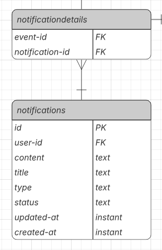 

El Database Diagram para el Bounded Context de Notificaciones modela la persistencia del agregado raíz notifications, encargado de gestionar los mensajes enviados a los usuarios sobre conciertos cercanos. Cada notificación está asociada a un usuario mediante user-id y contiene información como title, content, type, status, además de fechas de creación y actualización para su trazabilidad. La tabla notificationdetails representa una relación muchos-a-muchos entre notificaciones y eventos musicales, lo cual enlaza ambos mediante claves foráneas (notification-id y event-id).

## 2.6.5. Bounded Context: Registro y autenticación

### 2.6.5.1. Domain Layer

En el Domain Layer del bounded context de Registro y Autenticación, el agregador principal es **User**. Este representa los elementos esenciales para la identificación de usuarios dentro del sistema, así como para la gestión de credenciales seguras y el control de acceso.

El usuario (User) encapsula toda la información necesaria para autenticar al usuario y validar su identidad. Adicionalmente, si el usuario ha sido registrado como artista, se asocia a una entidad **Artist**, que contiene información complementaria sobre su perfil artístico.

La lógica de negocio relacionada con estos procesos se centraliza en los servicios de dominio **UserCommandService** y **UserQueryService** para operaciones de autenticación y registro de usuarios, y en los servicios **ArtistCommandService** y **ArtistQueryService** para la gestión del perfil artístico asociado al usuario.

**Justificación:**  
Este enfoque permite desacoplar la lógica de autenticación y registro del resto del sistema, garantizando coherencia en la validación de credenciales y manejo de accesos. Al centralizar la lógica de creación, verificación e invalidación de sesiones en un servicio de dominio, se mejora la seguridad y la trazabilidad del sistema.

**Aggregate: User**  
Representa a un usuario registrado en la aplicación, que permite la autenticación y posterior acceso a funcionalidades protegidas del sistema.

**Atributos**

<table>
  <thead>
    <tr>
      <th>Atributo</th>
      <th>Tipo de dato</th>
      <th>Visibilidad</th>
      <th>Descripción</th>
    </tr>
  </thead>
  <tbody>
    <tr><td>id</td><td>UUID</td><td>Private</td><td>Identificador único del usuario</td></tr>
    <tr><td>email</td><td>String</td><td>Private</td><td>Correo electrónico registrado</td></tr>
    <tr><td>username</td><td>String</td><td>Private</td><td>Nombre de usuario visible</td></tr>
    <tr><td>passwordHash</td><td>String</td><td>Private</td><td>Hash de la contraseña del usuario</td></tr>
    <tr><td>artist</td><td>Artist</td><td>Private</td><td>Información artística asociada, si el usuario es artista</td></tr>
    <tr><td>createdAt</td><td>LocalDateTime</td><td>Private</td><td>Fecha y hora de creación de la cuenta</td></tr>
    <tr><td>updatedAt</td><td>LocalDateTime</td><td>Private</td><td>Última fecha y hora de actualización de la cuenta</td></tr>
  </tbody>
</table>

**Entity: Artist**  

Representa el perfil artístico de un usuario que se ha registrado como artista dentro de la aplicación.

**Atributos**

<table>
  <thead>
    <tr>
      <th>Atributo</th>
      <th>Tipo de dato</th>
      <th>Visibilidad</th>
      <th>Descripción</th>
    </tr>
  </thead>
  <tbody>
    <tr><td>artistId</td><td>UUID</td><td>Private</td><td>Identificador único del artista (igual al del usuario)</td></tr>
    <tr><td>artistName</td><td>String</td><td>Private</td><td>Nombre artístico</td></tr>
    <tr><td>bio</td><td>String</td><td>Private</td><td>Biografía o descripción del artista</td></tr>
    <tr><td>genres</td><td>String[]</td><td>Private</td><td>Género musical principal del artista</td></tr>
    <tr><td>createdAt</td><td>LocalDateTime</td><td>Private</td><td>Fecha de creación del perfil artístico</td></tr>
    <tr><td>updatedAt</td><td>LocalDateTime</td><td>Private</td><td>Fecha de actualización del perfil artístico</td></tr>
  </tbody>
</table>

**Domain Service: UserCommandService**

**Métodos**

<table>
  <thead>
    <tr><th>Método</th><th>Tipo de retorno</th><th>Descripción</th></tr>
  </thead>
  <tbody>
    <tr><td>createUser()</td><td>User</td><td>Registra una nueva cuenta de usuario.</td></tr>
    <tr><td>updateUser(UUID userId)</td><td>User</td><td>Actualiza los datos de un usuario existente.</td></tr>
    <tr><td>deleteUser(UUID userId)</td><td>void</td><td>Elimina el usuario deseado.</td></tr>
  </tbody>
</table>

**Domain Service: UserQueryService**

**Métodos**

<table>
  <thead>
    <tr><th>Método</th><th>Tipo de retorno</th><th>Descripción</th></tr>
  </thead>
  <tbody>
    <tr><td>getUserById(String email)</td><td>Optional&lt;User&gt;</td><td>Retorna una cuenta de usuario a partir del correo electrónico.</td></tr>
    <tr><td>getUserByArtistId(UUID artistId)</td><td>Optional&lt;User&gt;</td><td>Devuelve el usuario con el artistId deseado.</td></tr>
    <tr><td>isUsernameTaken(String username)</td><td>boolean</td><td>Verifica si el nombre de usuario ya está en uso.</td></tr>
    <tr><td>isEmailTaken(String email)</td><td>boolean</td><td>Verifica si el correo del usuario ya está en uso.</td></tr>
  </tbody>
</table>

**Domain Service: ArtistQueryService**

**Métodos**

<table>
  <thead>
    <tr><th>Método</th><th>Tipo de retorno</th><th>Descripción</th></tr>
  </thead>
  <tbody>
    <tr><td>getArtistByUserId(String email)</td><td>Optional&lt;Artist&gt;</td><td>Retorna una cuenta de usuario a partir del correo electrónico.</td></tr>
  </tbody>
</table>

**Domain Service: ArtistCommandService**

**Métodos**

<table>
  <thead>
    <tr><th>Método</th><th>Tipo de retorno</th><th>Descripción</th></tr>
  </thead>
  <tbody>
    <tr><td>createArtist()</td><td>Artist</td><td>Registra un nuevo artista.</td></tr>
    <tr><td>updateArtist(UUID artistId)</td><td>Artist</td><td>Actualiza los datos de un artista existente.</td></tr>
    <tr><td>deleteArtist(UUID artistId)</td><td>void</td><td>Elimina el artista deseado.</td></tr>
  </tbody>
</table>

### 2.6.5.2. Interface Layer

Dentro del bounded context de Registro y Autenticación, las clases principales en esta capa son **AuthenticationController**, **UsersController** y **ArtistsController**.
**AuthenticationController** gestiona los procesos de inicio de sesión y recuperación de credenciales.  
**UsersController** se encarga del registro de nuevos usuarios y de la administración de sus cuentas.  
**ArtistsController** permite gestionar el perfil artístico de aquellos usuarios que han sido registrados como artistas, incluyendo la creación, modificación o consulta de su información.

**Justificación:**

Esta capa actúa como punto de entrada al sistema de autenticación, permitiendo gestionar accesos mediante una API RESTful segura. Su diseño permite una fácil integración con mecanismos de autenticación por tokens, recuperación de contraseña o gestión de sesiones activas. La separación entre controladores mejora la organización del código, permite un control más granular sobre permisos y responsabilidades, y facilita la evolución de las funcionalidades de usuario y artista de forma independiente.

**Controller: AuthenticationController**

<table>
  <thead>
    <tr><th>Tipo de dato</th><th>Nombre</th><th>Visibilidad</th><th>Descripción</th></tr>
  </thead>
  <tbody>
    <tr><td>UserCommandService</td><td>userCommandService</td><td>Private</td><td>Servicio encargado del registro y modificación de cuentas</td></tr>
    <tr><td>UserQueryService</td><td>userQueryService</td><td>Private</td><td>Servicio que recupera información de cuentas existentes</td></tr>
  </tbody>
</table>

<table>
  <thead>
    <tr><th>Método</th><th>Tipo de retorno</th><th>Visibilidad</th><th>Descripción</th></tr>
  </thead>
  <tbody>
    <tr><td>signIn()</td><td>User</td><td>Public</td><td>Registra un nuevo usuario y devuelve los datos de su cuenta.</td></tr>
    <tr><td>logIn()</td><td>TokenResponse</td><td>Public</td><td>Verifica las credenciales del usuario y retorna un token JWT.</td></tr>
  </tbody>
</table>

**Controller: UsersController**

<table>
  <thead>
    <tr><th>Tipo de dato</th><th>Nombre</th><th>Visibilidad</th><th>Descripción</th></tr>
  </thead>
  <tbody>
    <tr><td>UserCommandService</td><td>userCommandService</td><td>Private</td><td>Servicio encargado del registro y modificación de cuentas</td></tr>
    <tr><td>UserQueryService</td><td>userQueryService</td><td>Private</td><td>Servicio que recupera información de cuentas existentes</td></tr>
  </tbody>
</table>

<table>
  <thead>
    <tr><th>Método</th><th>Tipo de retorno</th><th>Visibilidad</th><th>Descripción</th></tr>
  </thead>
  <tbody>
    <tr><td>createUser()</td><td>User</td><td>Public</td><td>Crea una nueva cuenta de usuario.</td></tr>
    <tr><td>updateUser(UUID userId)</td><td>User</td><td>Public</td><td>Actualiza los datos del usuario.</td></tr>
    <tr><td>deleteUser(UUID userId)</td><td>void</td><td>Public</td><td>Elimina el usuario deseado.</td></tr>
  </tbody>
</table>

**Controller: ArtistsController**

<table>
  <thead>
    <tr><th>Tipo de dato</th><th>Nombre</th><th>Visibilidad</th><th>Descripción</th></tr>
  </thead>
  <tbody>
    <tr><td>ArtistCommandService</td><td>artistCommandService</td><td>Private</td><td>Servicio responsable de crear o actualizar el perfil artístico</td></tr>
    <tr><td>ArtistQueryService</td><td>artistQueryService</td><td>Private</td><td>Servicio encargado de consultar la información del artista</td></tr>
  </tbody>
</table>

<table>
  <thead>
    <tr><th>Método</th><th>Tipo de retorno</th><th>Visibilidad</th><th>Descripción</th></tr>
  </thead>
  <tbody>
    <tr><td>createArtist()</td><td>Artist</td><td>Public</td><td>Crea el perfil de artista asociado a un usuario.</td></tr>
    <tr><td>updateArtist(UUID artistId)</td><td>Artist</td><td>Public</td><td>Actualiza la información del perfil artístico.</td></tr>
    <tr><td>getArtistByUserId(UUID userId)</td><td>Optional&lt;Artist&gt;</td><td>Public</td><td>Recupera el perfil de artista a partir del identificador de usuario.</td></tr>
    <tr><td>deleteArtist(UUID artistId)</td><td>void</td><td>Public</td><td>Elimina el perfil del artista deseado.</td></tr>
  </tbody>
</table>

### 2.6.5.3. Application Layer

Se implementan los servicios responsables de coordinar el flujo de autenticación, registro y administración de cuentas y perfiles artísticos. Estos servicios aplican la lógica necesaria antes de delegar al dominio, validando entradas, verificando condiciones previas y transformando datos si es necesario.

Los servicios **UserCommandServiceImpl** y **UserQueryServiceImpl** se encargan de gestionar las operaciones relacionadas con cuentas de usuario: desde el registro y cambio de credenciales hasta la recuperación de información de cuentas activas. Por otro lado, los servicios **ArtistCommandServiceImpl** y **ArtistQueryServiceImpl** permiten la creación, modificación y consulta del perfil artístico de un usuario previamente registrado como artista.

**Justificación:**

Separar responsabilidades entre comandos y consultas, así como distinguir claramente entre lógica de usuario y lógica de artista, permite escalar funcionalmente cada área, mantener una alta cohesión en los servicios y facilitar el mantenimiento seguro del sistema. Esta separación también habilita una evolución independiente de las reglas asociadas al perfil artístico sin afectar la lógica de identidad general.

**Service: UserQueryServiceImpl**

<table>
  <thead>
    <tr><th>Tipo de dato</th><th>Nombre</th><th>Visibilidad</th><th>Descripción</th></tr>
  </thead>
  <tbody>
    <tr><td>UserRepository</td><td>userRepository</td><td>Private</td><td>Acceso a datos de cuentas persistidas.</td></tr>
  </tbody>
</table>

<table>
  <thead>
    <tr><th>Método</th><th>Tipo de retorno</th><th>Descripción</th></tr>
  </thead>
  <tbody>
    <tr><td>getUserById(String email)</td><td>Optional&lt;User&gt;</td><td>Retorna una cuenta de usuario a partir del correo electrónico.</td></tr>
    <tr><td>getUserByArtistId(UUID artistId)</td><td>Optional&lt;User&gt;</td><td>Devuelve el usuario con el artistId deseado.</td></tr>
    <tr><td>isUsernameTaken(String username)</td><td>boolean</td><td>Verifica si el nombre de usuario ya está en uso.</td></tr>
    <tr><td>isEmailTaken(String email)</td><td>boolean</td><td>Verifica si el correo del usuario ya está en uso.</td></tr>
  </tbody>
</table>

**Service: UserCommandServiceImpl**

<table>
  <thead>
    <tr><th>Tipo de dato</th><th>Nombre</th><th>Visibilidad</th><th>Descripción</th></tr>
  </thead>
  <tbody>
    <tr><td>UserRepository</td><td>userRepository</td><td>Private</td><td>Permite almacenar y modificar cuentas en la base de datos.</td></tr>
  </tbody>
</table>

<table>
  <thead>
    <tr><th>Método</th><th>Tipo de retorno</th><th>Descripción</th></tr>
  </thead>
  <tbody>
    <tr><td>createUser()</td><td>User</td><td>Registra una nueva cuenta de usuario.</td></tr>
    <tr><td>updateUser(UUID userId)</td><td>User</td><td>Actualiza los datos de un usuario existente.</td></tr>
    <tr><td>deleteUser(UUID userId)</td><td>void</td><td>Elimina el usuario deseado.</td></tr>
  </tbody>
</table>

**Service: ArtistCommandServiceImpl**

<table>
  <thead>
    <tr><th>Método</th><th>Tipo de retorno</th><th>Descripción</th></tr>
  </thead>
  <tbody>
    <tr><td>createArtist()</td><td>Artist</td><td>Registra un nuevo artista.</td></tr>
    <tr><td>updateArtist(UUID artistId)</td><td>Artist</td><td>Actualiza los datos de un artista existente.</td></tr>
    <tr><td>deleteArtist(UUID artistId)</td><td>void</td><td>Elimina el artista deseado.</td></tr>
  </tbody>
</table>

**Service: ArtistQueryServiceImpl**

<table>
  <thead>
    <tr><th>Método</th><th>Tipo de retorno</th><th>Descripción</th></tr>
  </thead>
  <tbody>
    <tr><td>getArtistByUserId(String email)</td><td>Optional&lt;Artist&gt;</td><td>Retorna una cuenta de usuario a partir del correo electrónico.</td></tr>
  </tbody>
</table>

### 2.6.5.4 Infrastructure Layer

La **Infrastructure Layer** del bounded context de Registro y Autenticación contiene los componentes encargados de persistir los datos de cuentas de usuario, credenciales y perfiles de artista. Esta capa implementa las interfaces **UserRepository** y **ArtistRepository**, que abstraen el acceso a las fuentes de datos utilizadas por el sistema.

**Justificación:**

Centralizar la lógica de acceso a datos en esta capa permite mantener el dominio aislado de detalles tecnológicos como el uso de JPA, Hibernate o servicios externos. De esta manera, se facilita la adaptabilidad del sistema ante cambios en la infraestructura sin comprometer la integridad del dominio.

**Repository: UserRepository**

Interfaz de persistencia que permite recuperar y guardar cuentas de usuario.

<table>
  <thead>
    <tr><th>Método</th><th>Tipo de retorno</th><th>Visibilidad</th><th>Descripción</th></tr>
  </thead>
  <tbody>
    <tr><td>existsByEmail(String email)</td><td>Optional&lt;User&gt;</td><td>Public</td><td>Verifica si un usuario ya usa el correo electrónico.</td></tr>
    <tr><td>existsByUsername(String username)</td><td>boolean</td><td>Public</td><td>Verifica si el nombre de usuario ya está registrado.</td></tr>
    <tr><td>findByArtistId(UUID artistId)</td><td>Optional&lt;User&gt;</td><td>Public</td><td>Recupera una cuenta a partir de su identificador.</td></tr>
  </tbody>
</table>

**Repository: ArtistRepository**

Interfaz que permite acceder y manipular los perfiles artísticos asociados a usuarios del sistema.

<table>
  <thead>
    <tr><th>Método</th><th>Tipo de retorno</th><th>Visibilidad</th><th>Descripción</th></tr>
  </thead>
  <tbody>
    <tr><td>findByUserId(UUID userId)</td><td>Optional&lt;Artist&gt;</td><td>Public</td><td>Obtiene el perfil artístico asociado a un usuario.</td></tr>
  </tbody>
</table>

### 2.6.5.5. Bounded Context Software Architecture Component Level Diagrams

  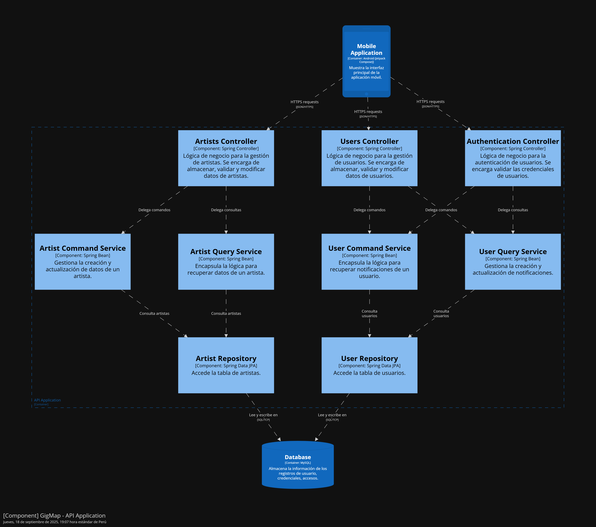

Este diagrama de componentes representa una arquitectura monolítica orientada al manejo de artistas, usuarios y autenticación dentro de GigMap. La Mobile Application, desarrollada como cliente principal en Android Studio con Kotlin y Jetpack Compose, interactúa con una API construida en Spring Boot a través de solicitudes HTTPS. Cada solicitud es procesada por uno de los tres controladores principales: Artists Controller, Users Controller o Authentication Controller.

Cada controlador delega la lógica de negocio a servicios especializados. En el caso de artistas, las operaciones de escritura se manejan mediante el Artist Command Service, mientras que las consultas las gestiona el Artist Query Service. De forma análoga, el User Command Service y el User Query Service encapsulan la lógica de lectura y escritura para la gestión de usuarios y sus notificaciones. El Authentication Controller, por su parte, valida las credenciales de acceso y se apoya en servicios internos para dicha lógica.

Todos los servicios acceden a la base de datos a través de los respectivos repositories (como ArtistRepository y UserRepository), los cuales utilizan Spring Data JPA para realizar operaciones de lectura y escritura. Finalmente, toda la información relacionada con usuarios, artistas, credenciales y accesos es almacenada en una base de datos MySQL, sirviendo como única fuente de verdad para la aplicación.

### 2.6.5.6. Bounded Context Software Architecture Code Level Diagrams

#### 2.6.5.6.1. Bounded Context Domain Layer Class Diagrams

  

El siguiente diagrama de clases representa el Bounded Context de Registro y Autenticación. Este modela las responsabilidades del dominio en torno al agregado principal User, que encapsula atributos clave como id, email, username, passwordHash, así como su relación con la entidad Artist. Este agregado representa a un usuario registrado en la aplicación, y gestiona tanto su identidad como su posible rol artístico, reflejado a través del atributo artist.

El dominio está soportado por dos servicios de aplicación: UserCommandService, responsable de operaciones de escritura como la creación, actualización y eliminación de usuarios, y UserQueryService, que ofrece consultas como la búsqueda de usuarios por ID, email o por artista asociado, además de validar la disponibilidad de un nombre de usuario o correo electrónico. Ambas capas interactúan con la interfaz UserRepository, que expone métodos para verificar la existencia de usuarios o recuperar instancias por su relación con un artista.

En paralelo, se modela la entidad Artist, que agrupa información relacionada a un perfil artístico como artistName, bio y genres, gestionada por los servicios ArtistCommandService y ArtistQueryService, encargados de la creación, actualización, eliminación y recuperación de artistas respectivamente. La relación uno a uno entre User y Artist permite establecer un vínculo directo entre la cuenta de usuario y su rol como creador en la aplicación, sin romper la separación de responsabilidades entre contextos.

#### 2.6.5.6.2. Bounded Context Database Design Diagram

  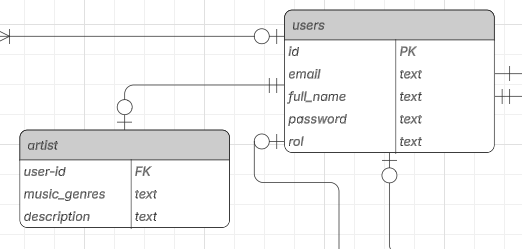

El Database Diagram para el Bounded Context de Registro y Autenticación modela la persistencia del agregado raíz User, responsable de gestionar el acceso y la identidad de los usuarios dentro de GigMap. La tabla users almacena información esencial como el email, full_name, password y rol, siendo id su clave primaria. Esta tabla representa el núcleo del proceso de autenticación y autorización. Por otro lado, la entidad artist extiende al usuario cuando este cumple el rol de artista, mediante una relación uno a uno definida por la clave foránea user-id. Esta entidad contiene atributos propios del dominio artístico como music_genres y description.

# Capítulo III: Solution UI/UX Design

## 3.1. Product Design

El product design es el proceso mediante el cual se define la apariencia, estructura y funcionamiento del producto. En esta etapa se busca crear una solución que combine una buena experiencia de usuario con una implementación técnica eficiente. Su propósito es asegurar que el diseño cumpla con los objetivos del proyecto, facilitando la interacción entre el usuario y la aplicación de manera clara, funcional y atractiva.

### 3.1.1. Style Guidelines

El product design es el proceso mediante el cual se define la apariencia, estructura y funcionamiento del producto. En esta etapa se busca crear una solución que combine una buena experiencia de usuario con una implementación técnica eficiente. Su propósito es asegurar que el diseño cumpla con los objetivos del proyecto, facilitando la interacción entre el usuario y la aplicación de manera clara, funcional y atractiva.

En esta sección, StayBits sienta las bases para contar con un repositorio central y organizado de uso común para todo el equipo, que incluye assets, fonts, entre otros elementos. Esto se realiza con el fin de mantener una presentación consistente y enfocada. Asimismo, se incluyen secciones para General Style Guidelines, Web Style Guidelines y Mobile Style Guidelines, que establecen los lineamientos visuales y de diseño del producto.

#### 3.1.1.1. General Style Guidelines

El diseño general del producto se fundamenta en la coherencia visual, la legibilidad y la identidad de marca. Estas pautas buscan garantizar una experiencia uniforme a lo largo de toda la aplicación, reflejando los valores y la personalidad del proyecto. Cada elemento visual ha sido seleccionado cuidadosamente para comunicar profesionalismo y cercanía, manteniendo un equilibrio entre lo formal y lo casual.

**Branding:**

El branding del proyecto se representa mediante un símbolo de localización acompañado de una nota musical, una combinación que refleja la esencia y propósito de la aplicación: conectar a las personas con experiencias musicales cercanas a su entorno. Esta fusión visual transmite el vínculo entre la música y la exploración, dos pilares fundamentales del proyecto. El ícono, busca ser fácilmente reconocible y adaptable a diferentes formatos y tamaños, desde íconos móviles hasta elementos gráficos dentro de la interfaz.

Los colores principales del logotipo, **#5C0F1A** y **#99182C**, se escogieron por su capacidad para evocar energía, pasión y creatividad, atributos estrechamente relacionados con el ámbito musical. El uso predominante del tono **#5C0F1A** comunica profundidad y elegancia, mientras que **#99182C** aporta contraste y vitalidad, reforzando la identidad visual del sistema y creando una sensación de dinamismo. En conjunto, estos elementos visuales consolidan una identidad sólida y coherente, que no solo distingue al proyecto a nivel estético, sino que también expresa su personalidad y propósito de conectar a las personas a través de la música y la experiencia compartida.

  

**Colores:**

La paleta de colores del proyecto busca equilibrio entre modernidad, contraste y armonía visual. Cada tono cumple un propósito específico dentro de la interfaz:

- **F6F6F6**: se utiliza como color de fondo principal en toda la aplicación, ofreciendo una apariencia limpia, ligera y agradable a la vista.

- **000000**: actúa como color de contraste para textos y elementos destacados sobre el fondo claro, garantizando legibilidad y jerarquía visual.

- **5C0F1A**: se emplea como color acento, aportando fuerza, carácter y cohesión con el logotipo.

- **736D6D** y **8E8787**: complementan la interfaz como tonos neutros secundarios, utilizados en iconografía, líneas divisorias o textos secundarios para mantener balance visual.

  

**Tipografía**

Se utiliza la familia tipográfica Inter, reconocida por su legibilidad y diseño contemporáneo. Dentro del sistema visual, se varían sus pesos —Bold, SemiBold, Medium, Regular y Black— dependiendo de la importancia y el nivel de énfasis que requiera cada elemento textual.

- **Encabezados**: se emplean pesos más altos, Inter Bold o SemiBold, para destacar jerarquías y secciones clave.

- **Cuerpo de texto:** se utiliza Inter Regular o Medium, priorizando la claridad en la lectura prolongada.

Esta elección tipográfica contribuye a mantener una identidad visual coherente y una experiencia de usuario equilibrada, asegurando una comunicación clara y profesional en toda la aplicación.

  

**Tono de comunicación**

El tono adoptado es formal pero cercano, buscando transmitir profesionalismo sin perder empatía. El lenguaje combina claridad y calidez, fomentando una conexión natural con el usuario. Este equilibrio refuerza la identidad del proyecto como una aplicación confiable, moderna y accesible.

La comunicación se desarrolla bajo una línea respetuosa y entusiasta, proyectando energía y dinamismo a través tanto del texto como de los elementos visuales.

### 3.1.2. Information Architecture

La Information Architecture (IA) se centra en la organización, estructuración y presentación del contenido dentro del sistema, con el objetivo de facilitar la navegación y la comprensión por parte del usuario. A través de esta etapa, se establecen las bases para que la información sea accesible, coherente y fácil de encontrar. En esta sección, el equipo define las decisiones y fundamentos que orientan la distribución del contenido en las distintas experiencias digitales, incluyendo la Landing Page y la aplicación, asegurando que los usuarios puedan interactuar de manera intuitiva y sin esfuerzo. Asimismo, se detallan los lineamientos relacionados con los Organization Systems, Labeling Systems, Navigation Systems y Searching Systems, que en conjunto conforman la estructura lógica y funcional del producto.

#### 3.1.2.1. Organization Systems

En esta sección, el equipo detalla cómo se aplicarán los sistemas de organización de la información dentro de GigMap, con el objetivo de garantizar que los usuarios puedan acceder fácilmente a la información que necesitan y navegar de manera eficiente por la aplicación. La estructura de la información busca ofrecer una experiencia intuitiva y ordenada, facilitando la interacción con los diferentes módulos y funcionalidades del sistema.

La organización visual del contenido se estructurará de la siguiente manera:

- **Jerárquica (Visual Hierarchy):** este enfoque se aplicará para resaltar los elementos más relevantes de la interfaz, como los botones de acción, eventos o secciones prioritarias. Se utilizarán variaciones en tamaño, color y posición para guiar la atención del usuario y reforzar la comprensión de la estructura general de la aplicación.

- **Organización Secuencial (Step-by-Step):** se empleará en procesos que requieren un flujo lógico y progresivo, como el registro de usuarios, la visualización de información de conciertos o la publicación de eventos. Cada paso se presentará de forma clara y sencilla, reduciendo la carga cognitiva y asegurando una experiencia fluida.

- **Organización Matricial:** este sistema se implementará en secciones donde los usuarios necesiten comparar o explorar diferentes opciones, como listados de conciertos, artistas o comunidades. Este enfoque permitirá visualizar varias categorías o tipos de información en paralelo, fomentando una exploración más flexible y completa.

Este enfoque en la organización de la información está alineado con los objetivos de diseño de GigMap, que buscan ofrecer una interfaz clara, minimalista y centrada en el usuario, donde los elementos esenciales sean fácilmente identificables, los flujos de navegación estén optimizados y la jerarquía visual contribuya a una experiencia coherente y atractiva.

#### 3.1.2.2. Labelling Systems

El sistema de etiquetado define la manera en que se representará la información dentro de la aplicación, priorizando la claridad, simplicidad y coherencia en el lenguaje. El propósito es que los usuarios puedan identificar rápidamente las funciones y secciones sin confusión, asociando cada etiqueta con su contenido o acción correspondiente. Las etiquetas se han diseñado para ser breves, intuitivas y consistentes

| **Sección / Función**                          | **Etiqueta Propuesta**                         |
|------------------------------------------------|------------------------------------------------|
| Lista de conciertos asistidos y por asistir     | GigList                                   |
| Creación de conciertos               | Crear concierto  |
| Creación de eventos                |  Crear evento relacionado |
| Creación de comunidades                |  Crear comunidad |
| Publicaciones con “me gusta”                    | Likes                                |
| Comunidades a las que pertenece el usuario      | Comunidades                               |
| Perfil del usuario                              | Mi perfil / Editar perfil              |
| Sección general de eventos                      | Eventos relacionados                    |
| Página de inicio          | Inicio                 |
| Mapa interactivo        | Mapa                 |

#### 3.1.2.3. SEO Tags and Meta Tags

En esta sección se presentan las etiquetas SEO (Search Engine Optimization) y los Meta Tags que optimizan la visibilidad de GigMap en motores de búsqueda y tiendas de aplicaciones.

Estas etiquetas contribuyen a mejorar el posicionamiento y facilitar que los usuarios encuentren GigMap fácilmente, tanto en la landing page como la aplicación mobile.

Se han definido los valores para las principales páginas del sitio web (Landing Page) y los elementos de optimización en la aplicación móvil (ASO – App Store Optimization).

**Landing Page:**

| **Etiqueta**        | **Valor Asignado** |
|----------------------|--------------------|
| **Title**            | GigMap |
| **Meta Description** | Descubre, organiza y comparte tus experiencias musicales. Con GigMap puedes explorar conciertos cercanos, crear eventos y conectar con comunidades de fans. |
| **Keywords**         | conciertos, música en vivo, eventos, fans, artistas, comunidades musicales, gigmap |
| **Author**           | StayBits |

**Aplicación mobile:**

| **Elemento**         | **Valor Asignado** |
|----------------------|--------------------|
| **App Title**        | GigMap |
| **App Subtitle**     | Tu mapa musical: conciertos, comunidades y experiencias únicas |
| **App Description**  | Con GigMap, encuentra conciertos cerca de ti, crea tus propios eventos, sigue a tus artistas favoritos y conecta con otros fans. Todo desde una interfaz intuitiva y moderna. |
| **App Keywords**     | música, conciertos, eventos, fans, artistas, comunidad, gigmap, experiencias en vivo |
| **App Developer**    | StayBits |

#### 3.1.2.4. Searching Systems

En esta sección se detallan los medios y herramientas de búsqueda implementados dentro de GigMap, diseñados para que los usuarios puedan localizar rápidamente la información o los contenidos que desean, sin sentirse abrumados por el volumen de datos disponibles. El objetivo es garantizar una experiencia de exploración fluida, intuitiva y eficiente, tanto en la aplicación móvil como en la Landing Page.

A continuación, se describen los sistemas de búsqueda implementados:

- **Búsqueda de conciertos:** En la sección principal de conciertos, se integra un icono de lupa que permite a los usuarios buscar eventos específicos por nombre, artista o ubicación. Tras realizar la búsqueda, los resultados se muestran en una lista filtrada y actualizada en tiempo real, facilitando la exploración.

- **Filtro de géneros musicales:** Dentro de la vista de conciertos, se incluye un icono de filtro que despliega una barra lateral con diferentes géneros musicales. De esta manera, el usuario puede seleccionar uno o varios géneros para personalizar su experiencia y visualizar únicamente los conciertos que coincidan con sus preferencias musicales.

- **Búsqueda de comunidades:** En la pestaña de Comunidades, los usuarios disponen de una barra de búsqueda que les permite encontrar grupos afines a sus intereses, ya sea por nombre, temática o popularidad. Esto fomenta la conexión entre fans con gustos similares.

- **Navegación guiada en la Landing Page:** En la Landing Page, el menú de navegación (navbar) actúa como un sistema de búsqueda estructurado por secciones. Incluye accesos directos a:

	- Inicio: Vista principal de presentación del proyecto.

	- Para Fans: Sección que muestra los beneficios y funcionalidades pensadas para los usuarios fanáticos.

	- Para Artistas: Espacio destinado a mostrar las ventajas y herramientas disponibles para músicos y creadores.

	- Descargar: Botón que redirige directamente a la tienda de aplicaciones para obtener la versión móvil de GigMap.

Cada uno de estos mecanismos busca optimizar la experiencia del usuario, reduciendo el tiempo de búsqueda y mejorando la accesibilidad de la información dentro del ecosistema GigMap.

#### 3.1.2.5. Navigation Systems

En esta sección, el equipo detalla las acciones y técnicas que guían a los usuarios a través del Landing Page y la aplicación móvil, asegurando una navegación fluida, coherente y centrada en el cumplimiento de sus objetivos. El propósito es que cada usuario pueda desplazarse intuitivamente por el contenido, comprendiendo de forma inmediata cómo interactuar con las diferentes secciones del producto.

**Landing Page:**

La navegación en la Landing Page está diseñada para ofrecer una experiencia clara, directa y atractiva desde el primer contacto con el usuario. Se emplea una estructura de navegación superior (navbar) con las siguientes secciones principales:

- **Inicio:** Presenta una visión general del proyecto GigMap, introduciendo su propósito, características y propuesta de valor.

- **Para Fans:** Expone los beneficios, funcionalidades y experiencias que la plataforma ofrece a los usuarios fanáticos, fomentando su participación dentro del ecosistema musical.

- **Para Artistas:** Describe las herramientas, ventajas y oportunidades que GigMap pone a disposición de los músicos y creadores para conectar con sus audiencias.

- **Descargar:**  Botón de acción que redirige al usuario hacia la tienda de aplicaciones para obtener la versión móvil de GigMap, promoviendo la transición del entorno web a la aplicación nativa.

- **Footer con suscripción al newsletter:** En la parte inferior de la Landing Page se incluye un footer interactivo que permite a los usuarios suscribirse a un newsletter. Este espacio busca mantenerlos informados sobre novedades, lanzamientos y próximos eventos relacionados con GigMap, reforzando la conexión continua entre la plataforma y su comunidad.

**Aplicación Mobile:**

La navegación en la aplicación móvil de GigMap se centra en la simplicidad, accesibilidad y coherencia visual. Se utiliza una barra de navegación inferior compuesta por cuatro secciones principales, cada una diseñada para ofrecer un acceso rápido y claro a las funciones esenciales:

- **Inicio:** Muestra el feed principal con secciones como“Descubre nuevos conciertos”, que redirige a la lista completa de eventos disponibles,“Nuevos artistas en GigMap”, y publicaciones recientes de los artistas que el usuario sigue. Esta vista prioriza la interacción y el descubrimiento de contenido relevante.

- **Mapa:** Permite a los usuarios explorar un mapa interactivo que accede a su ubicación actual y muestra los conciertos disponibles cerca de ellos, fomentando la exploración geográfica de eventos musicales en tiempo real.

- **Comunidades:** Espacio donde los usuarios pueden unirse a comunidades existentes, crear nuevas y visualizar aquellas de las que ya forman parte, promoviendo la interacción social y el sentido de pertenencia dentro de la aplicación.

- **Perfil:** Sección destinada al perfil del usuario, donde puede visualizar su información personal, historial de actividad y editar sus datos o preferencias, manteniendo el control sobre su identidad dentro de GigMap.

### 3.1.3. Landing Page UI Design
#### 3.1.3.1. Landing Page Wireframe

En esta sección se presentan los wireframes del Landing Page diseñados para su visualización en navegadores web de escritorio. La propuesta refleja la aplicación de los principios de diseño visual, los elementos de composición y los fundamentos de diseño inclusivo, garantizando una experiencia accesible y coherente para todo tipo de usuarios. Asimismo, la estructura de los wireframes evidencia la arquitectura de información planteada, priorizando la jerarquía visual, la claridad en la navegación y la fácil identificación de secciones clave como “Inicio", "Para Fans”y“Para Artistas"

**Sección de Inicio:**

  

**Sección Para Fans:**

  

**Sección Para Artistas:**

  

#### 3.1.3.2. Landing Page Mock-up

En esta sección se presentan los mockups finales del Landing Page, los cuales representan la materialización visual del diseño propuesto en los wireframes. Estos mockups muestran la aplicación coherente de la paleta de colores, los principios de diseño inclusivo y los lineamientos de estilo general definidos previamente. Además, reflejan la identidad visual de GigMap, transmitiendo una imagen moderna, profesional y alineada con su propósito: conectar a fans y artistas a través de una experiencia digital atractiva y funcional. La composición mantiene una jerarquía visual clara y una navegación intuitiva que facilita la exploración del sitio.

**Sección de inicio:**

  

**Sección Para Fans:**

  

**Sección Para Artistas:**

  

### 3.1.4. Mobile Applications UX/UI Design
#### 3.1.4.1. Mobile Applications Wireframes
#### 3.1.4.2. Mobile Applications Wireflow Diagrams
#### 3.1.4.3. Mobile Applications Mock-ups

En esta sección se presentan los mockups de la aplicación mobile de GigMap, los cuales ilustran la versión interactiva de la plataforma diseñada para navegadores. Estos mockups reflejan la integración de los principios de diseño centrado en el usuario, manteniendo la coherencia visual con la identidad de marca establecida en el Landing Page. Se prioriza una interfaz limpia, moderna y funcional, donde la paleta cromática, la tipografía Inter y los elementos de navegación trabajan en conjunto para ofrecer una experiencia fluida.

Cada pantalla busca transmitir claridad en las acciones, accesibilidad y una estructura visual que facilite la exploración de conciertos, comunidades y perfiles dentro del ecosistema GigMap.

   
   
   
   
   
   
   
   
   
  

#### 3.1.4.4. Mobile Applications User Flow Diagrams

Esta sección presenta la propuesta de User Flows elaborados en Lucidchart, donde se representan las rutas que los usuarios siguen dentro de las diferentes aplicaciones que conforman el proyecto. Cada flujo está diseñado en función de los User Persona y sus respectivos User Goals, evidenciando tanto el camino principal o esperado (happy path) como las rutas alternativas (unhappy paths). Los diagramas incluyen los mockups de las pantallas involucradas, mostrando la secuencia lógica de acciones que conducen al cumplimiento de los objetivos del usuario. 

Además, se emplea un sistema de colores para diferenciar cada tipo de flujo, garantizando una lectura clara e intuitiva.

 
 

**User Flow 1: Registro e Inicio de Sesión**

Este flujo muestra el proceso inicial en GigMap, donde el usuario elige entre registrarse o iniciar sesión. Si decide registrarse, selecciona su tipo de cuenta —artista o fan— y completa el formulario correspondiente. Finalmente, accede satisfactoriamente a la aplicación para comenzar a explorar sus funciones.

  

  

**User Flow 2: Filtrado de Conciertos por Género Musical**

Este flujo representa el proceso mediante el cual el usuario accede a la sección de conciertos desde la pantalla principal. Una vez allí, utiliza la función de filtro para seleccionar su género musical preferido. Finalmente, la aplicación muestra únicamente los conciertos programados que coinciden con el género elegido, ofreciendo una experiencia personalizada.

  

  

**User Flow 3: Visualización y Marcado de Asistencia a un Concierto**

En este flujo, el usuario navega por la pestaña de conciertos y selecciona uno de su interés. Al ingresar, accede a la información detallada del evento, como fecha, ubicación y descripción. Finalmente, puede marcar su asistencia y visualizar la localización del concierto directamente en el mapa interactivo.

  

  

**User Flow 4: Unión a una Comunidad**

En este flujo, el usuario accede a la pestaña de comunidades y explora las opciones disponibles. Al encontrar una comunidad de su interés, selecciona para ver su información detallada. Finalmente, presiona el botón de “Unirse”, completando satisfactoriamente su incorporación a la comunidad elegida.

  

  

**User Flow 5: Creación de una Comunidad**

En este flujo, el usuario navega hasta la pestaña de comunidades y selecciona la opción “Crear comunidad”. Luego, completa el formulario con los datos solicitados, como nombre, descripción e imagen representativa. Al enviar el formulario, la comunidad se crea exitosamente y queda registrada en la aplicación.

  

  

**User Flow 6: Seguir a un Usuario desde un Concierto**

En este flujo, el usuario revisa la lista de asistentes a un concierto y selecciona el perfil de alguien que le interesa. Tras visualizar su información, decide seguirlo presionando el botón correspondiente. La acción se completa exitosamente, estableciendo la conexión entre ambos usuarios dentro de la aplicación.

  

  

**User Flow 7: Visualizar Perfil de Otro Usuario desde un Concierto**

En este flujo, el usuario accede a la lista de asistentes de un concierto y selecciona el perfil de otro usuario. Al ingresar, puede visualizar información detallada como los conciertos a los que ha asistido o planea asistir, el contenido al que ha dado like y las comunidades a las que pertenece, promoviendo la interacción y el sentido de comunidad dentro de GigMap.

  

  

**User Flow 8: Visualizar Información de un Concierto desde el Mapa**

En este flujo, el usuario navega por el mapa interactivo y selecciona un concierto cercano. Al hacer clic, se despliega una vista detallada con toda la información relevante del evento, incluyendo ubicación, fecha, artistas participantes y opciones para marcar asistencia, brindando una experiencia intuitiva y contextual.

  

  

**User Flow 9: Crear Concierto**

En este flujo, el usuario accede a la sección de conciertos y selecciona la opción “Crear concierto”. Luego, completa un formulario con información clave como nombre del evento, fecha, ubicación, género musical y artistas participantes. Finalmente, confirma la creación, generando exitosamente un nuevo concierto dentro de la aplicación.

  

  

**User Flow 10: Crear Evento Relacionado a un Concierto**

En este flujo, el usuario se encuentra dentro de la información detallada de un concierto y selecciona la opción "Crear evento relacionado". A continuación, completa un formulario con los datos del nuevo evento, como título, descripción y fecha. Tras confirmar, el sistema asocia exitosamente el evento creado con el concierto principal, ampliando la experiencia y conexión entre actividades musicales.

  

  

**User Flow 11: Editar Perfil de Usuario**

En este flujo, el usuario accede a su perfil y selecciona la opción “Editar perfil”. Luego, modifica los datos personales como nombre, foto, descripción y preferencias. Al guardar los cambios, el perfil se actualiza exitosamente, reflejando la información editada dentro de la aplicación.

  

  

User Flow 12: Acceso a Notificaciones

En este flujo, el usuario se encuentra en cualquier pestaña de la aplicación que tenga el botón de notificaciones, le da click al botón de notificaciones, esto lo dirige directamente a su bandeja de notificaciones, donde puede revisar alertas, conciertos y actividades relevantes. 

  

  

# Conclusiones

-	El proyecto GigMap se consolida como una propuesta innovadora frente a los desafíos que presenta la escena musical en vivo, posicionándose como un puente tecnológico entre artistas emergentes y un público en constante búsqueda de experiencias auténticas. Su enfoque en geolocalización, personalización y participación comunitaria redefine la manera en que los usuarios descubren conciertos, aportando una solución efectiva a la falta de difusión de eventos independientes y al mismo tiempo ampliando las oportunidades de visibilización de artistas locales. El sistema demuestra cómo la tecnología, aplicada con una visión social y cultural, puede transformar dinámicas de consumo y enriquecer el ecosistema musical urbano.

-	Los resultados obtenidos a partir de las entrevistas y validaciones confirman los assumptions e hipótesis planteados en el proceso de Lean UX: los fans valoran la inmediatez y accesibilidad de información en tiempo real, mientras que los artistas emergentes demandan canales efectivos de promoción que les permitan conectar directamente con sus audiencias. En este sentido, GigMap contribuye a equilibrar una brecha crítica en la industria, donde el 99,9% de los nuevos artistas permanece invisible en un mercado saturado. La aplicación ofrece un escenario donde los conciertos locales, muchas veces inadvertidos, logran alcanzar a quienes más los disfrutan, fomentando así la cultura de descubrimiento musical.

-	La arquitectura planteada a lo largo del trabajo, sustentada en principios de Domain-Driven Design y en la descomposición por bounded contexts, permitió organizar de manera estratégica los subdominios (descubrimiento, notificaciones, interacción social, gestión de usuarios y eventos relacionados). Este diseño estructurado facilita la escalabilidad de la aplicación, asegura mantenibilidad en el tiempo y garantiza que cada módulo pueda evolucionar sin comprometer la visión global del sistema. Complementariamente, los modelos construidos a través de event stormings, diagramas de C4 y representaciones del dominio ofrecieron claridad sobre las interacciones clave y aseguraron coherencia en el desarrollo.

-	En un nivel cultural y social, GigMap trasciende su rol como aplicación móvil para convertirse en un catalizador del capital cultural. Al visibilizar la oferta musical dispersa, la aplicación fortalece la economía creativa local (bares, salas de concierto, colectivos culturales), estimula el turismo musical y fomenta la diversidad de propuestas artísticas. La posibilidad de crear y asistir a eventos relacionados expande la experiencia de los conciertos más allá del show principal, reforzando la identidad comunitaria de los fans y potenciando el sentido de pertenencia.

-	El éxito sostenible de GigMap dependerá de mantener un equilibrio entre las expectativas de sus stakeholders: ofrecer a los usuarios experiencias fluidas y personalizadas, brindar a los artistas herramientas sencillas pero potentes para la promoción, y generar valor tangible para promotores y aliados estratégicos. Retos como la calidad de los datos en tiempo real, la monetización sin comprometer la experiencia de usuario y la consolidación de una comunidad activa requerirán procesos iterativos constantes. Sin embargo, los hallazgos obtenidos y la validación de hipótesis posicionan a GigMap de manera favorable para su adopción, especialmente en un contexto donde la convergencia entre tecnología móvil, cultura local y consumo experiencial abre terreno fértil para su expansión.

-	En conclusión, GigMap se erige no solo como una herramienta tecnológica, sino como un proyecto cultural transformador, capaz de democratizar el acceso a la música en vivo, dinamizar economías locales y nutrir la vida comunitaria. Con una base técnica sólida, un enfoque centrado en el usuario y un compromiso con el crecimiento de la escena independiente, la aplicación se proyecta como un referente en la construcción de nuevas formas de conexión entre artistas y públicos, celebrando la diversidad y vitalidad del mundo musical contemporáneo.

# Bibliografía

- Chartmetric. (2023). Year in music 2023: Part 1. Chartmetric. `https://reports.chartmetric.com/2023/year-in-music/part-1`

- GlobeNewswire. (2025). Music Tourism Market Analysis Report 2024: Specialized Music Festivals, Expanding Offering, Niche Genres, and Unique Cultural Experiences – Global Long-term Forecast to 2028 and 2033. `https://www.globenewswire.com/news-release/2025/01/07/3005534/28124/en/Music-Tourism-Market-Analysis-Report-2024-Specialized-Music-Festivals-Expanding-Offering-Niche-Genres-and-Unique-Cultural-Experiences-Global-Long-term-Forecast-to-2028-and-2033.html`

- Hesmondhalgh, D. (2019). The Cultural Industries (4.ª ed.). SAGE. `https://uk.sagepub.com/en-gb/eur/the-cultural-industries/book250830`
  
- Industriamusical.com. (2024). Solo el 0.01% de los artistas emergentes alcanza niveles moderados de éxito.` https://industriamusical.com/solo-el-0-01-de-los-artistas-emergentes-alcanza-niveles-moderados-de-exito/`

- Instituto de Estudios Peruanos (IEP). (2019). Informe de Opinión: Música y hábitos de consumo cultural. `https://iep.org.pe/wp-content/uploads/2019/09/Informe-OP-Septiembre-2019-M%C3%BAsica-7.pdf`

- Mauch, M., MacCallum, R. M., Levy, M., & Leroi, A. M. (2021). Cultural divergence in popular music: The increasing diversity of music consumption on Spotify across countries. ResearchGate. `https://www.researchgate.net/publication/353483127_Cultural_Divergence_in_popular_music_the_increasing_diversity_of_music_consumption_on_Spotify_across_countries`
  
- Mordor Intelligence. (2023). Independent Artists Market – Growth, Trends, and Forecasts (2023–2028). Mordor Intelligence. `https://www.mordorintelligence.com/industry-reports/independent-artists`
  
- Mordor Intelligence. (2024). Análisis del mercado de artistas independientes - crecimiento, tendencias y pronósticos (2024-2029). `https://www.mordorintelligence.com/es/industry-reports/independent-artists`

- Ramos-Pla, A., Ramírez-Montoya, M. S., & García-Peñalvo, F. J. (2022). Consumo musical y su relación con la asistencia a conciertos entre universitarios. Revista de Comunicación, 21(2). `https://www.redalyc.org/journal/280/28065583023/html/`

- Redalyc. (2023). Segmento objetivo en el consumo cultural. Red de Revistas Científicas de América Latina y el Caribe, España y Portugal. `https://www.redalyc.org/journal/280/28065583023/html/`
  
- Think with Google. (s. f.). Mobile “near me” searches. `www.thinkwithgoogle.com/marketing-strategies/search/mobile-near-me-searches/`
  
- UNESCO. (2022). Re Shaping Policies for Creativity (Global Report). `https://www.unesco.org/creativity/sites/default/files/medias/fichiers/2023/01/380474eng.pdf`

# Anexos

**Registro de Entrevistas:**
- `https://upcedupe-my.sharepoint.com/:v:/g/personal/pcsierey_upc_edu_pe/EWAVbjg95iRMieIyfmsp59sBsqLdJ-VfaUPfzpuXXZqWDw?e=MWUekM&nav=eyJyZWZlcnJhbEluZm8iOnsicmVmZXJyYWxBcHAiOiJTdHJlYW1XZWJBcHAiLCJyZWZlcnJhbFZpZXciOiJTaGFyZURpYWxvZy1MaW5rIiwicmVmZXJyYWxBcHBQbGF0Zm9ybSI6IldlYiIsInJlZmVycmFsTW9kZSI6InZpZXcifX0%3D`

**Bounded Context Canvases:**
- `https://miro.com/app/board/uXjVJISYDZs=/`

**Event Storming:**
- `https://miro.com/app/board/uXjVJJVTxdE=/?share_link_id=263549564316`
  
**Bounded Context Domain Layer Class Diagrams:**
- `https://lucid.app/lucidchart/c4fcc116-38bb-4452-a822-563346f85914/edit?invitationId=inv_e37a0d87-1595-4c30-9945-6a3ad64347cd&page=0_0`

**Diagrama de Base de Datos:**
- `https://lucid.app/lucidchart/05424e23-5e84-4387-9dce-03e18885fc89/edit?invitationId=inv_3b68e893-018f-41c7-a6f9-254bbdcaa6ab`

